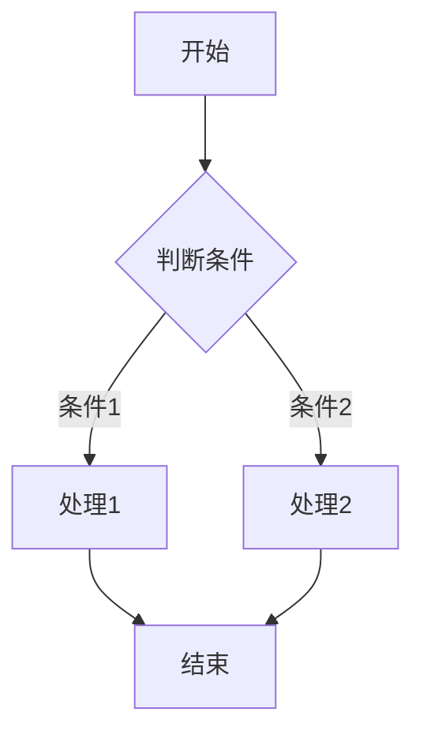

# Markdown Extension Examples

This page demonstrates some of the built-in markdown extensions provided by VitePress.

## Syntax Highlighting

VitePress provides Syntax Highlighting powered by [Shiki](https://github.com/shikijs/shiki), with additional features like line-highlighting:


**Input**

````md
```js{4}
export default {
  data () {
    return {
      msg: 'Highlighted!'
    }
  }
}
```
````

**Output**

```js{4}
export default {
  data () {
    return {
      msg: 'Highlighted!'
    }
  }
}
```

## Custom Containers

**Input**

```md
::: info
This is an info box.
:::

::: tip
This is a tip.
:::

::: warning
This is a warning.
:::

::: danger
This is a dangerous warning.
:::

::: details
This is a details block.
:::
```

**Output**

::: info
This is an info box.
:::

::: tip
This is a tip.
:::

::: warning
This is a warning.
:::

::: danger
This is a dangerous warning.
:::

::: details
This is a details block.
:::

## Mermaid 图表

VitePress 支持通过 `vitepress-plugin-mermaid` 插件显示 Mermaid 图表。

**Input**

````md

````

**Output**


更多 Mermaid 图表类型（流程图、序列图、甘特图等）请参考 [Mermaid 官方文档](https://mermaid.js.org/)。

## More

Check out the documentation for the [full list of markdown extensions](https://vitepress.dev/guide/markdown).
