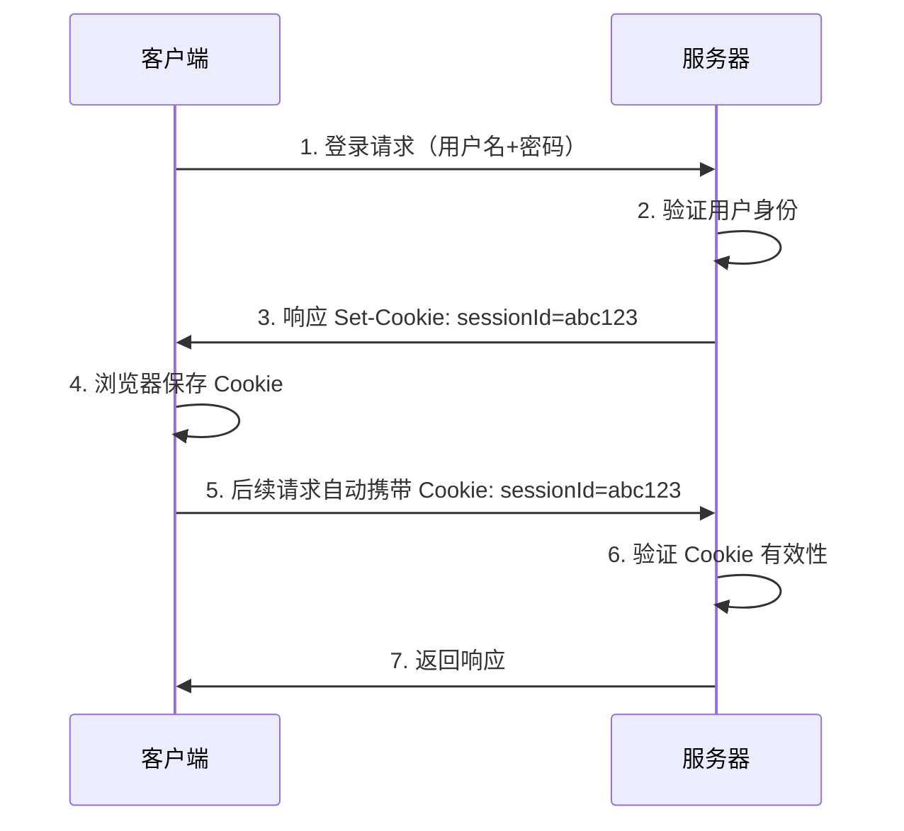
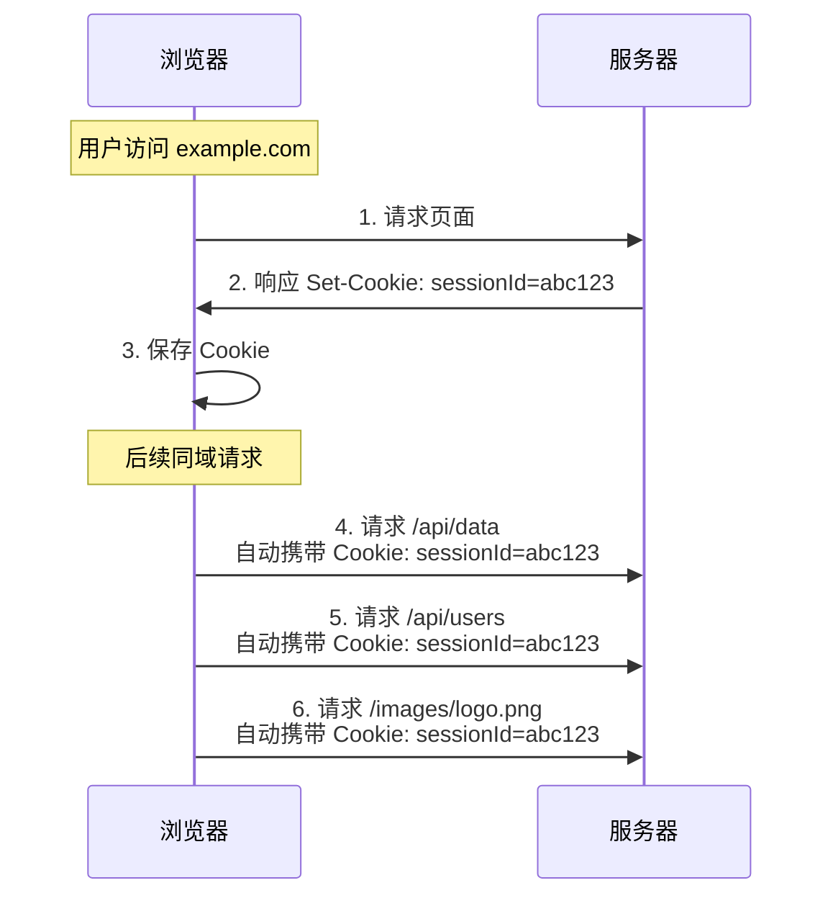
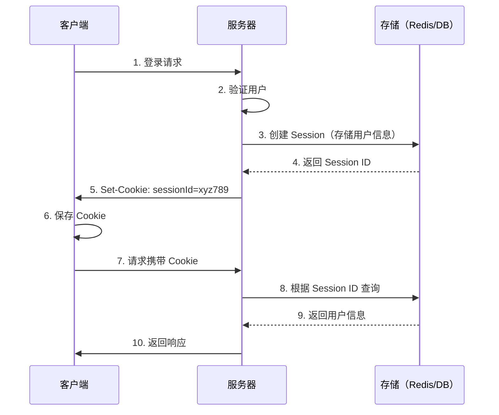
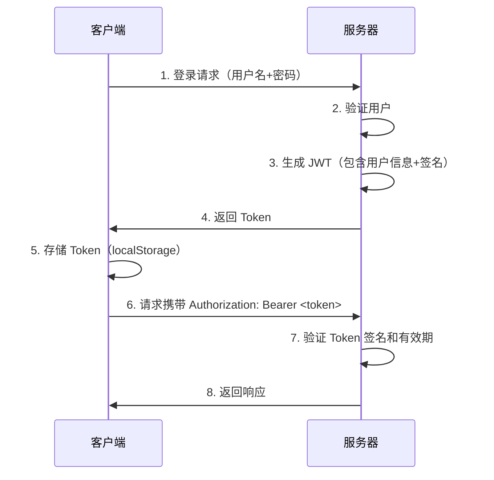
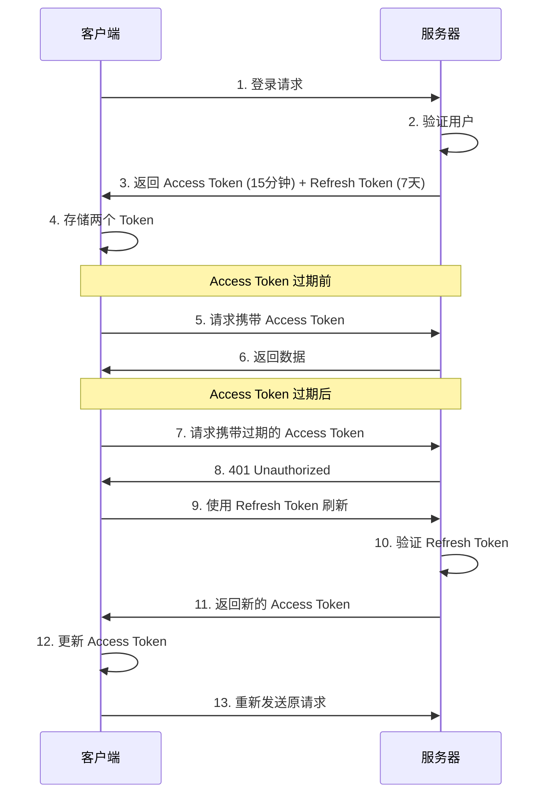
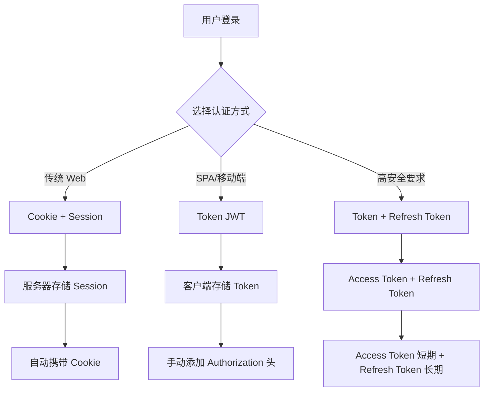

# 认证机制：Cookie、Token、Session

## 概述

本文档详细介绍 Web 应用中三种常见的认证机制：Cookie、Session 和 Token。理解它们的区别、工作原理和使用场景，对于构建安全、可扩展的 Web 应用至关重要。

## Cookie（HTTP Cookie）

### 什么是 Cookie

Cookie 是由服务器通过 `Set-Cookie` 响应头设置，浏览器自动保存并在后续请求中通过 `Cookie` 请求头发送的小型数据。

### Cookie 的特点

- **存储位置**：浏览器本地（可设置过期时间）
- **自动携带**：同域请求自动在请求头中携带
- **大小限制**：约 4KB
- **安全属性**：可设置 `HttpOnly`、`Secure`、`SameSite` 等

### Cookie 的工作流程



### Cookie 的自动携带机制

#### 同域请求（自动携带）

当请求的域名、协议、端口与设置 Cookie 的页面一致时，浏览器会自动在请求头中携带 Cookie：



#### 跨域请求（需要配置）

跨域请求是否携带 Cookie 取决于：

1. **客户端设置** `credentials: 'include'`
2. **服务器设置** `Access-Control-Allow-Credentials: true`
3. **服务器设置** `Access-Control-Allow-Origin` 为具体域名（不能是 `*`）

```javascript
// 前端：需要显式设置 credentials
fetch('https://api.example.com/data', {
  credentials: 'include'  // 必须设置这个
});

// 后端：需要设置 CORS 头
res.setHeader('Access-Control-Allow-Credentials', 'true');
res.setHeader('Access-Control-Allow-Origin', 'https://yourdomain.com'); // 不能是 *
```

#### Cookie 属性对携带行为的影响

**SameSite 属性**

```javascript
// SameSite 的三种值
Set-Cookie: sessionId=abc123; SameSite=Strict   // 仅同站请求携带
Set-Cookie: sessionId=abc123; SameSite=Lax      // 同站 + 顶级导航携带（默认）
Set-Cookie: sessionId=abc123; SameSite=None     // 跨站也携带（需 Secure）
```

- `Strict`：仅同站请求携带，跨站不携带
- `Lax`（默认）：同站请求携带；跨站 GET 导航（如链接跳转）携带；跨站 POST/iframe 不携带
- `None`：跨站也携带，但必须配合 `Secure`（HTTPS）

**Path 属性**

```javascript
Set-Cookie: sessionId=abc123; Path=/api
```

- 只有路径匹配时才会携带
- 例如：`Path=/api` 时，访问 `/api/users` 会携带，访问 `/home` 不会携带

**Domain 属性**

```javascript
Set-Cookie: sessionId=abc123; Domain=.example.com
```

- 设置 `Domain=.example.com` 时，`api.example.com` 和 `www.example.com` 都会携带
- 未设置时，仅当前域名携带

#### 不会携带 Cookie 的情况

1. Cookie 已过期
2. Cookie 被删除
3. 跨域请求未设置 `credentials: 'include'`
4. `SameSite=Strict` 且为跨站请求
5. 路径不匹配（`Path` 限制）
6. 协议不匹配（`Secure` Cookie 在 HTTP 下不发送）

### Cookie 代码示例

```javascript
// 服务器设置 Cookie（Node.js/Express）
res.cookie('sessionId', 'abc123', {
  httpOnly: true,    // 防止 JavaScript 访问
  secure: true,      // 仅 HTTPS 传输
  sameSite: 'strict', // CSRF 防护
  maxAge: 24 * 60 * 60 * 1000 // 24小时
});

// 客户端读取 Cookie（浏览器）
// 通过 document.cookie 访问（如果未设置 httpOnly）
const cookies = document.cookie;

// Next.js App Router - 设置 Cookie
import { cookies } from 'next/headers'

export async function setSession(sessionData: string) {
  cookies().set('session', sessionData, {
    httpOnly: true,
    secure: process.env.NODE_ENV === 'production',
    sameSite: 'lax',
    maxAge: 60 * 60 * 24 * 7,
    path: '/',
  })
}

// 读取 Cookie
export async function getSession() {
  const session = cookies().get('session')
  return session?.value
}
```

## Session（会话）

### 什么是 Session

Session 是服务器端存储的用户会话信息，通常与 Cookie 配合使用（Cookie 存储 Session ID）。

### Session 的特点

- **存储位置**：服务器端（内存、数据库、Redis 等）
- **客户端存储**：只存储 Session ID（通常通过 Cookie）
- **服务器控制**：服务器可随时使 Session 失效
- **安全性**：适合存储敏感信息

### Session 的工作流程



### Session 代码示例

```javascript
// 服务器端（Node.js/Express + express-session）
const session = require('express-session');
const RedisStore = require('connect-redis')(session);

app.use(session({
  store: new RedisStore({ client: redisClient }),
  secret: 'your-secret-key',
  resave: false,
  saveUninitialized: false,
  cookie: {
    httpOnly: true,
    secure: true,
    maxAge: 24 * 60 * 60 * 1000
  }
}));

// 设置 Session 数据
req.session.userId = user.id;
req.session.username = user.username;

// 读取 Session 数据
const userId = req.session.userId;

// 销毁 Session
req.session.destroy((err) => {
  if (err) {
    console.error('Session 销毁失败:', err);
  }
});
```

## Token（令牌）

### 什么是 Token

Token 是包含用户信息和签名的字符串，客户端存储并在请求头中发送。

### Token 的类型

- **JWT (JSON Web Token)**：自包含、无状态
- **OAuth Token**：用于第三方授权
- **Access Token / Refresh Token**：访问令牌和刷新令牌

### Token 的特点

- **存储位置**：客户端（localStorage、sessionStorage、Cookie）
- **自包含**：JWT 包含用户信息
- **无状态**：服务器无需存储
- **跨域支持**：可跨域使用

### Token 的工作流程（JWT 示例）



### Token 代码示例

```javascript
// 服务器生成 JWT（Node.js）
const jwt = require('jsonwebtoken');

// 生成 Token
const token = jwt.sign(
  { userId: user.id, username: user.username },
  'your-secret-key',
  { expiresIn: '1h' }
);

// 验证 Token
try {
  const decoded = jwt.verify(token, 'your-secret-key');
  console.log('用户信息:', decoded);
} catch (err) {
  console.error('Token 验证失败:', err);
}

// 客户端存储和使用（浏览器）
// 存储
localStorage.setItem('token', token);

// 发送请求
fetch('/api/protected', {
  headers: {
    'Authorization': `Bearer ${localStorage.getItem('token')}`
  }
});

// 使用 axios
axios.get('/api/protected', {
  headers: {
    'Authorization': `Bearer ${localStorage.getItem('token')}`
  }
});
```

### Refresh Token 机制



```javascript
// Refresh Token 实现示例
// 登录时返回两个 Token
const accessToken = jwt.sign(
  { userId: user.id },
  'access-secret',
  { expiresIn: '15m' }
);

const refreshToken = jwt.sign(
  { userId: user.id },
  'refresh-secret',
  { expiresIn: '7d' }
);

// 将 Refresh Token 存储在 httpOnly Cookie 中（更安全）
res.cookie('refreshToken', refreshToken, {
  httpOnly: true,
  secure: true,
  sameSite: 'strict',
  maxAge: 7 * 24 * 60 * 60 * 1000
});

// 刷新 Token 的中间件
async function refreshAccessToken(req, res, next) {
  const accessToken = req.headers.authorization?.split(' ')[1];
  
  try {
    jwt.verify(accessToken, 'access-secret');
    // Token 有效，继续
    next();
  } catch (err) {
    if (err.name === 'TokenExpiredError') {
      // Access Token 过期，使用 Refresh Token
      const refreshToken = req.cookies.refreshToken;
      
      try {
        const decoded = jwt.verify(refreshToken, 'refresh-secret');
        // 生成新的 Access Token
        const newAccessToken = jwt.sign(
          { userId: decoded.userId },
          'access-secret',
          { expiresIn: '15m' }
        );
        
        // 返回新的 Access Token
        res.setHeader('X-New-Access-Token', newAccessToken);
        req.userId = decoded.userId;
        next();
      } catch (refreshErr) {
        // Refresh Token 也过期，需要重新登录
        res.status(401).json({ error: '请重新登录' });
      }
    } else {
      res.status(401).json({ error: 'Token 无效' });
    }
  }
}
```

## 三者对比

| 特性 | Cookie | Session | Token |
|------|--------|---------|-------|
| **存储位置** | 浏览器 | 服务器 | 客户端（localStorage/Cookie） |
| **数据大小** | 约 4KB | 无限制 | 通常较大（JWT 可能几KB） |
| **安全性** | 中等（可设置安全属性） | 高（服务器端存储） | 中等（依赖签名验证） |
| **跨域支持** | 有限（同源策略） | 需要额外配置 | 支持（CORS） |
| **服务器状态** | 无状态 | 有状态 | 无状态（JWT） |
| **扩展性** | 一般 | 需要共享存储（Redis） | 好（无状态） |
| **移动端支持** | 有限 | 需要 Cookie 支持 | 好 |
| **自动携带** | ✅ 同域自动携带 | ✅ 通过 Cookie 自动携带 | ❌ 需手动添加请求头 |

### Cookie 自动携带总结

| 场景 | 是否自动携带 | 说明 |
|------|------------|------|
| 同域请求 | ✅ 是 | 浏览器自动在 `Cookie` 请求头中携带 |
| 跨域请求 | ⚠️ 需配置 | 需要设置 `credentials: 'include'` 和 CORS |
| Cookie 过期 | ❌ 否 | 浏览器自动删除，不会携带 |
| 路径不匹配 | ❌ 否 | `Path` 属性限制 |
| SameSite=Strict 跨站 | ❌ 否 | 安全策略限制 |

## 使用场景

### Cookie + Session 适合

- ✅ 传统 Web 应用
- ✅ 需要服务器端控制会话
- ✅ 需要存储敏感信息
- ✅ 单域应用
- ✅ 需要服务器端撤销会话

### Token（JWT）适合

- ✅ 前后端分离（SPA、移动端）
- ✅ 微服务架构（无状态）
- ✅ 跨域应用
- ✅ 需要高扩展性
- ✅ 移动端应用

### 混合方案



## 安全最佳实践

### Cookie 安全设置

```javascript
// 安全的 Cookie 设置
res.cookie('sessionId', sessionId, {
  httpOnly: true,      // 防止 XSS 攻击（JavaScript 无法访问）
  secure: true,        // 仅 HTTPS 传输
  sameSite: 'strict',  // 防止 CSRF 攻击
  maxAge: 3600000,     // 设置过期时间
  path: '/'            // 路径限制
});
```

### Token 安全设置

```javascript
// 使用 Refresh Token 机制
// Access Token：短期有效（15分钟）
// Refresh Token：长期有效（7天），存储在 httpOnly Cookie

// 防止 Token 泄露的措施：
// 1. 使用 HTTPS
// 2. 不在 URL 中传递 Token
// 3. 定期刷新 Token
// 4. 实现 Token 黑名单机制
// 5. 设置合理的过期时间
```

### Session 安全设置

```javascript
// Session 安全配置
app.use(session({
  secret: process.env.SESSION_SECRET, // 使用环境变量
  resave: false,                       // 避免不必要的保存
  saveUninitialized: false,            // 不保存未初始化的 Session
  cookie: {
    httpOnly: true,
    secure: process.env.NODE_ENV === 'production',
    sameSite: 'strict',
    maxAge: 24 * 60 * 60 * 1000
  },
  // 使用 Redis 等外部存储，避免内存泄漏
  store: new RedisStore({ client: redisClient })
}));
```

### 常见安全威胁与防护

| 威胁 | 说明 | 防护措施 |
|------|------|----------|
| **XSS（跨站脚本攻击）** | 恶意脚本窃取 Cookie/Token | `HttpOnly` Cookie、内容安全策略（CSP） |
| **CSRF（跨站请求伪造）** | 利用用户 Cookie 发起恶意请求 | `SameSite` 属性、CSRF Token |
| **Token 泄露** | Token 被窃取后滥用 | HTTPS、短期过期、Refresh Token |
| **Session 劫持** | 窃取 Session ID | HTTPS、定期轮换 Session ID |

## 实际应用示例

### Next.js 中的认证实现

::: tip Next.js 相关文档
关于 Next.js 中处理 Cookie 和认证的更多信息，请参考：
- [Next.js 服务端路由处理程序（Route Handlers）](/guides/nextjs/router-handle) - 了解如何在 Route Handlers 中处理 Cookie 和认证
- [Next.js 官方文档 - Cookies](https://nextjs.org/docs/app/api-reference/functions/cookies) - Next.js Cookies API 参考
:::

```typescript
// app/api/auth/login/route.ts
import { cookies } from 'next/headers'
import { sign } from 'jsonwebtoken'

export async function POST(request: Request) {
  const { username, password } = await request.json()
  
  // 验证用户（示例）
  const user = await validateUser(username, password)
  
  if (!user) {
    return Response.json({ error: '用户名或密码错误' }, { status: 401 })
  }
  
  // 方案 1: 使用 Cookie + Session（推荐用于 SSR）
  const sessionId = generateSessionId()
  await storeSession(sessionId, user)
  
  cookies().set('sessionId', sessionId, {
    httpOnly: true,
    secure: process.env.NODE_ENV === 'production',
    sameSite: 'lax',
    maxAge: 60 * 60 * 24 * 7,
    path: '/',
  })
  
  // 方案 2: 使用 JWT Token
  const token = sign(
    { userId: user.id, username: user.username },
    process.env.JWT_SECRET!,
    { expiresIn: '1h' }
  )
  
  return Response.json({ 
    token,  // 客户端存储到 localStorage
    user: { id: user.id, username: user.username }
  })
}

// app/api/protected/route.ts
import { cookies } from 'next/headers'
import { verify } from 'jsonwebtoken'

export async function GET(request: Request) {
  // 方案 1: 从 Cookie 读取 Session
  const sessionId = cookies().get('sessionId')?.value
  if (!sessionId) {
    return Response.json({ error: '未授权' }, { status: 401 })
  }
  
  const session = await getSession(sessionId)
  if (!session) {
    return Response.json({ error: 'Session 无效' }, { status: 401 })
  }
  
  // 方案 2: 从请求头读取 Token
  const authHeader = request.headers.get('authorization')
  const token = authHeader?.split(' ')[1]
  
  if (!token) {
    return Response.json({ error: '未授权' }, { status: 401 })
  }
  
  try {
    const decoded = verify(token, process.env.JWT_SECRET!)
    // 使用 decoded 中的用户信息
    return Response.json({ data: '受保护的数据', user: decoded })
  } catch (err) {
    return Response.json({ error: 'Token 无效' }, { status: 401 })
  }
}
```

### React 客户端使用示例

```typescript
// hooks/useAuth.ts
import { useState, useEffect } from 'react'

export function useAuth() {
  const [user, setUser] = useState(null)
  const [loading, setLoading] = useState(true)
  
  useEffect(() => {
    // 从 localStorage 读取 Token
    const token = localStorage.getItem('token')
    
    if (token) {
      // 验证 Token 并获取用户信息
      fetch('/api/user', {
        headers: {
          'Authorization': `Bearer ${token}`
        }
      })
      .then(res => res.json())
      .then(data => {
        if (data.user) {
          setUser(data.user)
        } else {
          localStorage.removeItem('token')
        }
      })
      .finally(() => setLoading(false))
    } else {
      setLoading(false)
    }
  }, [])
  
  const login = async (username: string, password: string) => {
    const res = await fetch('/api/auth/login', {
      method: 'POST',
      headers: { 'Content-Type': 'application/json' },
      body: JSON.stringify({ username, password })
    })
    
    const data = await res.json()
    
    if (res.ok) {
      localStorage.setItem('token', data.token)
      setUser(data.user)
      return { success: true }
    } else {
      return { success: false, error: data.error }
    }
  }
  
  const logout = () => {
    localStorage.removeItem('token')
    setUser(null)
  }
  
  return { user, loading, login, logout }
}
```

## 总结

### 核心要点

1. **Cookie**：浏览器存储的小型数据，通常用于存储 Session ID，同域请求自动携带
2. **Session**：服务器端会话存储，配合 Cookie 使用，适合传统 Web 应用
3. **Token**：自包含的认证令牌，适合无状态架构和跨域应用

### 选择建议

- **传统 Web 应用** → Cookie + Session
- **现代 SPA/移动端** → Token（JWT）
- **需要高扩展性** → Token
- **需要服务器端控制** → Session
- **高安全要求** → Token + Refresh Token 机制

### 关键区别

- **Cookie** 在同域请求中会自动携带，无需手动处理
- **Session** 需要服务器端存储，适合需要服务器控制的场景
- **Token** 是无状态的，适合分布式系统和微服务架构

理解这些认证机制的区别和适用场景，有助于构建安全、可扩展的 Web 应用。

## 参考链接

### 官方文档
- [MDN - HTTP Cookies](https://developer.mozilla.org/zh-CN/docs/Web/HTTP/Cookies)
- [MDN - SameSite Cookies](https://developer.mozilla.org/zh-CN/docs/Web/HTTP/Headers/Set-Cookie/SameSite)
- [Next.js - Cookies API](https://nextjs.org/docs/app/api-reference/functions/cookies)
- [Next.js - Route Handlers](https://nextjs.org/docs/app/building-your-application/routing/route-handlers)

### 工具和标准
- [JWT.io](https://jwt.io/) - JWT 介绍和调试工具
- [RFC 6265 - HTTP State Management Mechanism](https://tools.ietf.org/html/rfc6265)
- [RFC 7519 - JSON Web Token (JWT)](https://tools.ietf.org/html/rfc7519)

### 相关文档
- [网络与通信：HTTP、缓存、HTTPS](/guides/general/network-communication) - 了解 HTTP 协议和 Cookie 的传输机制
- [Next.js 服务端路由处理程序](/guides/nextjs/router-handle) - Next.js 中处理认证的实践

