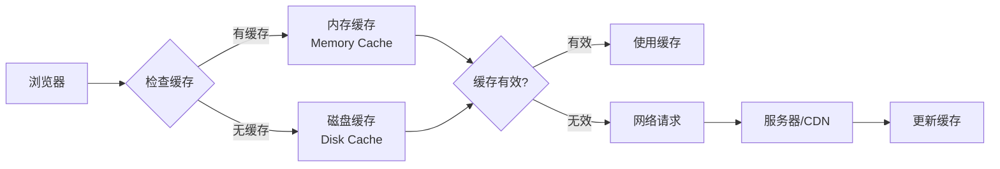
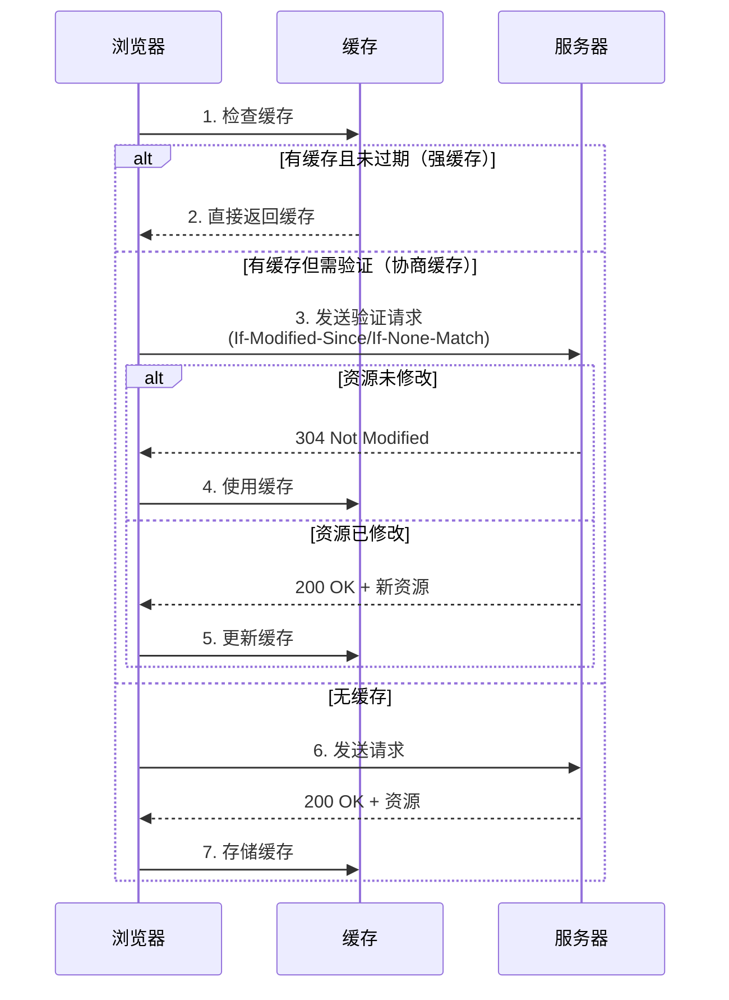
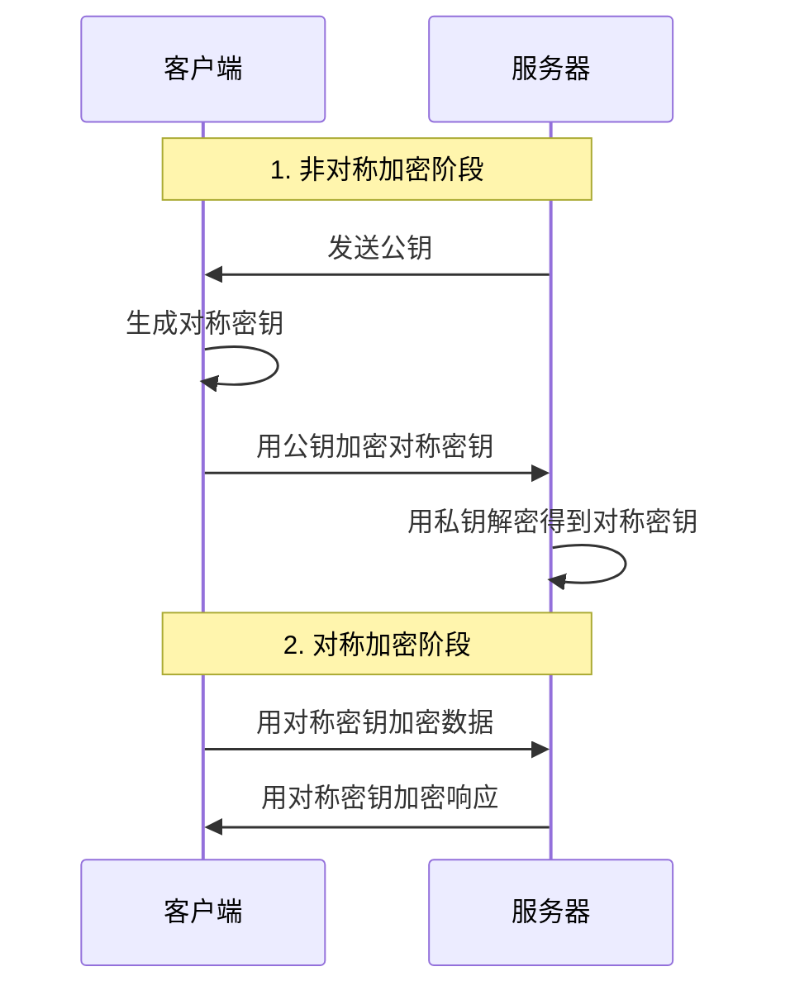
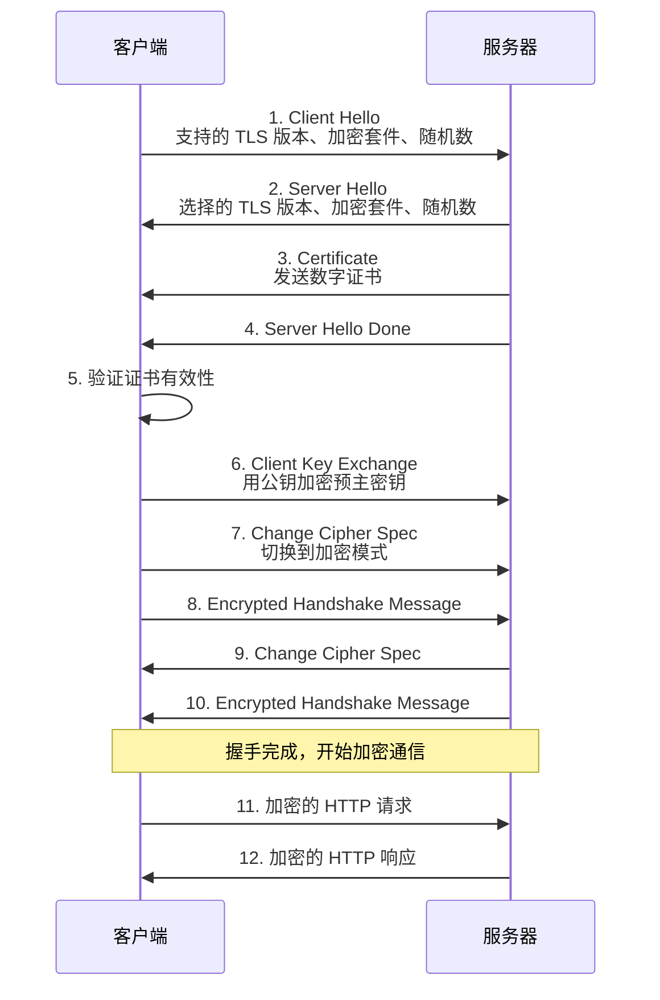

# 网络与通信

## 概述

本文档介绍网络通信的核心知识，包括 HTTP 基础、HTTP 缓存机制和 HTTPS 安全协议。这些知识是理解现代 Web 应用通信的基础。

## HTTP 基础

### 什么是 HTTP

HTTP（HyperText Transfer Protocol，超文本传输协议）是应用层协议，用于浏览器和服务器之间的通信。它定义了客户端如何请求资源，以及服务器如何响应请求。

### HTTP 请求结构

HTTP 请求由以下部分组成：

1. **请求行**：包含请求方法、URL 和协议版本
   ```
   GET /api/users HTTP/1.1
   ```

2. **请求头**：包含元数据信息
   ```
   Host: example.com
   User-Agent: Mozilla/5.0
   Accept: application/json
   Content-Type: application/json
   Authorization: Bearer token
   ```

3. **请求体**：可选，用于 POST、PUT 等方法传递数据

### HTTP 响应结构

HTTP 响应由以下部分组成：

1. **状态行**：包含协议版本、状态码和状态描述
   ```
   HTTP/1.1 200 OK
   ```

2. **响应头**：包含元数据信息
   ```
   Content-Type: application/json
   Content-Length: 1024
   Cache-Control: no-cache
   ```

3. **响应体**：实际的响应数据

### HTTP 方法

| 方法 | 用途 | 是否幂等 | 是否有请求体 |
|------|------|----------|--------------|
| GET | 获取资源 | 是 | 否 |
| POST | 创建资源或提交数据 | 否 | 是 |
| PUT | 更新资源（完整替换） | 是 | 是 |
| PATCH | 部分更新资源 | 否 | 是 |
| DELETE | 删除资源 | 是 | 否 |
| OPTIONS | 获取支持的请求方法 | 是 | 否 |

### HTTP 状态码

状态码分为 5 类：

- **1xx（信息性）**：请求已接收，继续处理
- **2xx（成功）**：请求成功处理
  - `200 OK`：请求成功
  - `201 Created`：资源创建成功
  - `204 No Content`：成功但无返回内容
- **3xx（重定向）**：需要进一步操作
  - `301 Moved Permanently`：永久重定向
  - `302 Found`：临时重定向
  - `304 Not Modified`：资源未修改（缓存相关）
- **4xx（客户端错误）**：请求有误
  - `400 Bad Request`：请求格式错误
  - `401 Unauthorized`：未授权
  - `403 Forbidden`：禁止访问
  - `404 Not Found`：资源不存在
- **5xx（服务器错误）**：服务器处理错误
  - `500 Internal Server Error`：服务器内部错误
  - `502 Bad Gateway`：网关错误
  - `503 Service Unavailable`：服务不可用

### HTTP 版本演进

#### HTTP/1.0
- 每个请求需要建立新的 TCP 连接
- 连接效率低

#### HTTP/1.1（当前主流）
- **持久连接**：默认保持连接，可复用
- **管道化**：可发送多个请求，但响应必须按顺序返回
- **分块传输**：支持流式传输
- **Host 头**：支持虚拟主机

#### HTTP/2
- **多路复用**：单个连接可并行处理多个请求
- **头部压缩**：减少头部大小
- **服务器推送**：服务器可主动推送资源

#### HTTP/3
- 基于 UDP 的 QUIC 协议
- 更快的连接建立
- 更好的移动网络支持

### 常见请求头字段

| 字段 | 说明 |
|------|------|
| `Host` | 目标服务器的主机名和端口 |
| `User-Agent` | 客户端信息 |
| `Accept` | 客户端可接受的媒体类型 |
| `Accept-Language` | 客户端可接受的语言 |
| `Content-Type` | 请求体的媒体类型 |
| `Content-Length` | 请求体的长度 |
| `Authorization` | 认证信息 |
| `Cookie` | 客户端存储的 Cookie |
| `Referer` | 来源页面 URL |

## HTTP 缓存

### 为什么需要缓存

HTTP 缓存可以：
- **减少网络请求**：直接从缓存获取资源
- **提升响应速度**：避免网络延迟
- **降低服务器负载**：减少服务器处理请求
- **节省带宽**：减少数据传输

### 缓存位置



缓存可以存储在：
- **浏览器缓存**：内存缓存（Memory Cache）和磁盘缓存（Disk Cache）
- **代理服务器缓存**：中间代理服务器
- **CDN 缓存**：内容分发网络边缘节点

### 缓存策略

HTTP 缓存分为两种策略：

#### 1. 强缓存

浏览器直接使用缓存，不向服务器发送请求。通过以下响应头控制：

**Cache-Control**（HTTP/1.1，优先级高）
```
Cache-Control: max-age=3600        // 缓存 3600 秒
Cache-Control: no-cache            // 必须验证缓存
Cache-Control: no-store            // 不缓存
Cache-Control: private             // 仅客户端缓存
Cache-Control: public               // 可被任何缓存存储
```

**Expires**（HTTP/1.0，优先级低）
```
Expires: Wed, 21 Oct 2025 07:28:00 GMT
```

#### 2. 协商缓存

浏览器向服务器验证缓存是否有效，通过以下头部实现：

**Last-Modified / If-Modified-Since**
```
响应头: Last-Modified: Wed, 21 Oct 2025 07:28:00 GMT
请求头: If-Modified-Since: Wed, 21 Oct 2025 07:28:00 GMT
```

**ETag / If-None-Match**（更精确）
```
响应头: ETag: "33a64df551425fcc55e4d42a148795d9f25f89d4"
请求头: If-None-Match: "33a64df551425fcc55e4d42a148795d9f25f89d4"
```

### 缓存流程



### 缓存最佳实践

::: tip 提示
- 静态资源（CSS、JS、图片）使用强缓存，设置较长的 `max-age`
- 动态内容使用协商缓存，确保数据及时更新
- 使用 `ETag` 比 `Last-Modified` 更精确，适合频繁更新的资源
- 对于需要实时性的 API，使用 `Cache-Control: no-cache` 或 `no-store`
:::

## HTTPS

### 什么是 HTTPS

HTTPS（HTTP Secure）是 HTTP 的安全版本，通过 SSL/TLS 协议对传输数据进行加密，确保数据在传输过程中的安全性和完整性。

### 为什么需要 HTTPS

HTTP 的缺点：
- **明文传输**：数据可被窃听
- **无身份验证**：无法验证服务器身份
- **数据可被篡改**：中间人可修改数据

HTTPS 解决的问题：
- **加密传输**：数据经过加密，无法被窃听
- **身份验证**：通过数字证书验证服务器身份
- **数据完整性**：确保数据未被篡改

### 加密原理

HTTPS 使用混合加密方式：

#### 1. 对称加密

加密和解密使用同一密钥，速度快但密钥传输不安全。

```
明文 + 密钥 → [加密] → 密文
密文 + 密钥 → [解密] → 明文
```

#### 2. 非对称加密

使用公钥和私钥对，公钥加密只能用私钥解密，反之亦然。安全性高但速度慢。

```
明文 + 公钥 → [加密] → 密文
密文 + 私钥 → [解密] → 明文
```

#### 3. 混合加密（HTTPS 采用）

结合两种加密方式的优点：
1. 使用非对称加密传输对称加密的密钥
2. 使用对称加密传输实际数据



### SSL/TLS 协议

SSL（Secure Sockets Layer）和 TLS（Transport Layer Security）是加密协议：
- SSL 是旧版本，已废弃
- TLS 是 SSL 的继任者，当前使用 TLS 1.2 或 TLS 1.3

TLS 位于传输层和应用层之间，为 HTTP 提供加密通道。

### 数字证书和 CA

#### 数字证书

数字证书包含：
- 服务器的公钥
- 服务器域名
- 证书颁发机构（CA）信息
- 有效期
- 数字签名

#### CA（证书颁发机构）

CA 是受信任的第三方机构，负责：
- 验证服务器身份
- 颁发数字证书
- 确保证书真实性

常见的 CA：Let's Encrypt、DigiCert、GlobalSign 等

### HTTPS 握手过程



详细步骤：

1. **客户端发起请求**：发送支持的 TLS 版本、加密套件、随机数
2. **服务器响应**：选择 TLS 版本和加密套件，发送数字证书和随机数
3. **证书验证**：客户端验证证书的有效性（CA、域名、有效期）
4. **密钥交换**：客户端生成预主密钥，用服务器公钥加密后发送
5. **生成会话密钥**：双方使用随机数和预主密钥生成会话密钥
6. **加密通信**：使用会话密钥进行对称加密通信

### HTTPS 性能考虑

::: warning 注意
- HTTPS 握手会增加首次连接的延迟（RTT）
- 加密解密会消耗 CPU 资源
- 使用 HTTP/2 可以显著提升 HTTPS 性能
- TLS 1.3 相比 TLS 1.2 减少了握手次数，性能更好
:::

## 总结

- **HTTP** 是应用层协议，定义了客户端和服务器之间的通信规范
- **HTTP 缓存** 通过强缓存和协商缓存机制提升性能和用户体验
- **HTTPS** 通过 SSL/TLS 协议提供加密传输，确保数据安全和身份验证

理解这些知识有助于：
- 优化 Web 应用性能（合理使用缓存）
- 确保数据传输安全（使用 HTTPS）
- 调试网络问题（理解请求响应流程）

## 参考链接

- [MDN - HTTP](https://developer.mozilla.org/zh-CN/docs/Web/HTTP)
- [MDN - HTTP 缓存](https://developer.mozilla.org/zh-CN/docs/Web/HTTP/Caching)
- [MDN - HTTPS](https://developer.mozilla.org/zh-CN/docs/Glossary/HTTPS)
- [RFC 7231 - HTTP/1.1](https://tools.ietf.org/html/rfc7231)
- [RFC 8446 - TLS 1.3](https://tools.ietf.org/html/rfc8446)
