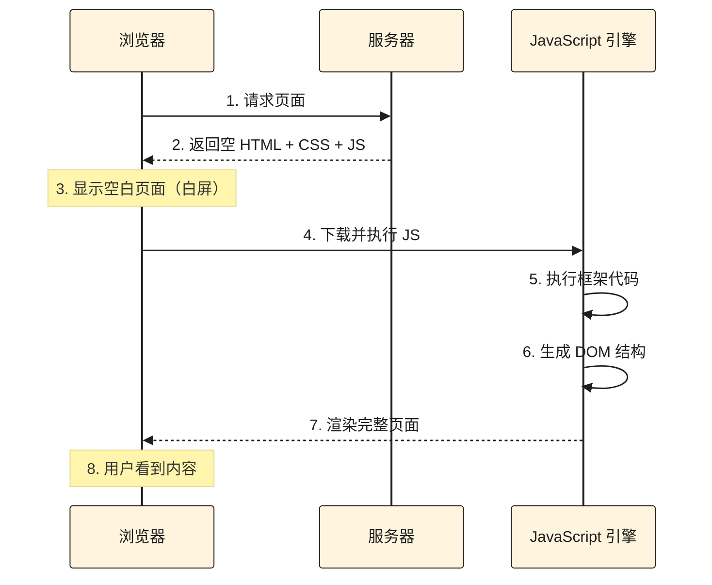
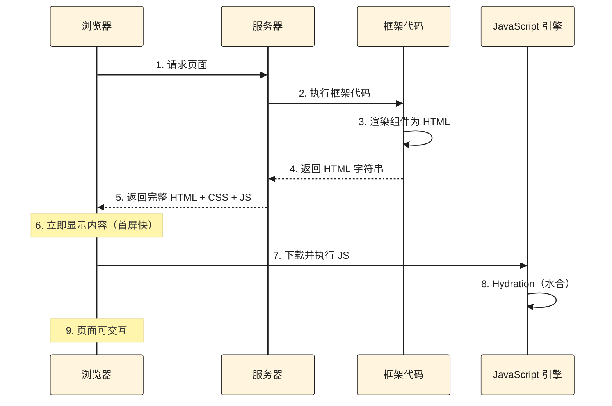
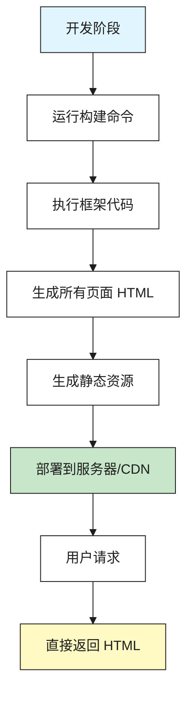
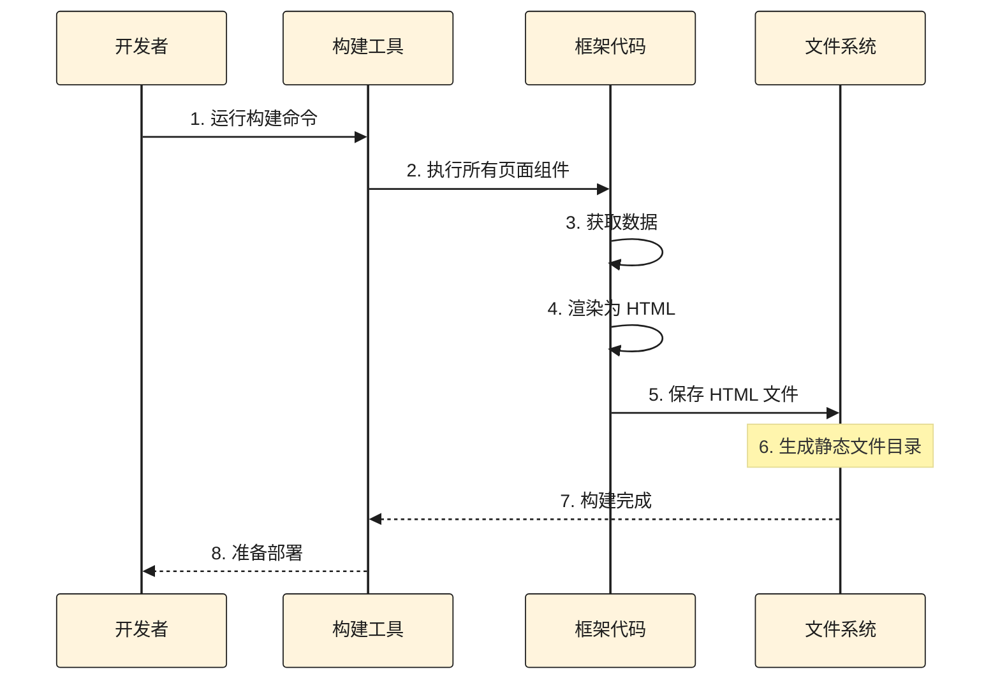
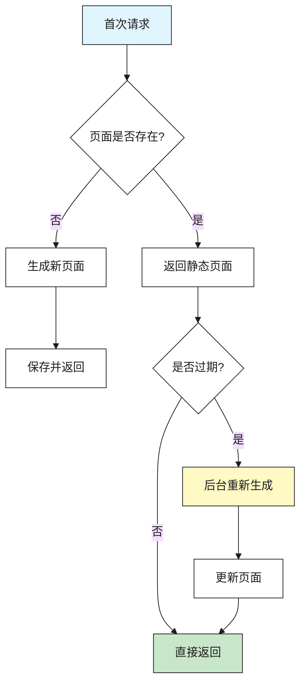
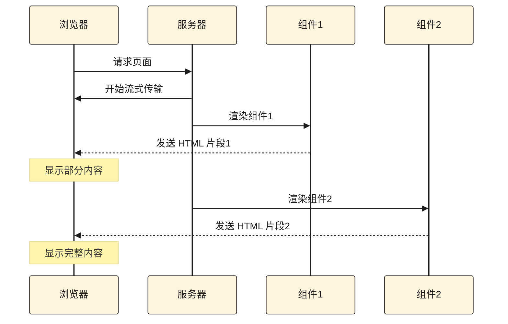
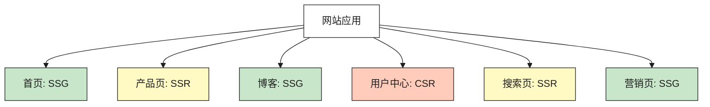

# 前端渲染模式：CSR、SSR 和 SSG

## 概述

在现代前端开发中，选择合适的渲染模式对应用的性能、SEO 和用户体验至关重要。不同的渲染模式适用于不同的场景，理解它们的工作原理和特点，能够帮助我们做出更好的技术决策。

### 三种渲染模式概览

- **CSR（Client-Side Rendering）** - 客户端渲染：在浏览器中执行 JavaScript 生成页面内容
- **SSR（Server-Side Rendering）** - 服务器渲染：在服务器端执行代码生成 HTML，然后发送给客户端
- **SSG（Static Site Generation）** - 静态站点生成：在构建时预先生成所有页面的 HTML 文件

### 为什么需要了解不同的渲染模式

不同的渲染模式在以下方面有显著差异：

- **首屏加载时间**：影响用户首次看到内容的速度
- **SEO 友好性**：影响搜索引擎对内容的索引
- **服务器压力**：影响服务器的计算和资源消耗
- **开发复杂度**：影响开发和维护的难度
- **内容更新频率**：影响内容更新的灵活性

::: tip 核心理解
选择渲染模式不是非此即彼的选择，现代框架（如 Next.js）支持混合使用多种渲染模式，根据页面的实际需求选择最合适的方案。
:::

## CSR（客户端渲染）

CSR（Client-Side Rendering）是最传统的单页应用（SPA）渲染方式，所有页面内容都在浏览器中通过 JavaScript 动态生成。

### 核心概念

CSR 的工作流程是：浏览器请求服务器 → 服务器返回 HTML/CSS 资源和 JavaScript 文件 → JavaScript 在浏览器中执行生成 DOM → 浏览器渲染 DOM。

### 工作流程



### 特点

#### 初始 HTML 结构

CSR 应用的初始 HTML 通常是空的或只有基本结构：

```html
<!DOCTYPE html>
<html>
  <head>
    <title>我的应用</title>
    <link rel="stylesheet" href="/styles.css">
  </head>
  <body>
    <div id="root"></div>
    <script src="/app.js"></script>
  </body>
</html>
```

`<div id="root"></div>` 是 React 等框架挂载应用的容器，初始时是空的。

#### JavaScript 执行过程

```jsx
// React 应用示例
import React from 'react'
import ReactDOM from 'react-dom/client'
import App from './App'

// JavaScript 执行后才会生成 DOM
const root = ReactDOM.createRoot(document.getElementById('root'))
root.render(<App />)
```

#### 首屏加载特点

1. **白屏时间长**：需要等待 JavaScript bundle 下载和执行
2. **内容逐步显示**：JavaScript 执行完成后才能看到内容
3. **交互延迟**：在 JavaScript 加载完成前，页面无法交互

### 优点

- **开发简单**：不需要服务器端配置，纯前端开发
- **交互丰富**：客户端可以快速响应用户操作，无需服务器往返
- **服务器压力小**：服务器只提供静态文件，不进行动态计算
- **缓存友好**：静态资源可以被 CDN 和浏览器缓存

### 缺点

- **首屏加载慢**：需要下载和执行 JavaScript 才能看到内容
- **SEO 不友好**：搜索引擎爬虫可能无法正确索引动态生成的内容
- **对低性能设备不友好**：JavaScript 执行需要消耗客户端计算资源
- **初始白屏**：在 JavaScript 加载期间用户看到空白页面

### 适用场景

- **后台管理系统**：不需要 SEO，交互复杂
- **单页应用（SPA）**：内容主要由用户交互驱动
- **需要丰富交互的应用**：如游戏、数据可视化等
- **内容不依赖搜索引擎的场景**

### 代码示例

#### React CSR 应用

```jsx
// App.jsx
import { useState, useEffect } from 'react'

function App() {
  const [data, setData] = useState(null)
  const [loading, setLoading] = useState(true)

  useEffect(() => {
    // 客户端获取数据
    fetch('/api/data')
      .then(res => res.json())
      .then(data => {
        setData(data)
        setLoading(false)
      })
  }, [])

  if (loading) {
    return <div>加载中...</div>
  }

  return (
    <div>
      <h1>我的应用</h1>
      <p>{data?.message}</p>
    </div>
  )
}

export default App
```

```jsx
// index.jsx
import React from 'react'
import ReactDOM from 'react-dom/client'
import App from './App'

// 在浏览器中渲染
const root = ReactDOM.createRoot(document.getElementById('root'))
root.render(<App />)
```

### 性能考虑

- **代码分割**：使用动态导入减少初始 bundle 大小
- **懒加载**：延迟加载非关键资源
- **预加载**：使用 `<link rel="preload">` 预加载关键资源
- **压缩优化**：压缩 JavaScript 和 CSS 文件

## SSR（服务器渲染）

SSR（Server-Side Rendering）是在服务器端执行框架代码生成 HTML，然后将完整的 HTML 发送给客户端。

### 核心概念

SSR 的工作流程是：浏览器请求服务器 → 服务器执行 React/Vue 等框架代码生成 HTML → 服务器返回包含内容的 HTML 和 CSS 资源 → 浏览器解析并显示 → 浏览器执行 JavaScript 进行 Hydration（水合）。

::: warning 重要修正
SSR 不是"服务器在内部 API 执行 JS"，而是服务器执行 React/Vue 等框架代码，将组件渲染成 HTML 字符串。
:::

### 工作流程



### 特点

#### 服务器端渲染

服务器执行框架代码，生成包含内容的 HTML：

```jsx
// 服务器端代码（Node.js + React）
import React from 'react'
import { renderToString } from 'react-dom/server'
import App from './App'

function handleRequest(req, res) {
  // 在服务器端渲染组件
  const html = renderToString(<App />)
  
  // 返回完整的 HTML
  res.send(`
    <!DOCTYPE html>
    <html>
      <head><title>我的应用</title></head>
      <body>
        <div id="root">${html}</div>
        <script src="/app.js"></script>
      </body>
    </html>
  `)
}
```

#### Hydration（水合）过程

浏览器接收到 HTML 后，还需要执行 JavaScript 进行"水合"：

```jsx
// 客户端代码
import React from 'react'
import ReactDOM from 'react-dom/client'
import App from './App'

// Hydration：将事件处理器附加到已有的 DOM 上
const root = ReactDOM.hydrateRoot(
  document.getElementById('root'),
  <App />
)
```

**Hydration 的作用：**
- 将事件处理器附加到服务器渲染的 DOM 上
- 使页面可以响应用户交互
- 恢复组件的状态和生命周期

::: tip 理解 Hydration
Hydration 就像给已经建好的房子（服务器渲染的 HTML）通上水电（JavaScript 交互功能），让房子可以正常使用。
:::

### 优点

- **首屏加载快**：用户立即看到内容，无需等待 JavaScript 执行
- **SEO 友好**：搜索引擎可以直接索引 HTML 内容
- **对低性能设备友好**：服务器完成渲染，减少客户端计算
- **更好的用户体验**：减少白屏时间

### 缺点

- **服务器压力大**：每次请求都需要服务器执行渲染
- **TTFB（Time To First Byte）可能较长**：服务器需要时间生成 HTML
- **开发复杂度高**：需要配置服务器端环境
- **需要 Node.js 服务器**：不能部署到纯静态托管

### 适用场景

- **内容驱动的网站**：博客、新闻、电商产品页
- **需要 SEO 的应用**：公开网站、营销页面
- **首屏性能要求高的应用**：需要快速展示内容
- **需要服务端数据预取**：在服务器端获取数据后渲染

### 代码示例

#### Next.js SSR 示例

```jsx
// pages/product/[id].js (Pages Router)
export async function getServerSideProps(context) {
  const { id } = context.params
  
  // 在服务器端获取数据
  const product = await fetchProduct(id)
  
  return {
    props: {
      product
    }
  }
}

export default function ProductPage({ product }) {
  return (
    <div>
      <h1>{product.name}</h1>
      <p>{product.description}</p>
      <p>价格: ¥{product.price}</p>
    </div>
  )
}
```

#### App Router SSR 示例

```tsx
// app/product/[id]/page.tsx
async function ProductPage({ params }: { params: { id: string } }) {
  // 在服务器端获取数据（默认是 Server Component）
  const product = await fetchProduct(params.id)
  
  return (
    <div>
      <h1>{product.name}</h1>
      <p>{product.description}</p>
      <p>价格: ¥{product.price}</p>
    </div>
  )
}

export default ProductPage
```

### 性能考虑

- **缓存策略**：对不经常变化的内容进行缓存
- **流式渲染**：使用 Streaming SSR 逐步发送内容
- **代码分割**：减少客户端 JavaScript bundle 大小
- **CDN 加速**：使用 CDN 加速静态资源

## SSG（静态站点生成）

SSG（Static Site Generation）是在构建时预先生成所有页面的 HTML 文件，部署时是纯静态资源。

### 核心概念

SSG 的工作流程是：构建时执行框架代码生成所有页面的 HTML → 部署纯静态文件 → 用户请求时直接返回预生成的 HTML。

::: tip 关键理解
SSG 是在**构建时**生成，不是运行时生成。所有页面在部署前就已经是完整的 HTML 文件了。
:::

### 工作流程



### 构建时生成流程



### 特点

#### 构建时生成

所有页面在构建时就已经生成：

```jsx
// Next.js SSG 示例
export async function getStaticProps() {
  // 构建时获取数据
  const posts = await fetchAllPosts()
  
  return {
    props: {
      posts
    }
  }
}

export default function BlogPage({ posts }) {
  return (
    <div>
      <h1>博客列表</h1>
      {posts.map(post => (
        <article key={post.id}>
          <h2>{post.title}</h2>
          <p>{post.excerpt}</p>
        </article>
      ))}
    </div>
  )
}
```

构建完成后，这个页面已经是完整的 HTML 文件，可以直接访问。

#### 静态文件结构

```
dist/
├── index.html          # 首页（已生成）
├── about.html          # 关于页（已生成）
├── blog/
│   ├── post-1.html     # 文章1（已生成）
│   ├── post-2.html     # 文章2（已生成）
│   └── ...
└── assets/
    ├── app.js
    └── styles.css
```

### 优点

- **访问速度快**：直接返回 HTML，无需服务器计算
- **SEO 友好**：搜索引擎可以直接索引静态 HTML
- **服务器压力小**：只需提供静态文件，可以部署到 CDN
- **成本低**：可以使用免费的静态托管服务
- **安全性高**：没有服务器端代码执行，减少攻击面

### 缺点

- **内容更新需要重新构建**：每次内容变化都需要重新构建和部署
- **不适合频繁更新的内容**：如实时数据、用户个性化内容
- **构建时间长**：如果页面很多，构建时间会很长
- **不适合动态路由**：无法根据用户请求动态生成页面

### 适用场景

- **博客和文档站点**：内容相对固定，更新频率低
- **营销页面**：产品介绍、公司官网
- **文档网站**：API 文档、技术文档
- **内容不频繁变化的网站**

### 代码示例

#### Next.js SSG 示例

```jsx
// pages/blog/[slug].js
export async function getStaticPaths() {
  // 构建时获取所有文章路径
  const posts = await getAllPosts()
  
  return {
    paths: posts.map(post => ({
      params: { slug: post.slug }
    })),
    fallback: false // 或 'blocking' 或 true
  }
}

export async function getStaticProps({ params }) {
  // 构建时获取文章数据
  const post = await getPostBySlug(params.slug)
  
  return {
    props: {
      post
    }
  }
}

export default function BlogPost({ post }) {
  return (
    <article>
      <h1>{post.title}</h1>
      <div dangerouslySetInnerHTML={{ __html: post.content }} />
    </article>
  )
}
```

#### App Router SSG 示例

```tsx
// app/blog/[slug]/page.tsx
// 默认就是 SSG（如果没有使用动态函数）

async function BlogPost({ params }: { params: { slug: string } }) {
  // 构建时获取数据
  const post = await getPostBySlug(params.slug)
  
  return (
    <article>
      <h1>{post.title}</h1>
      <div dangerouslySetInnerHTML={{ __html: post.content }} />
    </article>
  )
}

// 生成静态路径
export async function generateStaticParams() {
  const posts = await getAllPosts()
  return posts.map(post => ({
    slug: post.slug
  }))
}

export default BlogPost
```

### 性能考虑

- **预渲染关键页面**：优先生成访问量大的页面
- **增量构建**：只重新构建变化的页面
- **CDN 部署**：使用 CDN 加速静态资源访问
- **缓存策略**：设置合适的缓存头

## 三种模式对比

### 综合对比表

| 特性 | CSR | SSR | SSG |
|------|-----|-----|-----|
| **首屏加载** | 慢（需等待 JS） | 快（立即显示 HTML） | 最快（直接返回 HTML） |
| **SEO 友好性** | 不友好 | 友好 | 最友好 |
| **服务器压力** | 小（静态文件） | 大（每次请求渲染） | 最小（纯静态） |
| **内容更新** | 实时 | 实时 | 需重新构建 |
| **开发复杂度** | 低 | 高 | 中 |
| **适用场景** | SPA、后台系统 | 内容驱动网站 | 博客、文档站 |
| **部署要求** | 静态托管 | Node.js 服务器 | 静态托管 |
| **TTFB** | 快 | 可能较慢 | 最快 |
| **交互响应** | 快 | 需 Hydration | 需 Hydration |
| **构建时间** | 短 | 无构建 | 可能较长 |

### 首屏加载时间对比

```mermaid
%%{init: {'theme':'base', 'themeVariables': {'primaryTextColor':'#1e1e1e', 'primaryBorderColor':'#1e1e1e', 'lineColor':'#1e1e1e', 'secondaryTextColor':'#1e1e1e', 'tertiaryTextColor':'#1e1e1e'}}}%%
gantt
    title 首屏加载时间对比
    dateFormat X
    axisFormat %Ls
    
    section CSR
    下载 HTML/CSS/JS    :0, 2000
    执行 JS 生成 DOM    :2000, 3000
    渲染完成           :5000, 1000
    
    section SSR
    服务器渲染 HTML     :0, 1000
    下载 HTML/CSS       :1000, 500
    显示内容           :1500, 0
    下载并执行 JS      :1500, 2000
    Hydration 完成     :3500, 500
    
    section SSG
    下载 HTML/CSS       :0, 300
    显示内容           :300, 0
    下载并执行 JS      :300, 1500
    Hydration 完成     :1800, 200
```



### 选择建议

#### 使用 CSR 的场景

- 不需要 SEO 的应用（如后台管理系统）
- 交互复杂、需要丰富客户端逻辑
- 内容主要由用户操作驱动
- 可以接受首屏加载时间

#### 使用 SSR 的场景

- 需要 SEO 的内容驱动网站
- 内容需要实时更新
- 首屏性能要求高
- 有服务器资源支持

#### 使用 SSG 的场景

- 内容相对固定的网站（博客、文档）
- 需要最佳性能和 SEO
- 希望使用 CDN 和静态托管
- 内容更新频率低

### 混合使用场景

现代框架（如 Next.js）支持在同一应用中使用多种渲染模式：

```tsx
// Next.js App Router 示例

// SSG：首页（构建时生成）
// app/page.tsx
export default function HomePage() {
  return <div>首页内容</div>
}

// SSR：产品页（每次请求时生成）
// app/product/[id]/page.tsx
export const dynamic = 'force-dynamic'
export default async function ProductPage({ params }) {
  const product = await fetchProduct(params.id)
  return <div>{product.name}</div>
}

// CSR：用户仪表板（客户端渲染）
// app/dashboard/page.tsx
'use client'
export default function DashboardPage() {
  const [data, setData] = useState(null)
  // 客户端获取数据
  return <div>仪表板</div>
}
```

## 实际应用

### Next.js 中的实现

Next.js 提供了灵活的渲染模式选择：

#### Pages Router

```jsx
// CSR：默认客户端渲染
export default function Page() {
  return <div>客户端渲染</div>
}

// SSR：使用 getServerSideProps
export async function getServerSideProps() {
  return { props: {} }
}

// SSG：使用 getStaticProps
export async function getStaticProps() {
  return { props: {} }
}
```

#### App Router

```tsx
// SSG：默认静态生成（Server Component）
async function Page() {
  const data = await fetchData()
  return <div>{data}</div>
}

// SSR：使用 dynamic = 'force-dynamic'
export const dynamic = 'force-dynamic'
async function Page() {
  const data = await fetchData()
  return <div>{data}</div>
}

// CSR：使用 'use client'
'use client'
export default function Page() {
  return <div>客户端渲染</div>
}
```

### React 中的实现

#### 纯 CSR（Create React App）

```jsx
// 默认就是 CSR
import React from 'react'
import ReactDOM from 'react-dom/client'
import App from './App'

const root = ReactDOM.createRoot(document.getElementById('root'))
root.render(<App />)
```

#### 手动 SSR

```jsx
// 服务器端
import React from 'react'
import { renderToString } from 'react-dom/server'
import App from './App'

function renderApp(req, res) {
  const html = renderToString(<App />)
  res.send(`<div id="root">${html}</div>`)
}

// 客户端
import React from 'react'
import { hydrateRoot } from 'react-dom/client'
import App from './App'

hydrateRoot(document.getElementById('root'), <App />)
```

### Vue 中的实现

#### Nuxt.js（类似 Next.js）

```vue
<!-- SSR：默认服务器渲染 -->
<template>
  <div>{{ data }}</div>
</template>

<script setup>
const { data } = await useFetch('/api/data')
</script>
```

```vue
<!-- SSG：使用 generate -->
<script setup>
definePageMeta({
  static: true
})
</script>
```

### 如何选择合适的模式

1. **分析页面需求**
   - 是否需要 SEO？
   - 内容更新频率如何？
   - 是否需要用户个性化？

2. **考虑性能要求**
   - 首屏加载时间要求
   - 服务器资源限制
   - 用户设备性能

3. **评估开发成本**
   - 团队技术栈
   - 开发时间
   - 维护复杂度

4. **混合使用**
   - 不同页面使用不同模式
   - 利用框架的灵活性

## 进阶内容

### ISR（增量静态再生）

ISR（Incremental Static Regeneration）是 SSG 的增强版，允许在构建后重新生成页面。

#### 工作原理



#### Next.js ISR 示例

```jsx
// pages/blog/[slug].js
export async function getStaticProps({ params }) {
  const post = await getPostBySlug(params.slug)
  
  return {
    props: { post },
    // 60 秒后重新生成
    revalidate: 60
  }
}

export async function getStaticPaths() {
  return {
    paths: [],
    // 按需生成页面
    fallback: 'blocking'
  }
}
```

**ISR 的优势：**
- 结合了 SSG 的性能和 SSR 的灵活性
- 可以处理大量页面而无需全部预生成
- 内容可以定期更新而无需重新构建整个站点

### Streaming SSR

流式 SSR 允许服务器逐步发送 HTML，而不是等待整个页面渲染完成。

#### 工作原理



#### React 18 Streaming SSR

```tsx
import { renderToPipeableStream } from 'react-dom/server'

function handleRequest(req, res) {
  const { pipe } = renderToPipeableStream(<App />, {
    onShellReady() {
      // 开始流式传输
      res.setHeader('Content-Type', 'text/html')
      pipe(res)
    }
  })
}
```

**Streaming SSR 的优势：**
- 减少 TTFB（Time To First Byte）
- 用户可以更快看到内容
- 提升感知性能

### 混合渲染策略

在实际项目中，可以根据不同页面的需求，混合使用多种渲染模式：



**电商网站示例：**
- **首页、产品列表页**：使用 SSG，内容相对固定，需要最佳性能
- **产品详情页**：使用 SSR，需要 SEO 和实时数据
- **购物车、用户中心**：使用 CSR，不需要 SEO，交互复杂
- **搜索结果页**：使用 SSR，需要 SEO 和动态内容
- **营销活动页**：使用 SSG，内容固定，需要快速加载

**Next.js 混合渲染示例：**

```tsx
// app/page.tsx - SSG（默认）
export default function HomePage() {
  return <div>首页内容</div>
}

// app/product/[id]/page.tsx - SSR
export const dynamic = 'force-dynamic'
export default async function ProductPage({ params }) {
  const product = await fetchProduct(params.id)
  return <div>{product.name}</div>
}

// app/dashboard/page.tsx - CSR
'use client'
export default function DashboardPage() {
  const [data, setData] = useState(null)
  useEffect(() => {
    fetch('/api/data').then(res => res.json()).then(setData)
  }, [])
  return <div>仪表板</div>
}
```

## 最佳实践

### 性能优化建议

#### CSR 性能优化

1. **代码分割**
   ```jsx
   // 使用动态导入分割代码
   const HeavyComponent = lazy(() => import('./HeavyComponent'))
   
   function App() {
     return (
       <Suspense fallback={<div>加载中...</div>}>
         <HeavyComponent />
       </Suspense>
     )
   }
   ```

2. **资源预加载**
   ```html
   <link rel="preload" href="/critical.css" as="style">
   <link rel="preload" href="/app.js" as="script">
   ```

3. **懒加载非关键资源**
   ```jsx
   // 图片懒加载
   
   ```

#### SSR 性能优化

1. **缓存策略**
   ```tsx
   // Next.js 缓存示例
   export async function getServerSideProps() {
     const data = await fetch('https://api.example.com/data', {
       next: { revalidate: 3600 } // 缓存1小时
     })
     return { props: { data } }
   }
   ```

2. **流式渲染**
   ```tsx
   // 使用 Suspense 实现流式渲染
   export default function Page() {
     return (
       <div>
         <Header />
         <Suspense fallback={<Skeleton />}>
           <SlowComponent />
         </Suspense>
       </div>
     )
   }
   ```

3. **选择性 Hydration**
   ```tsx
   // 只对需要交互的部分进行水合
   'use client'
   export default function InteractiveComponent() {
     // 只有这个组件需要客户端 JavaScript
     return <button onClick={handleClick}>点击</button>
   }
   ```

#### SSG 性能优化

1. **增量构建**
   ```tsx
   // 只重新构建变化的页面
   export async function getStaticProps() {
     return {
       props: { data },
       revalidate: 60 // ISR：60秒后重新生成
     }
   }
   ```

2. **CDN 部署**
   - 将静态文件部署到 CDN
   - 利用 CDN 的全球节点加速访问
   - 设置合适的缓存策略

3. **资源优化**
   - 压缩 HTML、CSS、JavaScript
   - 使用现代图片格式（WebP、AVIF）
   - 启用 Gzip/Brotli 压缩

### SEO 优化建议

1. **使用 SSR 或 SSG**
   - 确保搜索引擎可以读取 HTML 内容
   - 避免纯 CSR 用于需要 SEO 的页面

2. **正确的 HTML 结构**
   ```html
   <!-- 使用语义化标签 -->
   <article>
     <header>
       <h1>文章标题</h1>
       <time datetime="2024-01-01">2024年1月1日</time>
     </header>
     <main>
       <p>文章内容</p>
     </main>
   </article>
   ```

3. **Meta 标签优化**
   ```tsx
   // Next.js 示例
   export const metadata = {
     title: '页面标题',
     description: '页面描述',
     keywords: '关键词1, 关键词2',
     openGraph: {
       title: '分享标题',
       description: '分享描述',
       images: ['/og-image.jpg']
     }
   }
   ```

4. **结构化数据**
   ```json
   {
     "@context": "https://schema.org",
     "@type": "Article",
     "headline": "文章标题",
     "author": {
       "@type": "Person",
       "name": "作者名"
     }
   }
   ```

5. **Sitemap 和 Robots.txt**
   - 生成并提交 sitemap.xml
   - 配置 robots.txt 指导搜索引擎爬虫

### 开发体验建议

1. **选择合适的框架**
   - Next.js：支持所有渲染模式，开箱即用
   - Remix：专注于 SSR 和 Web 标准
   - Gatsby：专注于 SSG
   - Vite：快速开发，适合 CSR

2. **开发环境一致性**
   ```json
   // package.json
   {
     "scripts": {
       "dev": "next dev", // 开发环境使用 SSR
       "build": "next build", // 生产环境构建
       "start": "next start" // 生产环境运行
     }
   }
   ```

3. **错误处理**
   ```tsx
   // 服务器端错误处理
   try {
     const data = await fetchData()
   } catch (error) {
     // 记录错误并返回错误页面
     return <ErrorPage />
   }
   
   // 客户端错误处理
   'use client'
   export default function Component() {
     useEffect(() => {
       fetchData().catch(error => {
         // 处理错误
         console.error(error)
       })
     }, [])
   }
   ```

4. **类型安全**
   ```tsx
   // 使用 TypeScript 确保类型安全
   interface PageProps {
     data: {
       title: string
       content: string
     }
   }
   
   export default function Page({ data }: PageProps) {
     return <div>{data.title}</div>
   }
   ```

5. **测试策略**
   - 单元测试：测试组件逻辑
   - 集成测试：测试渲染流程
   - E2E 测试：测试完整用户体验

## 常见问题

### Q: CSR 和 SPA 有什么区别？

A: CSR（客户端渲染）是一种渲染模式，SPA（单页应用）是一种应用架构。SPA 通常使用 CSR，但 CSR 也可以用于多页应用。SPA 的特点是整个应用只有一个 HTML 页面，通过 JavaScript 动态更新内容，无需整页刷新。

### Q: SSR 一定要用 Node.js 吗？

A: 不一定。虽然 React、Vue 等框架通常需要 Node.js 环境，但也有其他实现方式：
- **PHP**：可以使用 ReactPHP 或直接输出 HTML
- **Python**：可以使用 Django、Flask 等框架
- **Go**：可以使用模板引擎生成 HTML

不过，使用 Node.js 可以复用前端代码，开发体验更好。

### Q: SSG 适合动态内容吗？

A: 不太适合。SSG 在构建时生成页面，如果内容频繁变化，需要频繁重新构建。对于动态内容，应该使用：
- **SSR**：每次请求时生成
- **CSR**：客户端获取数据
- **ISR**：结合 SSG 和 SSR 的优势，定期重新生成

### Q: 可以同时使用多种渲染模式吗？

A: 可以。现代框架（如 Next.js）支持在同一个应用中混合使用不同的渲染模式。可以根据不同页面的需求选择最合适的模式：
- 首页、营销页：SSG
- 产品页、内容页：SSR
- 用户中心、仪表板：CSR

### Q: Hydration 是什么？为什么需要？

A: Hydration（水合）是 SSR 中的关键过程。服务器已经生成了 HTML，但这是"静态"的 HTML，没有事件监听器，无法交互。Hydration 就是让客户端 JavaScript"激活"这些 HTML，绑定事件监听器，使页面具有交互能力。

**为什么需要：**
- 服务器生成的 HTML 是静态的，没有 JavaScript 功能
- 需要客户端 JavaScript 来添加交互能力
- Hydration 将服务器 HTML 和客户端 JavaScript 连接起来

### Q: 如何选择渲染模式？

A: 选择渲染模式需要考虑多个因素：

**选择 CSR 的情况：**
- 不需要 SEO
- 交互复杂，需要丰富客户端逻辑
- 内容主要由用户操作驱动
- 可以接受首屏加载时间

**选择 SSR 的情况：**
- 需要 SEO 优化
- 内容需要实时更新
- 首屏性能要求高
- 有服务器资源支持

**选择 SSG 的情况：**
- 内容相对固定
- 需要最佳性能和 SEO
- 希望使用 CDN 和静态托管
- 内容更新频率低

### Q: ISR 和 SSR 有什么区别？

A: 
- **ISR**：是 SSG 的增强版本，在构建时生成页面，但可以在后台重新生成。首次请求返回静态页面，如果内容过期，在后台重新生成，下次请求返回新页面。
- **SSR**：是每次请求时在服务器端渲染。每次请求都会执行渲染逻辑。

**ISR 的优势：**
- 结合了 SSG 的性能和 SSR 的灵活性
- 可以处理大量页面而无需全部预生成
- 内容可以定期更新而无需重新构建整个站点

### Q: Streaming SSR 有什么优势？

A: Streaming SSR 的优势包括：
- **减少 TTFB**：不需要等待整个页面渲染完成就可以开始发送
- **更快的首屏**：用户可以更快看到内容
- **更好的用户体验**：逐步显示内容，而不是等待全部完成
- **提升感知性能**：即使总时间相同，用户感觉更快

### Q: 如何优化 CSR 的首屏加载？

A: 优化 CSR 首屏加载的方法：
1. **代码分割**：使用动态导入减少初始 bundle
2. **预加载关键资源**：使用 `<link rel="preload">`
3. **服务端渲染关键内容**：使用 SSR 渲染首屏，后续使用 CSR
4. **优化 JavaScript 体积**：压缩、Tree Shaking
5. **使用 CDN**：加速资源加载

### Q: SSR 的服务器压力如何缓解？

A: 缓解 SSR 服务器压力的方法：
1. **缓存策略**：对不经常变化的内容进行缓存
2. **CDN 缓存**：使用 CDN 缓存 HTML 响应
3. **流式渲染**：使用 Streaming SSR 减少服务器处理时间
4. **选择性 SSR**：只对需要 SSR 的页面使用，其他使用 SSG 或 CSR
5. **负载均衡**：使用多台服务器分担压力

### Q: SSG 构建时间过长怎么办？

A: 解决 SSG 构建时间过长的方法：
1. **增量构建**：只重新构建变化的页面
2. **并行构建**：使用多进程并行生成页面
3. **按需生成**：使用 ISR 按需生成页面
4. **分阶段构建**：优先构建重要页面
5. **优化数据获取**：减少数据获取时间

## 参考链接

- [Next.js 渲染模式文档](https://nextjs.org/docs/app/building-your-application/rendering)
- [React 服务器组件](https://react.dev/blog/2023/03/22/react-labs-what-we-have-been-working-on-march-2023#react-server-components)
- [Vue SSR 指南](https://vuejs.org/guide/scaling-up/ssr.html)
- [Web.dev - 渲染性能](https://web.dev/rendering-performance/)
- [MDN - 客户端渲染 vs 服务器端渲染](https://developer.mozilla.org/en-US/docs/Web/Performance/Server-side_rendering)
- [Next.js ISR 文档](https://nextjs.org/docs/app/building-your-application/data-fetching/incremental-static-regeneration)