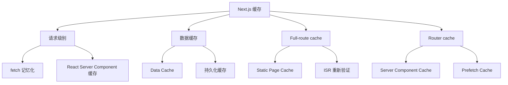
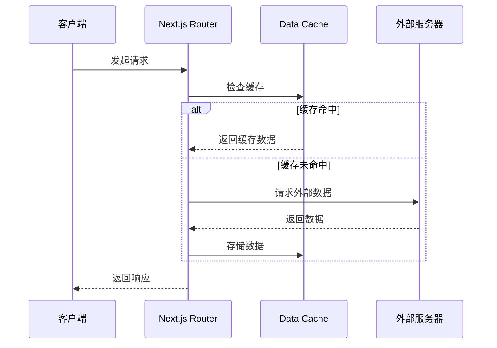

# Next.js 缓存机制

Next.js 提供了多层缓存机制，本文详细解释各种缓存类型及其配置方式。

## 缓存类型概览



## 请求级别缓存

### fetch 记忆化

```tsx
// 相同请求自动记忆化
async function getUser(id: string) {
  const res = await fetch(`https://api.example.com/users/${id}`);
  return res.json();
}

// 多个组件调用相同请求，只会发起一次网络请求
function UserProfile({ id }: { id: string }) {
  const user = getUser(id);
  // ...
}

function UserActivity({ id }: { id: string }) {
  const user = getUser(id);  // 使用缓存
  // ...
}
```

### 使用 React cache 扩展缓存

```tsx
import { cache } from 'react';

// 扩展 fetch 记忆化
export const getUser = cache(async (id: string) => {
  const res = await fetch(`https://api.example.com/users/${id}`);
  return res.json();
});

// 跨组件、跨请求共享缓存
export async function getUserData(id: string) {
  'use cache';
  const user = await getUser(id);
  return user;
}
```

## Data Cache

### fetch 缓存选项

```tsx
// 1. 默认行为：缓存到下次部署
const defaultCache = await fetch('https://api.example.com/data');

// 2. 不缓存（动态获取）
const noStore = await fetch('https://api.example.com/data', {
  cache: 'no-store'
});

// 3. 强制静态缓存
const forceCache = await fetch('https://api.example.com/data', {
  cache: 'force-cache'
});

// 4. 增量静态再生成 (ISR)
const isr = await fetch('https://api.example.com/data', {
  next: { revalidate: 3600 }  // 1小时后重新验证
});

// 5. 按标签失效
const tagged = await fetch('https://api.example.com/data', {
  next: { tags: ['products'] }
});
```

### 标签失效

```tsx
// 标记数据
async function getProducts() {
  return fetch('https://api.example.com/products', {
    next: { tags: ['products'] }
  });
}

// 使用 API 路由失效
// app/api/revalidate/route.ts
import { revalidateTag } from 'next/cache';

export async function POST(request: Request) {
  const tag = request.nextUrl.searchParams.get('tag');
  if (tag) {
    revalidateTag(tag);
    return Response.json({ revalidated: true });
  }
  return Response.json({ revalidated: false });
}

// 调用: POST /api/revalidate?tag=products
```

## Full-route Cache

### 静态页面缓存

```tsx
// app/page.tsx - 默认为静态
export default function Page() {
  return <div>静态页面内容</div>;
}

// 如果需要动态渲染
export const dynamic = 'force-dynamic';

// 或使用特定重新验证时间
export const revalidate = 60;  // 60秒后重新生成
```

### 增量静态再生成 (ISR)

```tsx
// app/blog/[slug]/page.tsx
export const revalidate = 3600;  // 1小时重新验证

async function getBlogPost(slug: string) {
  const res = await fetch(`https://api.example.com/posts/${slug}`);
  return res.json();
}

export default async function BlogPost({ params }: { params: { slug: string } }) {
  const post = await getBlogPost(params.slug);
  return <article>{post.content}</article>;
}
```

## Router Cache

### 预获取缓存

```tsx
// 链接自动预获取
import Link from 'next/link';

function Page() {
  return (
    <Link href="/products/1">
      <a>产品详情</a>
    </Link>
  );
}

// 视口内预获取（默认启用）
<Link href="/products/1" prefetch={true} />
```

### 手动预获取

```tsx
'use client';

import { useRouter } from 'next/navigation';
import { useEffect } from 'react';

function PrefetchExample({ href }: { href: string }) {
  const router = useRouter();

  useEffect(() => {
    // 预获取但不导航
    router.prefetch(href);
  }, [href]);

  return <button onClick={() => router.push(href)}>进入</button>;
}
```

## 缓存配置

### 路由段配置

```tsx
// app/dashboard/layout.tsx

// 静态布局
export const dynamic = false;

// 每次请求重新验证
export const dynamic = 'force-dynamic';

// 使用 ISR
export const revalidate = 60;
```

### 路由组配置

```tsx
// app/(marketing)/page.tsx - 营销页面使用 ISR
export const revalidate = 3600;

// app/(dashboard)/page.tsx - 仪表板使用动态
export const dynamic = 'force-dynamic';
```

## 缓存流程图



## 最佳实践

| 场景 | 配置 |
|------|------|
| 静态内容 | 默认（缓存） |
| 频繁变化数据 | `cache: 'no-store'` |
| 半静态数据 | `revalidate: 60` |
| 实时数据 | 客户端获取 |
| 需要失效机制 | 使用 tags |

## 缓存失效方式

```tsx
// 1. 时间失效
export const revalidate = 3600;

// 2. 标签失效
await fetch('https://api.example.com/data', {
  next: { tags: ['posts'] }
});

// API 路由失效
import { revalidateTag } from 'next/cache';
revalidateTag('posts');

// 3. 路径失效
// 部署后自动失效

// 4. 手动清除
// 调用 On-Demand Revalidation
```

## 常见问题

### Q: 缓存没有生效？

A: 检查以下配置：

```tsx
// 确保不是动态路由
export const dynamic = false;

// 检查 fetch 选项
const data = await fetch(url, {
  cache: 'force-cache',  // 明确指定
  next: { revalidate: 60 }
});
```

### Q: 如何调试缓存？

A: 使用 Next.js Dev Tools：

```bash
# 启用详细日志
DEBUG=next:* npm run dev
```

### Q: 混合使用 SSR 和 ISR？

A: 可以在同一页面使用：

```tsx
// 动态获取用户信息
async function getUserData() {
  return fetch('/api/user', { cache: 'no-store' });
}

// 静态获取产品列表
async function getProducts() {
  return fetch('/api/products', { next: { revalidate: 3600 } });
}
```

## 相关资源

- [Next.js 缓存文档](https://nextjs.org/docs/app/building-your-application/caching)
- [fetch API](https://nextjs.org/docs/app/api-reference/functions/fetch)
- [revalidateTag](https://nextjs.org/docs/app/api-reference/functions/revalidateTag)
