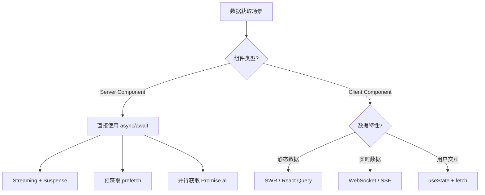

# Next.js 数据获取

Next.js App Router 提供了多种数据获取方式，本文详细介绍 Server Components 和 Client Components 中的数据获取模式。

## 数据获取策略概览



## Server Components 数据获取

### 直接 async/await

```tsx
// app/users/page.tsx
import { Suspense } from 'react';

async function getUsers() {
  const res = await fetch('https://api.example.com/users');
  if (!res.ok) throw new Error('获取用户失败');
  return res.json();
}

async function UserList() {
  const users = await getUsers();

  return (
    <ul>
      {users.map(user => (
        <li key={user.id}>{user.name}</li>
      ))}
    </ul>
  );
}

export default function Page() {
  return (
    <Suspense fallback={<div>加载用户中...</div>}>
      <UserList />
    </Suspense>
  );
}
```

### 并行数据获取

```tsx
// app/dashboard/page.tsx
async function getUsers() {
  const res = await fetch('https://api.example.com/users');
  return res.json();
}

async function getOrders() {
  const res = await fetch('https://api.example.com/orders');
  return res.json();
}

async function getProducts() {
  const res = await fetch('https://api.example.com/products');
  return res.json();
}

export default async function Page() {
  // 并行获取数据
  const [users, orders, products] = await Promise.all([
    getUsers(),
    getOrders(),
    getProducts()
  ]);

  return (
    <div>
      <Dashboard users={users} orders={orders} products={products} />
    </div>
  );
}
```

### 预获取数据

```tsx
// app/products/page.tsx
import { preload } from 'react-dom';

async function getProduct(id: string) {
  const res = await fetch(`https://api.example.com/products/${id}`);
  return res.json();
}

export default function ProductPage({ params }: { params: { id: string } }) {
  // 预获取数据
  preload(`https://api.example.com/products/${params.id}`, as: 'fetch');

  return <ProductDetails id={params.id} />;
}
```

## 数据缓存

### fetch 缓存选项

```tsx
// 默认缓存 - 缓存到下次部署
const data1 = await fetch('https://api.example.com/data');

// 不缓存 - 每次都请求
const data2 = await fetch('https://api.example.com/data', {
  cache: 'no-store'
});

// 强制动态 - 不缓存
const data3 = await fetch('https://api.example.com/data', {
  cache: 'no-store'
});

// 静态重新验证 - 每60秒重新验证
const data4 = await fetch('https://api.example.com/data', {
  next: { revalidate: 60 }
});

// 静态 - 只在构建时获取
const data5 = await fetch('https://api.example.com/data', {
  cache: 'force-cache'
});
```

### 使用 React cache 缓存函数

```tsx
import { cache } from 'react';

// 缓存数据获取函数
export const getUser = cache(async (userId: string) => {
  const res = await fetch(`https://api.example.com/users/${userId}`);
  return res.json();
});

// 在多个组件中使用，相同参数只会请求一次
function UserProfile({ userId }: { userId: string }) {
  const user = getUser(userId);
  // ...
}

function UserPosts({ userId }: { userId: string }) {
  const user = getUser(userId);  // 使用缓存
  // ...
}
```

## 客户端数据获取

### SWR（推荐用于客户端）

```tsx
'use client';

import useSWR from 'swr';

const fetcher = (url: string) => fetch(url).then(res => res.json());

function UserProfile({ userId }: { userId: string }) {
  const { data, error, isLoading } = useSWR(
    `/api/users/${userId}`,
    fetcher,
    {
      revalidateOnFocus: false,
      dedupingInterval: 5000
    }
  );

  if (isLoading) return <div>加载中...</div>;
  if (error) return <div>加载失败</div>;

  return <div>{data.name}</div>;
}
```

### TanStack Query

```tsx
'use client';

import { useQuery } from '@tanstack/react-query';

async function fetchUsers() {
  const res = await fetch('/api/users');
  return res.json();
}

function UserList() {
  const { data, isLoading, error } = useQuery({
    queryKey: ['users'],
    queryFn: fetchUsers,
    staleTime: 60000,  // 1分钟内不重新获取
    gcTime: 300000     // 5分钟后垃圾回收
  });

  if (isLoading) return <div>加载中...</div>;
  if (error) return <div>错误</div>;

  return <ul>{data.map(u => <li key={u.id}>{u.name}</li>)}</ul>;
}
```

## Streaming 与 Suspense

```tsx
// app/page.tsx
import { Suspense } from 'react';

function NewsFeed() {
  return (
    <ul>
      {/* 新闻列表 */}
    </ul>
  );
}

function RecommendedUsers() {
  return (
    <ul>
      {/* 推荐用户 */}
    </ul>
  );
}

function Weather() {
  return <div>天气信息</div>;
}

export default function Page() {
  return (
    <div className="grid grid-cols-3">
      <div className="col-span-2">
        <Suspense fallback={<div className="skeleton">加载新闻...</div>}>
          <NewsFeed />
        </Suspense>
      </div>
      <div>
        <Suspense fallback={<div className="skeleton">加载推荐...</div>}>
          <RecommendedUsers />
        </Suspense>
        <Suspense fallback={<div className="skeleton">加载天气...</div>}>
          <Weather />
        </Suspense>
      </div>
    </div>
  );
}
```

## 错误处理

```tsx
// app/products/[id]/page.tsx
import { notFound } from 'next/navigation';

async function getProduct(id: string) {
  const res = await fetch(`https://api.example.com/products/${id}`);
  if (res.status === 404) return null;
  if (!res.ok) throw new Error('获取产品失败');
  return res.json();
}

export default async function ProductPage({ params }: { params: { id: string } }) {
  const product = await getProduct(params.id);

  if (!product) {
    notFound();  // 触发 not-found.tsx
  }

  return <ProductDetails product={product} />;
}
```

## 最佳实践

| 场景 | 推荐方案 |
|------|----------|
| Server Component 数据获取 | 直接 async/await + Suspense |
| 频繁变化的数据 | fetch + no-store |
| 相对稳定的数据 | fetch + revalidate |
| 用户相关数据 | SWR / TanStack Query |
| 实时数据 | WebSocket / Server-Sent Events |
| 多个独立数据源 | Promise.all 并行获取 |

## 常见问题

### Q: 如何在客户端获取初始数据？

A: 使用 `initialData` 或服务端预获取：

```tsx
// 客户端组件
'use client';

import { useInitialData } from './use-initial-data';

function Component({ initialData }) {
  const { data } = useSWR('/api/data', fetcher, {
    fallbackData: initialData
  });
}
```

### Q: 如何处理跨请求的数据共享？

A: 使用 React cache：

```tsx
import { cache } from 'react';

export const getData = cache(async (key: string) => {
  return fetchDB(key);
});
```

### Q: 什么时候用 ISR 什么时候用 SSR？

A:
- **ISR** - 数据相对稳定，需要高性能
- **SSR** - 每个请求数据都不同，需要实时性

## 相关资源

- [Next.js 数据获取文档](https://nextjs.org/docs/app/building-your-application/data-fetching)
- [fetch API 扩展](https://nextjs.org/docs/app/api-reference/functions/fetch)
- [SWR](https://swr.vercel.app/)
- [TanStack Query](https://tanstack.com/query/latest)
