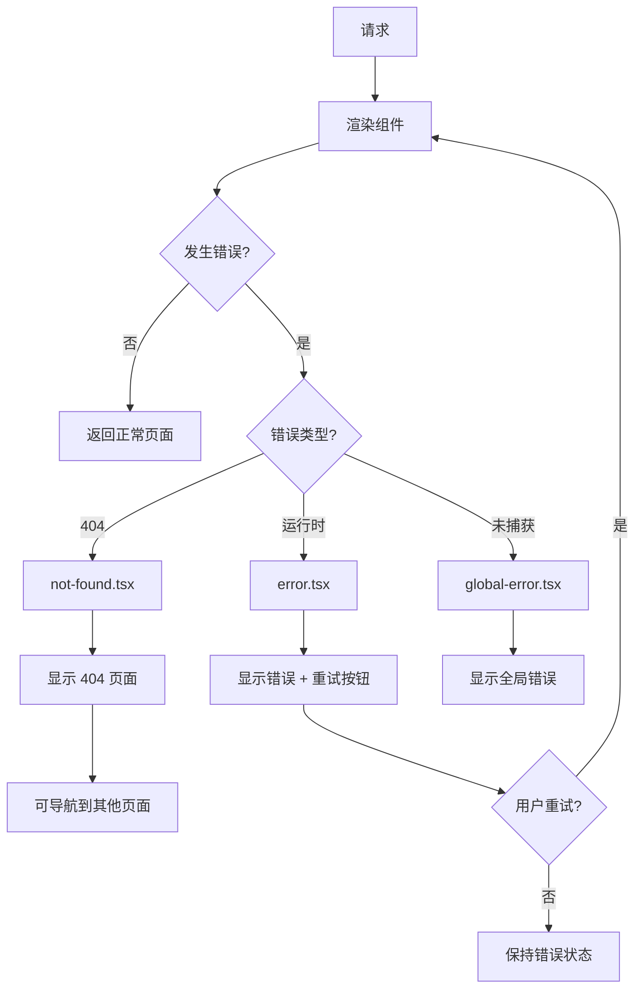

# Next.js 错误处理

Next.js 提供了优雅的错误处理机制，包括 `error.tsx`、`not-found.tsx`、全局错误边界等。

## 错误处理架构

```mermaid
flowchart TD
    A[错误发生] --> B{错误类型?}
    B -->|404| C[not-found.tsx]
    B -->|运行时错误| D[error.tsx]
    B -->|未捕获异常| E[global-error.tsx]
    B -->|redirect| F[redirect()]

    C --> G[显示 404 页面]
    D --> H[显示错误页面 + 可恢复]
    E --> I[显示错误页面 + 不可恢复]
```

## error.tsx

### 基本用法

```tsx
// app/error.tsx
'use client';

import { useEffect } from 'react';
import { ErrorResponse } from '@tanstack/react-query';

export default function Error({
  error,
  reset,
}: {
  error: ErrorResponse;
  reset: () => void;
}) {
  useEffect(() => {
    // 记录错误到监控服务
    console.error('应用错误:', error);
  }, [error]);

  return (
    <div className="error-container">
      <h2>出错了！</h2>
      <p>{error.message}</p>
      <button onClick={() => reset()}>重试</button>
    </div>
  );
}
```

### 处理不同类型错误

```tsx
// app/error.tsx
'use client';

import { useEffect } from 'react';

export default function Error({
  error,
  reset,
}: {
  error: Error & { digest?: string };
  reset: () => void;
}) {
  useEffect(() => {
    // 区分错误类型
    if (error.message.includes('fetch')) {
      console.error('数据获取错误:', error);
    } else if (error.message.includes('auth')) {
      console.error('认证错误:', error);
    }
  }, [error]);

  return (
    <div>
      <h2>出错了</h2>
      <p>{error.message}</p>
      <button onClick={() => reset()}>重试</button>
    </div>
  );
}
```

### 嵌套错误边界

```tsx
// app/dashboard/error.tsx (dashboard 专用错误页)
'use client';

export default function DashboardError({
  error,
  reset,
}: {
  error: Error;
  reset: () => void;
}) {
  return (
    <div>
      <h2>仪表板错误</h2>
      <button onClick={() => reset()}>重试</button>
    </div>
  );
}

// app/error.tsx (根级别错误页)
'use client';

export default function RootError({
  error,
  reset,
}: {
  error: Error;
  reset: () => void;
}) {
  return (
    <div>
      <h2>发生严重错误</h2>
      <button onClick={() => {
        reset();
        window.location.href = '/';
      }}>
        返回首页
      </button>
    </div>
  );
}
```

## not-found.tsx

### 基本用法

```tsx
// app/not-found.tsx
import Link from 'next/link';

export default function NotFound() {
  return (
    <div className="not-found">
      <h1>404 - 页面未找到</h1>
      <p>抱歉，您访问的页面不存在。</p>
      <Link href="/">返回首页</Link>
    </div>
  );
}
```

### 编程式触发

```tsx
// app/products/[id]/page.tsx
import { notFound } from 'next/navigation';

async function getProduct(id: string) {
  const res = await fetch(`https://api.example.com/products/${id}`);
  if (res.status === 404) return null;
  if (!res.ok) throw new Error('获取产品失败');
  return res.json();
}

export default async function ProductPage({ params }: { params: { id: string } }) {
  const product = await getProduct(params.id);

  if (!product) {
    notFound();  // 触发 not-found.tsx
  }

  return <ProductDetails product={product} />;
}
```

### 在 Server Actions 中使用

```tsx
// app/actions.ts
'use server';

import { notFound } from 'next/navigation';

export async function deleteProduct(id: string) {
  const product = await db.product.findUnique({ where: { id } });

  if (!product) {
    notFound();
  }

  await db.product.delete({ where: { id } });
  revalidatePath('/products');
}
```

## global-error.tsx

### 基本用法

```tsx
// app/global-error.tsx
'use client';

export default function GlobalError({
  error,
  reset,
}: {
  error: Error;
  reset: () => void;
}) {
  return (
    <html>
      <body>
        <div className="global-error">
          <h1>应用发生错误</h1>
          <p>{error.message}</p>
          <button onClick={() => reset()}>重试</button>
        </div>
      </body>
    </html>
  );
}
```

## 错误处理策略

### 数据获取错误

```tsx
// app/products/page.tsx
import { Suspense } from 'react';
import { ErrorBoundary } from '@/components/ErrorBoundary';

function ProductList() {
  // 数据获取逻辑
}

function ProductSkeleton() {
  return <div className="skeleton">加载中...</div>;
}

function ProductError({ error, reset }: { error: Error; reset: () => void }) {
  return (
    <div>
      <p>加载失败: {error.message}</p>
      <button onClick={reset}>重试</button>
    </div>
  );
}

export default function Page() {
  return (
    <ErrorBoundary fallback={ProductError}>
      <Suspense fallback={<ProductSkeleton />}>
        <ProductList />
      </Suspense>
    </ErrorBoundary>
  );
}
```

### API 路由错误

```tsx
// app/api/products/route.ts
import { NextResponse } from 'next/server';

export async function GET(request: Request) {
  try {
    const products = await fetchProducts();

    if (products.length === 0) {
      return NextResponse.json(
        { error: '没有找到产品' },
        { status: 404 }
      );
    }

    return NextResponse.json(products);
  } catch (error) {
    return NextResponse.json(
      { error: '服务器错误' },
      { status: 500 }
    );
  }
}
```

### 错误监控集成

```tsx
// lib/error-monitoring.ts
export function logError(error: Error, context?: Record<string, any>) {
  // 发送到错误监控服务
  console.error({
    message: error.message,
    stack: error.stack,
    context,
    timestamp: new Date().toISOString(),
  });
}

// app/error.tsx
'use client';

import { logError } from '@/lib/error-monitoring';

export default function Error({
  error,
  reset,
}: {
  error: Error & { digest?: string };
  reset: () => void;
}) {
  useEffect(() => {
    logError(error, {
      digest: error.digest,
      pathname: window?.location?.pathname,
    });
  }, [error]);

  return (
    <div>
      <h2>出错了</h2>
      <button onClick={reset}>重试</button>
    </div>
  );
}
```

## 错误处理流程图



## 常见问题

### Q: error.tsx 不生效？

A: 检查以下配置：

```tsx
// 确保 error.tsx 在正确的目录
app/
├── page.tsx      // 正常页面
├── error.tsx     // 错误边界 ← 必须和 page.tsx 同级或更高
└── layout.tsx    // 布局
```

### Q: 如何区分客户端和服务端错误？

```tsx
// error.tsx
'use client';

import { useEffect } from 'react';

export default function Error({
  error,
  reset,
}: {
  error: Error & { digest?: string };
  reset: () => void;
}) {
  useEffect(() => {
    // 服务端渲染时也能记录
    console.error('错误:', error);
  }, [error]);

  return (
    <div>
      <h2>发生错误</h2>
      <button onClick={reset}>重试</button>
    </div>
  );
}
```

### Q: 如何恢复导航？

```tsx
// app/error.tsx
'use client';

export default function Error({
  error,
  reset,
}: {
  error: Error;
  reset: () => void;
}) {
  return (
    <div>
      <h2>出错了</h2>
      <div>
        <button onClick={() => reset()}>重试</button>
        <button onClick={() => window.history.back()}>返回</button>
        <button onClick={() => (window.location.href = '/')}>首页</button>
      </div>
    </div>
  );
}
```

## 最佳实践

1. **分离错误处理** - 每个路由段可以有自己的 error.tsx
2. **提供有用信息** - 显示友好的错误信息
3. **支持重试** - 允许用户重新尝试操作
4. **记录错误** - 集成错误监控服务
5. **优雅降级** - 提供备用方案

## 相关资源

- [Next.js 错误处理文档](https://nextjs.org/docs/app/building-your-application/routing/error-handling)
- [error.tsx](https://nextjs.org/docs/app/api-reference/file-conventions/error)
- [not-found](https://nextjs.org/docs/app/api-reference/functions/not-found)
