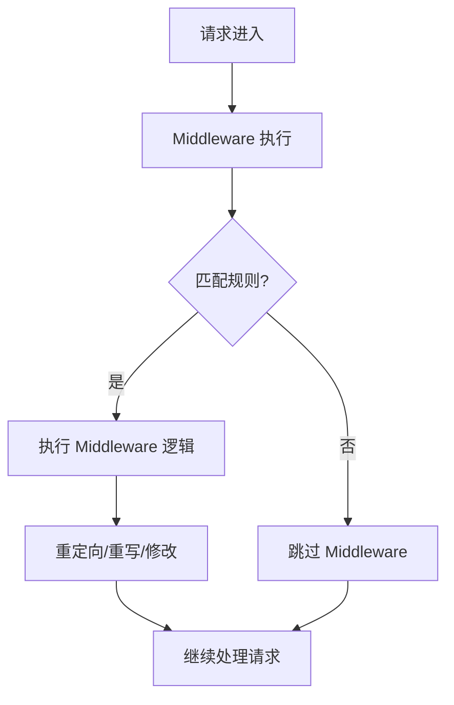

# Next.js Middleware

Middleware 允许在请求完成前运行代码，可以用于修改请求、重定向、添加响应头等。

## 概述

Middleware 在以下时机运行：

- 渲染之前
- 缓存之前
- 路由匹配之前



## 创建 Middleware

### 基本结构

```typescript
// middleware.ts (项目根目录)
import { NextResponse } from 'next/server';
import type { NextRequest } from 'next/server';

export function middleware(request: NextRequest) {
  // 检查路径
  if (request.nextUrl.pathname.startsWith('/admin')) {
    // 重定向
    return NextResponse.redirect(new URL('/login', request.url));
  }

  // 添加响应头
  const response = NextResponse.next();
  response.headers.set('x-custom-header', 'value');

  return response;
}

// 配置匹配路径
export const config = {
  matcher: [
    /*
     * 匹配所有路径除了:
     * - api 路由
     * - _next/static 文件
     * - _next/image 图片
     * - favicon.ico
     */
    '/((?!api|_next/static|_next/image|favicon.ico).*)',
  ],
};
```

### 匹配规则

```typescript
export const config = {
  // 匹配特定路径
  matcher: '/dashboard/:path*',

  // 多个路径
  matcher: ['/admin/:path*', '/user/:path*'],

  // 排除路径
  matcher: [
    /*
     * 匹配所有路径除了:
     * - /api/ (API 路由)
     * - /_next/ (Next.js 内部)
     * - /_static (静态文件)
     * - 包含 ? 的路径 (查询参数)
     * - 包含 # 的路径 (锚点)
     */
    '/((?!api|_next/static|_next/image|favicon.ico|.*\\?.*|.*\\#.*).*)',
  ],
};
```

## 常见用例

### 1. 认证保护

```typescript
// middleware.ts
import { NextResponse } from 'next/server';
import type { NextRequest } from 'next/server';

export function middleware(request: NextRequest) {
  // 检查认证 token
  const token = request.cookies.get('auth-token')?.value;

  if (!token) {
    const loginUrl = new URL('/login', request.url);
    loginUrl.searchParams.set('from', request.nextUrl.pathname);
    return NextResponse.redirect(loginUrl);
  }

  // 验证 token 有效性
  if (!isValidToken(token)) {
    const response = NextResponse.redirect(new URL('/login', request.url));
    response.cookies.delete('auth-token');
    return response;
  }

  return NextResponse.next();
}

function isValidToken(token: string): boolean {
  // token 验证逻辑
  return true;
}

export const config = {
  matcher: ['/dashboard/:path*', '/profile/:path*', '/settings/:path*'],
};
```

### 2. A/B 测试

```typescript
// middleware.ts
import { NextResponse } from 'next/server';
import type { NextRequest } from 'next/server';

export function middleware(request: NextRequest) {
  // 检查是否已有 bucket
  let bucket = request.cookies.get('ab-bucket')?.value;

  if (!bucket) {
    // 随机分配 bucket
    bucket = Math.random() < 0.5 ? 'a' : 'b';
  }

  const response = NextResponse.next();
  response.cookies.set('ab-bucket', bucket);
  response.headers.set('x-ab-bucket', bucket);

  return response;
}
```

### 3. 地理定位重定向

```typescript
// middleware.ts
import { NextResponse } from 'next/server';
import type { NextRequest } from 'next/server';

export function middleware(request: NextRequest) {
  const country = request.geo?.country || 'US';

  // 欧盟用户重定向到 GDPR 页面
  if (['DE', 'FR', 'IT', 'ES', 'PL'].includes(country)) {
    return NextResponse.redirect(
      new URL('/gdpr', request.url)
    );
  }

  return NextResponse.next();
}
```

### 4. 维护模式

```typescript
// middleware.ts
import { NextResponse } from 'next/server';
import type { NextRequest } from 'next/server';

const MAINTENANCE_MODE = process.env.MAINTENANCE_MODE === 'true';

export function middleware(request: NextRequest) {
  if (MAINTENANCE_MODE) {
    // 维护模式重定向
    if (!request.nextUrl.pathname.startsWith('/maintenance')) {
      return NextResponse.redirect(
        new URL('/maintenance', request.url)
      );
    }
  }

  return NextResponse.next();
}
```

### 5. 添加请求头

```typescript
// middleware.ts
import { NextResponse } from 'next/server';
import type { NextRequest } from 'next/server';

export function middleware(request: NextRequest) {
  const response = NextResponse.next();

  // 添加安全头
  response.headers.set('X-Frame-Options', 'DENY');
  response.headers.set('X-Content-Type-Options', 'nosniff');
  response.headers.set('Referrer-Policy', 'origin-when-cross-origin');
  response.headers.set(
    'Content-Security-Policy',
    "default-src 'self'; script-src 'self' 'unsafe-inline'"
  );

  return response;
}
```

### 6. URL 重写

```typescript
// middleware.ts
import { NextResponse } from 'next/server';
import type { NextRequest } from 'next/server';

export function middleware(request: NextRequest) {
  const url = request.nextUrl;

  // 重写路径
  if (url.pathname.startsWith('/old-path')) {
    return NextResponse.rewrite(
      new URL('/new-path' + url.pathname.slice(8), request.url)
    );
  }

  // 子域重写
  if (url.hostname.startsWith('api.')) {
    return NextResponse.rewrite(
      new URL(`/api-proxy${url.pathname}`, request.url)
    );
  }

  return NextResponse.next();
}
```

### 7. 请求限流

```typescript
// middleware.ts
import { NextResponse } from 'next/server';
import type { NextRequest } from 'next/server';

// 简单限流 - 使用内存存储（生产环境用 Redis）
const rateLimit = new Map<string, { count: number; resetTime: number }>();

export function middleware(request: NextRequest) {
  const ip = request.ip || 'unknown';
  const now = Date.now();
  const windowMs = 60 * 1000; // 1分钟窗口
  const maxRequests = 100; // 最大请求数

  const record = rateLimit.get(ip);

  if (!record || now > record.resetTime) {
    rateLimit.set(ip, { count: 1, resetTime: now + windowMs });
    return NextResponse.next();
  }

  if (record.count >= maxRequests) {
    return new NextResponse('Too Many Requests', { status: 429 });
  }

  record.count++;
  return NextResponse.next();
}
```

## 使用 Edge Runtime

```typescript
// middleware.ts
import { NextResponse } from 'next/server';
import type { NextRequest } from 'next/server';

// 默认使用 Edge Runtime
export const runtime = 'edge';

// 也可以明确指定
export const config = {
  runtime: 'edge',
};
```

## 调试 Middleware

```typescript
// 添加日志
export function middleware(request: NextRequest) {
  console.log('Middleware:', {
    pathname: request.nextUrl.pathname,
    method: request.method,
    ip: request.ip,
    ua: request.headers.get('user-agent'),
  });

  return NextResponse.next();
}
```

## 常见问题

### Q: Middleware 和 API 路由同时匹配？

A: Middleware 先执行，然后才是 API 路由：

```typescript
export function middleware(request: NextRequest) {
  // 可以阻止 API 路由
  if (request.nextUrl.pathname.startsWith('/api/admin')) {
    return NextResponse.json({ error: 'Forbidden' }, { status: 403 });
  }
  return NextResponse.next();
}
```

### Q: 如何访问请求体？

A: Middleware 无法访问请求体：

```typescript
// 不支持
export async function middleware(request: NextRequest) {
  const body = await request.json();  // ✗ 错误
}
```

### Q: Middleware 在哪些文件运行？

A: 只在项目根目录的 `middleware.ts` 文件：

```
project/
├── app/
├── public/
├── middleware.ts  ← 放在这里
├── next.config.js
└── package.json
```

### Q: 如何跳过 Middleware？

A: 使用 `x-middleware-skip` 头：

```typescript
// 在 API 路由或 Server Action 中
export async function GET(request: NextRequest) {
  const response = NextResponse.next();
  response.headers.set('x-middleware-skip', 'true');
  return response;
}
```

## 最佳实践

1. **保持轻量** - Middleware 每次请求都执行
2. **避免同步操作** - 使用 Edge Runtime
3. **正确配置 matcher** - 只匹配需要的路径
4. **处理错误** - 添加错误边界
5. **安全性** - 验证所有输入

## 相关资源

- [Next.js Middleware 文档](https://nextjs.org/docs/app/building-your-application/routing/middleware)
- [NextResponse API](https://nextjs.org/docs/app/api-reference/functions/next-response)
