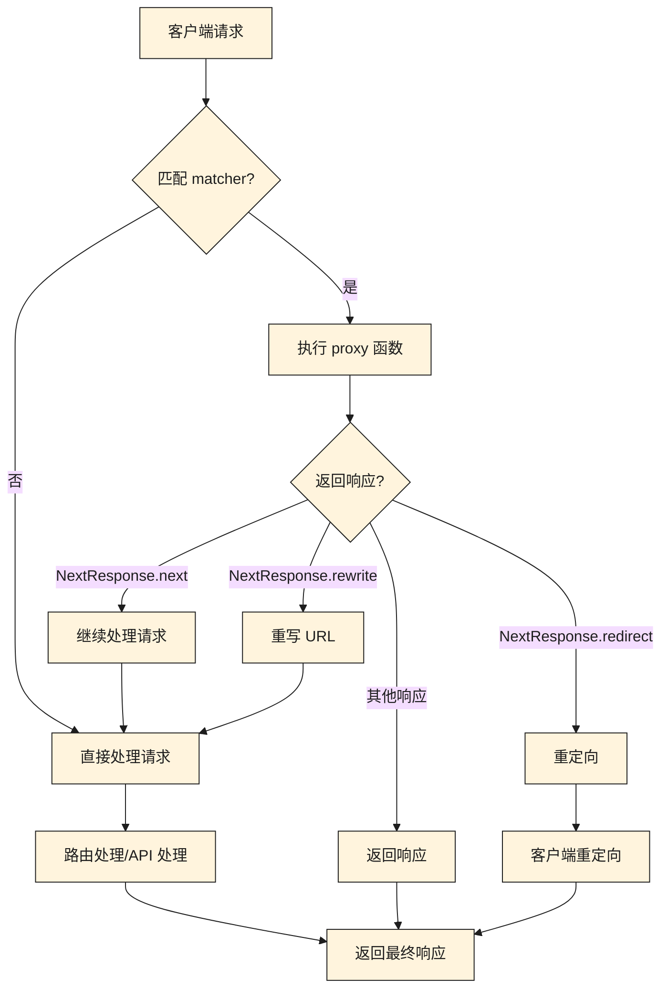

# Next.js Proxy（代理）

## 概述

从 Next.js 16 开始，原先的 `middleware`（中间件）被重命名为 `proxy`（代理），以更清晰地体现其在应用程序网络边界中的作用。`proxy` 运行在 Node.js 运行时环境中，主要用于拦截和处理传入的请求。

### 核心特点

- **请求拦截**：在请求完成之前进行拦截和处理
- **请求修改**：可以修改请求头、请求体、响应体等
- **路由控制**：支持重定向、重写、阻止请求等操作
- **运行时限制**：仅支持 Node.js 运行时，不支持 Edge 运行时

### 应用场景

`proxy` 适用于以下场景：

- **处理跨域请求**：通过设置适当的 CORS 头，允许来自不同源的请求访问资源
- **接口转发**：将特定路径的请求转发到其他服务器或服务（如 Java、Go、Python 等后端服务）
- **限流**：配合第三方服务，对请求进行限流处理
- **鉴权/判断是否登录**：在请求到达实际处理程序之前，检查用户的身份验证状态

## 基本使用

### 文件位置

`proxy.ts`（或 `proxy.js`）文件应放置在以下位置之一：

- 项目根目录：`proxy.ts`
- `src` 目录（如果项目使用 `src` 目录结构）：`src/proxy.ts`

Next.js 会自动检测并调用该文件中的 `proxy` 函数。

### 基本示例

创建一个 `proxy.ts` 文件，并导出一个名为 `proxy` 的函数：

```typescript
import { NextRequest, NextResponse } from "next/server";

export async function proxy(request: NextRequest) {
    console.log(request.url, 'url');
    return NextResponse.next();
}
```

::: warning 重要提示
`proxy` 函数必须返回一个 `NextResponse` 对象。如果不返回响应，请求将无法继续处理。
:::

### 默认行为

默认情况下，`proxy` 会拦截项目中所有的请求，包括：

- 静态资源（图片、CSS、JS 等）
- API 请求
- 页面请求
- 其他所有路由

如果只想匹配特定路径的请求，需要使用 `config` 配置（见下文）。

## 配置匹配路径

### 简单匹配

使用 `config` 对象中的 `matcher` 属性来指定 `proxy` 应该应用于哪些路径：

```typescript
import { NextRequest, NextResponse } from "next/server";

export async function proxy(request: NextRequest) {
    console.log(request.url, 'url');
    return NextResponse.next();
}

// 配置匹配路径
export const config = {
    matcher: '/api/:path*',
};
```

上述配置表示仅匹配以 `/api/` 开头的路径。

### 多个路径匹配

`matcher` 支持数组形式，可以匹配多个路径：

```typescript
export const config = {
    matcher: ['/api/:path*', '/api/user/:path*'],
};
```

### 正则表达式匹配

`matcher` 也支持正则表达式，用于更复杂的匹配规则：

```typescript
export const config = {
    matcher: ['/((?!api|_next/static|_next/image|.*\\.png$).*)'],
};
```

这个正则表达式会匹配所有路径，但排除：
- `/api` 路径
- `_next/static` 静态资源
- `_next/image` 图片优化路径
- 所有 `.png` 文件

## 复杂匹配

对于更复杂的匹配需求，可以使用对象形式的 `matcher` 配置，包含 `source`、`has` 和 `missing` 等属性：

### 配置说明

- **`source`**：表示匹配的路径模式
- **`has`**：表示匹配路径中必须包含的条件
- **`missing`**：表示匹配路径中必须不包含的条件
- **`type`**：只能匹配 `header`、`query`、`cookie` 三种类型

### 示例

```typescript
import { NextRequest, NextResponse } from "next/server";

export async function proxy(request: NextRequest) {
    console.log('start proxy');
    return NextResponse.next();
}

export const config = {
    matcher: [
        {
            source: '/home/:path*',
            // 表示匹配路径中必须包含 Authorization 头和 userId 查询参数
            has: [
                { type: 'header' as const, key: 'Authorization', value: 'Bearer 123456' },
                { type: 'query' as const, key: 'userId', value: '123' }
            ],
            // 表示匹配路径中必须不包含 token Cookie 和 userId 查询参数（值为 456）
            missing: [
                { type: 'cookie' as const, key: 'token', value: '123456' },
                { type: 'query' as const, key: 'userId', value: '456' },
            ]
        },
    ]
};
```

这个配置会匹配：
- 路径以 `/home/` 开头
- 请求头中包含 `Authorization: Bearer 123456`
- 查询参数中包含 `userId=123`
- Cookie 中不包含 `token=123456`
- 查询参数中不包含 `userId=456`

## 实际应用场景

### 1. 处理跨域请求

以下示例展示了如何在 `proxy` 中处理跨域请求，允许所有来源访问 `/api` 下的接口：

```typescript
import { NextRequest, NextResponse } from "next/server";

export async function proxy(request: NextRequest) {
    // 处理 OPTIONS 预检请求
    if (request.method === 'OPTIONS') {
        return new NextResponse(null, {
            status: 200,
            headers: corsHeaders,
        });
    }

    const response = NextResponse.next();
    Object.entries(corsHeaders).forEach(([key, value]) => {
        response.headers.set(key, value);
    });
    return response;
}

const corsHeaders = {
    'Access-Control-Allow-Origin': '*',
    'Access-Control-Allow-Methods': 'GET, POST, PUT, DELETE, OPTIONS',
    'Access-Control-Allow-Headers': 'Content-Type, Authorization',
};

export const config = {
    matcher: '/api/:path*',
};
```

::: tip 提示
对于生产环境，建议将 `Access-Control-Allow-Origin` 设置为具体的域名，而不是 `*`，以提高安全性。
:::

### 2. 接口转发

将 `/api` 路径下的请求转发到其他服务器：

```typescript
import { NextRequest, NextResponse } from "next/server";

export async function proxy(request: NextRequest) {
    const url = request.nextUrl.clone();
    
    // 将 /api 路径转发到后端服务器
    url.pathname = url.pathname.replace(/^\/api/, '');
    url.href = `https://backend.example.com${url.pathname}${url.search}`;
    
    // 转发请求
    return NextResponse.rewrite(url);
}

export const config = {
    matcher: '/api/:path*',
};
```

### 3. 鉴权/判断是否登录

在请求到达实际处理程序之前，检查用户的身份验证状态：

```typescript
import { NextRequest, NextResponse } from "next/server";

export async function proxy(request: NextRequest) {
    const token = request.cookies.get('token');
    
    // 检查是否需要认证的路径
    if (request.nextUrl.pathname.startsWith('/dashboard')) {
        if (!token) {
            // 未登录，重定向到登录页
            return NextResponse.redirect(new URL('/login', request.url));
        }
        
        // 可以在这里验证 token 的有效性
        // const isValid = await validateToken(token.value);
        // if (!isValid) {
        //     return NextResponse.redirect(new URL('/login', request.url));
        // }
    }
    
    return NextResponse.next();
}

export const config = {
    matcher: ['/dashboard/:path*', '/api/protected/:path*'],
};
```

### 4. 限流

配合第三方服务或自定义逻辑，对请求进行限流处理：

```typescript
import { NextRequest, NextResponse } from "next/server";

// 简单的内存限流（生产环境建议使用 Redis 等外部存储）
const requestCounts = new Map<string, { count: number; resetTime: number }>();

export async function proxy(request: NextRequest) {
    const ip = request.ip || 'unknown';
    const now = Date.now();
    const limit = 100; // 每分钟最多 100 次请求
    const windowMs = 60 * 1000; // 1 分钟
    
    const record = requestCounts.get(ip);
    
    if (!record || now > record.resetTime) {
        // 重置计数
        requestCounts.set(ip, { count: 1, resetTime: now + windowMs });
        return NextResponse.next();
    }
    
    if (record.count >= limit) {
        // 超过限制，返回 429 Too Many Requests
        return new NextResponse('Too Many Requests', { status: 429 });
    }
    
    // 增加计数
    record.count++;
    return NextResponse.next();
}

export const config = {
    matcher: '/api/:path*',
};
```

## 请求处理流程

以下流程图展示了 `proxy` 在请求处理中的位置和作用：



## 从 Middleware 迁移到 Proxy

如果您正在从 Next.js 15 或更早版本迁移到 Next.js 16，需要进行以下更改：

### 1. 重命名文件

将 `middleware.ts` 或 `middleware.js` 文件重命名为 `proxy.ts` 或 `proxy.js`：

```bash
mv middleware.ts proxy.ts
# 或
mv middleware.js proxy.js
```

### 2. 更新函数名称

将导出的函数名称从 `middleware` 更改为 `proxy`：

```typescript
// 之前 (middleware.ts)
export function middleware(request: NextRequest) {
    return NextResponse.next();
}

// 现在 (proxy.ts)
export function proxy(request: NextRequest) {
    return NextResponse.next();
}
```

### 3. 更新配置项

在 `next.config.js` 中，将 `skipMiddlewareUrlNormalize` 更新为 `skipProxyUrlNormalize`：

```javascript
// next.config.js
/** @type {import('next').NextConfig} */
const nextConfig = {
    skipProxyUrlNormalize: true, // 之前是 skipMiddlewareUrlNormalize
};

module.exports = nextConfig;
```

### 4. 使用自动迁移工具

Next.js 提供了一个代码修改工具，可以自动执行上述迁移步骤：

```bash
npx @next/codemod@canary middleware-to-proxy .
```

该工具会自动：
- 重命名文件（`middleware.ts` → `proxy.ts`）
- 更新函数名称（`middleware` → `proxy`）
- 更新相关的配置项

## NextResponse API

`proxy` 函数可以使用 `NextResponse` 提供的多种方法来处理请求：

### NextResponse.next()

继续处理请求，不做任何修改：

```typescript
return NextResponse.next();
```

### NextResponse.redirect()

重定向到指定 URL：

```typescript
return NextResponse.redirect(new URL('/login', request.url));
```

### NextResponse.rewrite()

重写 URL（客户端不会看到 URL 变化）：

```typescript
const url = request.nextUrl.clone();
url.pathname = '/new-path';
return NextResponse.rewrite(url);
```

### NextResponse.json()

返回 JSON 响应：

```typescript
return NextResponse.json({ message: 'Unauthorized' }, { status: 401 });
```

### 修改请求头

```typescript
const response = NextResponse.next();
response.headers.set('X-Custom-Header', 'value');
return response;
```

### 修改响应头

```typescript
const response = NextResponse.next();
response.headers.set('X-Custom-Response-Header', 'value');
return response;
```

## 最佳实践

### 1. 精确配置 matcher

避免使用过于宽泛的 `matcher`，只匹配需要处理的路径：

```typescript
// ❌ 不推荐：匹配所有路径
export const config = {
    matcher: '/:path*',
};

// ✅ 推荐：只匹配需要的路径
export const config = {
    matcher: '/api/:path*',
};
```

### 2. 处理 OPTIONS 请求

在处理跨域请求时，记得处理 OPTIONS 预检请求：

```typescript
export async function proxy(request: NextRequest) {
    if (request.method === 'OPTIONS') {
        return new NextResponse(null, {
            status: 200,
            headers: corsHeaders,
        });
    }
    // ... 其他处理
}
```

### 3. 避免阻塞关键路径

不要对静态资源和 Next.js 内部路径使用 `proxy`：

```typescript
export const config = {
    matcher: ['/((?!_next/static|_next/image|favicon.ico).*)'],
};
```

### 4. 使用环境变量

将配置信息（如后端服务器地址）存储在环境变量中：

```typescript
const BACKEND_URL = process.env.BACKEND_URL || 'https://api.example.com';

export async function proxy(request: NextRequest) {
    const url = request.nextUrl.clone();
    url.href = `${BACKEND_URL}${url.pathname}${url.search}`;
    return NextResponse.rewrite(url);
}
```

### 5. 错误处理

添加适当的错误处理逻辑：

```typescript
export async function proxy(request: NextRequest) {
    try {
        // 处理逻辑
        return NextResponse.next();
    } catch (error) {
        console.error('Proxy error:', error);
        return NextResponse.json(
            { error: 'Internal Server Error' },
            { status: 500 }
        );
    }
}
```

## 注意事项

### 运行时限制

- **`proxy` 仅支持 Node.js 运行时**，不支持 Edge 运行时
- 如果需要使用 Edge 运行时，可以继续使用 `middleware`，但需注意该功能已被弃用，未来版本可能会移除

### 性能考虑

- `proxy` 会在每个匹配的请求上执行，应保持函数逻辑简洁高效
- 避免在 `proxy` 中进行耗时的操作（如数据库查询），这些操作应在路由处理程序中进行

### 类型安全

- 使用 TypeScript 时，`NextRequest` 和 `NextResponse` 提供完整的类型支持
- 对于 `config` 中的 `type` 字段，使用 `as const` 可以获得更好的类型推断：

```typescript
has: [
    { type: 'header' as const, key: 'Authorization', value: 'Bearer 123456' },
]
```

### 调试技巧

- 使用 `console.log` 输出调试信息
- 检查 `request.nextUrl` 来了解请求的详细信息
- 使用 `request.headers` 查看请求头信息

## 常见问题

### Q: proxy 和 middleware 有什么区别？

A: 从 Next.js 16 开始，`middleware` 被重命名为 `proxy`。功能上基本相同，但 `proxy` 仅支持 Node.js 运行时，而 `middleware` 支持 Edge 运行时（但已被弃用）。

### Q: 为什么我的 proxy 函数没有执行？

A: 请检查以下几点：
1. 文件是否放在正确的位置（项目根目录或 `src` 目录）
2. 文件名是否为 `proxy.ts` 或 `proxy.js`
3. 导出的函数名是否为 `proxy`
4. `matcher` 配置是否正确匹配了目标路径

### Q: 可以在 proxy 中进行异步操作吗？

A: 可以。`proxy` 函数支持 `async/await`，可以执行异步操作。但要注意性能影响，避免阻塞请求处理。

### Q: 如何排除某些路径不被 proxy 处理？

A: 使用正则表达式在 `matcher` 中排除路径：

```typescript
export const config = {
    matcher: ['/((?!_next/static|_next/image|favicon.ico).*)'],
};
```

### Q: proxy 可以访问数据库吗？

A: 技术上可以，但不推荐。`proxy` 应该在请求处理链的早期执行，应保持轻量级。数据库查询等耗时操作应在路由处理程序中进行。

### Q: 如何处理文件上传？

A: `proxy` 可以拦截文件上传请求，但文件处理应在路由处理程序中进行。可以在 `proxy` 中进行权限检查，然后使用 `NextResponse.next()` 继续处理。

## 参考链接

- [Next.js 官方文档 - Middleware](https://nextjs.org/docs/app/building-your-application/routing/middleware)
- [Next.js 升级指南 - 版本 16](https://nextjs.org/docs/app/building-your-application/upgrading/version-16)
- [Next.js API 参考 - NextResponse](https://nextjs.org/docs/app/api-reference/functions/next-response)
- [Next.js API 参考 - NextRequest](https://nextjs.org/docs/app/api-reference/functions/next-request)

