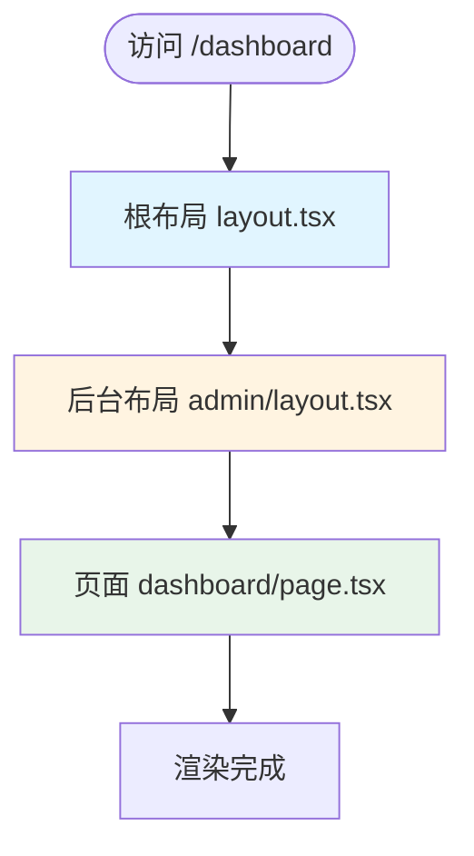
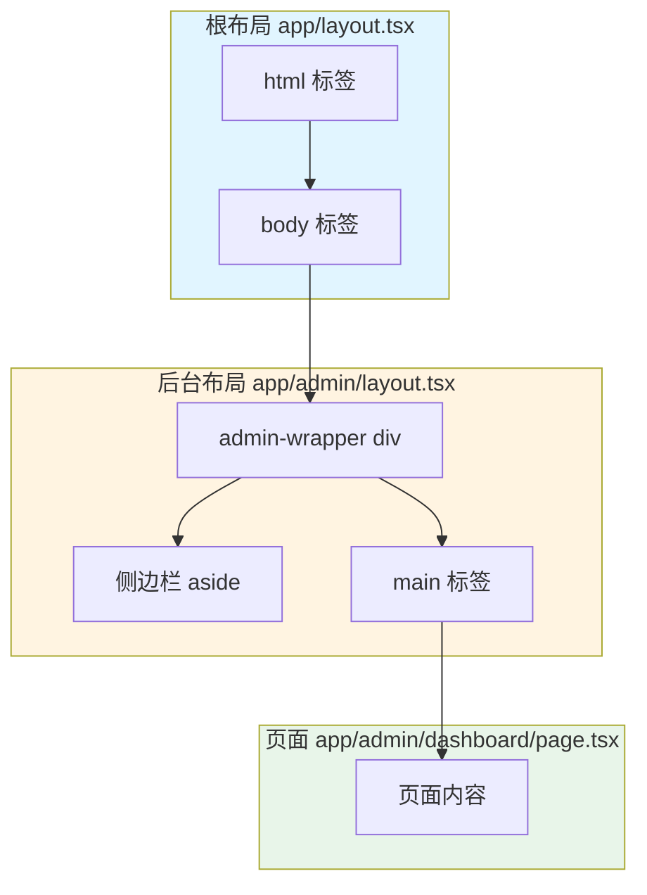

# Next.js 路由组（Route Groups）

## 概述

路由组（Route Groups）是 Next.js App Router 提供的一种代码组织方式，允许你使用括号 `(folderName)` 来组织路由文件，而不会影响 URL 结构。路由组主要用于将相关的路由文件组织在一起，并为不同的路由组创建不同的布局、加载状态和错误处理。

### 核心特点

- **不影响 URL**：括号内的文件夹名称不会出现在 URL 中
- **代码组织**：用于逻辑分组相关的路由文件
- **独立布局**：可以为每个路由组创建独立的布局
- **灵活嵌套**：支持路由组嵌套使用

### 适用场景

路由组特别适用于以下场景：

- 前台和后台项目分离
- 不同主题或样式的路由分离
- 不同认证状态的路由分离
- 多语言路由组织
- 大型项目的代码组织

## 基础概念

### 命名规则

路由组使用括号包裹文件夹名称，格式为 `(folderName)`：

```
app/
├── (marketing)/          ← 路由组
│   └── about/
│       └── page.tsx
└── about/                ← 普通文件夹
    └── page.tsx
```

::: warning 重要提示
括号是路由组的标识符，必须使用括号包裹文件夹名称。没有括号的文件夹是普通路由文件夹，会影响 URL 结构。
:::

### URL 不受影响

路由组的关键特性是**不会影响 URL 结构**。无论文件夹名称是什么，URL 都不会包含路由组的名称。

```
app/
├── (admin)/
│   └── dashboard/
│       └── page.tsx      → /dashboard（不是 /admin/dashboard）
│
└── (marketing)/
    └── about/
        └── page.tsx      → /about（不是 /marketing/about）
```

### 与普通文件夹的区别

| 特性 | 路由组 `(folderName)` | 普通文件夹 `folderName` |
|------|----------------------|------------------------|
| 影响 URL | ❌ 不影响 | ✅ 影响 |
| 用途 | 代码组织 | 路由定义 |
| 布局 | 可以为路由组创建布局 | 可以为文件夹创建布局 |
| URL 示例 | `(admin)/dashboard` → `/dashboard` | `admin/dashboard` → `/admin/dashboard` |

## 使用场景

### 1. 前台和后台项目分离

这是路由组最常见的应用场景。当你的项目同时包含前台（面向用户）和后台（管理界面）时，可以使用路由组将它们清晰地分离。

#### 文件结构

```
app/
├── layout.tsx                    # 根布局（HTML 结构）
│
├── (admin)/                      # 后台路由组
│   ├── layout.tsx                # 后台布局（侧边栏、顶部栏）
│   ├── loading.tsx               # 后台加载状态
│   ├── error.tsx                 # 后台错误处理
│   ├── dashboard/
│   │   └── page.tsx              → /dashboard
│   ├── users/
│   │   └── page.tsx              → /users
│   └── settings/
│       └── page.tsx              → /settings
│
└── (marketing)/                  # 前台路由组
    ├── layout.tsx                # 前台布局（导航栏、页脚）
    ├── loading.tsx               # 前台加载状态
    ├── error.tsx                 # 前台错误处理
    ├── about/
    │   └── page.tsx              → /about
    ├── contact/
    │   └── page.tsx              → /contact
    └── blog/
        └── page.tsx              → /blog
```

#### 后台布局示例

```tsx
// app/(admin)/layout.tsx
export default function AdminLayout({
  children,
}: {
  children: React.ReactNode
}) {
  return (
    <div className="admin-layout">
      <aside className="sidebar">
        <nav>
          <a href="/dashboard">仪表板</a>
          <a href="/users">用户管理</a>
          <a href="/settings">设置</a>
        </nav>
      </aside>
      <main className="admin-content">
        {children}
      </main>
    </div>
  )
}
```

#### 前台布局示例

```tsx
// app/(marketing)/layout.tsx
export default function MarketingLayout({
  children,
}: {
  children: React.ReactNode
}) {
  return (
    <div className="marketing-layout">
      <header>
        <nav>
          <a href="/">首页</a>
          <a href="/about">关于</a>
          <a href="/contact">联系</a>
          <a href="/blog">博客</a>
        </nav>
      </header>
      <main>{children}</main>
      <footer>
        <p>© 2024 公司名称</p>
      </footer>
    </div>
  )
}
```

### 2. 不同主题/样式分离

当你的应用需要为不同的路由组应用不同的主题或样式时，可以使用路由组：

```
app/
├── (marketing)/
│   ├── layout.tsx        # 营销主题布局（亮色、现代风格）
│   └── ...
└── (shop)/
    ├── layout.tsx        # 购物主题布局（暗色、商务风格）
    └── ...
```

### 3. 不同认证状态分离

根据用户的认证状态，为不同的路由组创建不同的布局：

```
app/
├── (auth)/               # 需要认证的路由
│   ├── layout.tsx        # 包含用户菜单的布局
│   └── dashboard/
│       └── page.tsx
└── (public)/            # 公开访问的路由
    ├── layout.tsx        # 简单的公开布局
    └── about/
        └── page.tsx
```

### 4. 多语言路由组织

虽然 Next.js 有专门的国际化（i18n）解决方案，但路由组也可以用于组织多语言路由：

```
app/
├── (zh-CN)/
│   └── about/
│       └── page.tsx
├── (en-US)/
│   └── about/
│       └── page.tsx
└── (ja-JP)/
    └── about/
        └── page.tsx
```

::: tip 提示
对于多语言项目，建议使用 Next.js 的国际化路由功能，而不是路由组。路由组更适合用于逻辑分组，而不是语言分组。
:::

## 布局嵌套机制

路由组内的布局会嵌套在父布局中。理解布局的嵌套顺序对于正确使用路由组非常重要。

### 布局执行顺序

当访问路由组内的页面时，布局的执行顺序是：**根布局 → 路由组布局 → 页面**



### 完整示例

```tsx
// app/layout.tsx - 根布局
export default function RootLayout({
  children,
}: {
  children: React.ReactNode
}) {
  return (
    <html lang="zh-CN">
      <body>
        <div id="root">
          {children}
        </div>
      </body>
    </html>
  )
}

// app/(admin)/layout.tsx - 后台布局
export default function AdminLayout({
  children,
}: {
  children: React.ReactNode
}) {
  return (
    <div className="admin-wrapper">
      <aside>侧边栏</aside>
      <main>{children}</main>
    </div>
  )
}

// app/(admin)/dashboard/page.tsx - 页面
export default function DashboardPage() {
  return <div>仪表板内容</div>
}
```

**渲染结果：**

```html
<html>
  <body>
    <div id="root">
      <div class="admin-wrapper">
        <aside>侧边栏</aside>
        <main>
          <div>仪表板内容</div>
        </main>
      </div>
    </div>
  </body>
</html>
```

### 布局嵌套流程图



## 路由组嵌套

路由组支持嵌套使用，可以创建更复杂的代码组织结构。

### 嵌套示例

```
app/
├── (admin)/
│   ├── (dashboard)/              # 嵌套路由组
│   │   └── analytics/
│   │       └── page.tsx          → /analytics
│   └── (settings)/
│       └── profile/
│           └── page.tsx          → /profile
```

### 嵌套路由组的布局

嵌套路由组时，布局也会嵌套：

```tsx
// app/(admin)/layout.tsx
export default function AdminLayout({ children }) {
  return (
    <div className="admin-layout">
      <nav>后台导航</nav>
      {children}
    </div>
  )
}

// app/(admin)/(dashboard)/layout.tsx
export default function DashboardLayout({ children }) {
  return (
    <div className="dashboard-layout">
      <aside>仪表板侧边栏</aside>
      {children}
    </div>
  )
}

// app/(admin)/(dashboard)/analytics/page.tsx
export default function AnalyticsPage() {
  return <div>分析页面</div>
}
```

**布局嵌套顺序：** 根布局 → `(admin)` 布局 → `(dashboard)` 布局 → 页面

## 代码示例

### 基础示例

最简单的路由组使用示例：

```
app/
├── (marketing)/
│   ├── about/
│   │   └── page.tsx              → /about
│   └── contact/
│       └── page.tsx              → /contact
└── (shop)/
    ├── products/
    │   └── page.tsx              → /products
    └── cart/
        └── page.tsx              → /cart
```

```tsx
// app/(marketing)/layout.tsx
export default function MarketingLayout({
  children,
}: {
  children: React.ReactNode
}) {
  return (
    <div className="marketing-theme">
      {children}
    </div>
  )
}

// app/(shop)/layout.tsx
export default function ShopLayout({
  children,
}: {
  children: React.ReactNode
}) {
  return (
    <div className="shop-theme">
      {children}
    </div>
  )
}
```

### 前台/后台分离完整示例

完整的项目结构示例：

```
app/
├── layout.tsx
├── (admin)/
│   ├── layout.tsx
│   ├── loading.tsx
│   ├── error.tsx
│   ├── dashboard/
│   │   └── page.tsx
│   ├── users/
│   │   ├── page.tsx
│   │   └── [id]/
│   │       └── page.tsx
│   └── settings/
│       └── page.tsx
└── (marketing)/
    ├── layout.tsx
    ├── loading.tsx
    ├── error.tsx
    ├── about/
    │   └── page.tsx
    ├── contact/
    │   └── page.tsx
    └── blog/
        ├── page.tsx
        └── [slug]/
            └── page.tsx
```

```tsx
// app/(admin)/layout.tsx
export default function AdminLayout({
  children,
}: {
  children: React.ReactNode
}) {
  return (
    <div className="min-h-screen bg-gray-100">
      <aside className="w-64 bg-gray-800 text-white p-4">
        <nav className="space-y-2">
          <a href="/dashboard" className="block py-2 px-4 hover:bg-gray-700 rounded">
            仪表板
          </a>
          <a href="/users" className="block py-2 px-4 hover:bg-gray-700 rounded">
            用户管理
          </a>
          <a href="/settings" className="block py-2 px-4 hover:bg-gray-700 rounded">
            设置
          </a>
        </nav>
      </aside>
      <main className="ml-64 p-8">
        {children}
      </main>
    </div>
  )
}

// app/(admin)/loading.tsx
export default function AdminLoading() {
  return (
    <div className="flex items-center justify-center min-h-screen">
      <div className="text-xl">加载中...</div>
    </div>
  )
}

// app/(admin)/error.tsx
'use client'

export default function AdminError({
  error,
  reset,
}: {
  error: Error & { digest?: string }
  reset: () => void
}) {
  return (
    <div className="flex flex-col items-center justify-center min-h-screen">
      <h2 className="text-2xl font-bold mb-4">后台页面出错</h2>
      <p className="text-gray-600 mb-4">{error.message}</p>
      <button
        onClick={reset}
        className="px-4 py-2 bg-blue-500 text-white rounded hover:bg-blue-600"
      >
        重试
      </button>
    </div>
  )
}

// app/(marketing)/layout.tsx
export default function MarketingLayout({
  children,
}: {
  children: React.ReactNode
}) {
  return (
    <div className="min-h-screen">
      <header className="bg-white shadow-sm">
        <nav className="container mx-auto px-4 py-4 flex justify-between items-center">
          <a href="/" className="text-2xl font-bold">公司名称</a>
          <div className="space-x-4">
            <a href="/about">关于</a>
            <a href="/contact">联系</a>
            <a href="/blog">博客</a>
          </div>
        </nav>
      </header>
      <main>{children}</main>
      <footer className="bg-gray-800 text-white py-8 mt-12">
        <div className="container mx-auto px-4 text-center">
          <p>© 2024 公司名称. 保留所有权利.</p>
        </div>
      </footer>
    </div>
  )
}
```

### 嵌套路由组示例

```tsx
// app/(admin)/(dashboard)/layout.tsx
export default function DashboardLayout({
  children,
}: {
  children: React.ReactNode
}) {
  return (
    <div className="dashboard-layout">
      <div className="dashboard-sidebar">
        <h3>仪表板</h3>
        <nav>
          <a href="/analytics">分析</a>
          <a href="/reports">报告</a>
        </nav>
      </div>
      <div className="dashboard-content">
        {children}
      </div>
    </div>
  )
}
```

### 与动态路由结合使用

路由组可以与动态路由结合使用：

```
app/
├── (admin)/
│   └── users/
│       └── [id]/
│           └── page.tsx          → /users/[id]
└── (marketing)/
    └── blog/
        └── [slug]/
            └── page.tsx          → /blog/[slug]
```

```tsx
// app/(admin)/users/[id]/page.tsx
export default async function UserPage({
  params,
}: {
  params: { id: string }
}) {
  const user = await fetchUser(params.id)
  
  return (
    <div>
      <h1>用户详情</h1>
      <p>用户 ID: {params.id}</p>
      <p>用户名: {user.name}</p>
    </div>
  )
}
```

## 最佳实践

### 何时使用路由组

路由组适用于以下场景：

- ✅ **前台/后台分离**：最常用的场景
- ✅ **不同主题/样式**：需要为不同路由组应用不同样式
- ✅ **代码组织**：大型项目需要清晰的代码结构
- ✅ **独立布局**：不同路由组需要完全不同的布局结构

::: tip 提示
如果只是简单的路由组织，不一定需要使用路由组。路由组的主要价值在于为不同的路由组创建独立的布局、加载状态和错误处理。
:::

### 命名规范建议

1. **使用描述性名称**：路由组名称应该清楚地表达其用途
   - ✅ `(admin)` - 后台管理
   - ✅ `(marketing)` - 营销页面
   - ✅ `(auth)` - 需要认证的页面
   - ❌ `(group1)` - 不清晰
   - ❌ `(a)` - 太简短

2. **使用小写字母**：遵循 Next.js 的命名约定
   - ✅ `(admin)`
   - ❌ `(Admin)`

3. **避免特殊字符**：除了括号，不要使用其他特殊字符
   - ✅ `(admin-dashboard)`
   - ❌ `(admin_dashboard)` - 下划线不推荐

### 文件组织建议

1. **为每个路由组创建独立的布局**：充分利用路由组的优势

2. **独立的加载和错误处理**：为每个路由组创建 `loading.tsx` 和 `error.tsx`

3. **保持结构清晰**：避免过深的嵌套，建议不超过 2-3 层

```
✅ 推荐结构
app/
├── (admin)/
│   └── dashboard/
│       └── page.tsx

❌ 不推荐（嵌套过深）
app/
├── (admin)/
│   └── (dashboard)/
│       └── (analytics)/
│           └── page.tsx
```

4. **合理使用路由组**：不要过度使用，只在真正需要时使用

### 性能优化建议

1. **代码分割**：Next.js 会自动为每个路由组进行代码分割
2. **布局优化**：将共享的样式和脚本放在根布局中
3. **按需加载**：路由组内的组件会按需加载

## 常见问题

### Q: 路由组的名称会出现在 URL 中吗？

A: **不会**。路由组的名称（括号内的部分）不会出现在 URL 中。例如，`(admin)/dashboard/page.tsx` 对应的 URL 是 `/dashboard`，而不是 `/admin/dashboard`。

### Q: 路由组和普通文件夹有什么区别？

A: 主要区别在于：
- **路由组** `(folderName)`：不影响 URL，仅用于代码组织
- **普通文件夹** `folderName`：会影响 URL，成为路由的一部分

### Q: 可以在路由组内再创建路由组吗？

A: **可以**。路由组支持嵌套使用，但建议不要嵌套过深（不超过 2-3 层），以保持代码结构清晰。

### Q: 路由组的布局执行顺序是什么？

A: 布局的执行顺序是：**根布局 → 路由组布局 → 子路由组布局 → 页面**。每个布局都会嵌套在前一个布局中。

### Q: 路由组会影响 SEO 吗？

A: **不会**。因为路由组的名称不会出现在 URL 中，所以不会影响 SEO。URL 结构保持不变。

### Q: 如何为路由组创建独立的加载状态？

A: 在路由组文件夹内创建 `loading.tsx` 文件即可。例如，`app/(admin)/loading.tsx` 会为所有后台路由提供加载状态。

### Q: 路由组可以包含动态路由吗？

A: **可以**。路由组完全支持动态路由，例如 `(admin)/users/[id]/page.tsx`。

### Q: 路由组和路由组之间可以共享布局吗？

A: **可以**。如果多个路由组需要共享布局，可以将共享的布局放在它们的共同父级，或者使用根布局。

## 参考链接

- [Next.js 路由组官方文档](https://nextjs.org/docs/app/building-your-application/routing/route-groups)
- [Next.js App Router 文档](https://nextjs.org/docs/app)
- [Next.js 布局文档](https://nextjs.org/docs/app/building-your-application/routing/pages-and-layouts)
