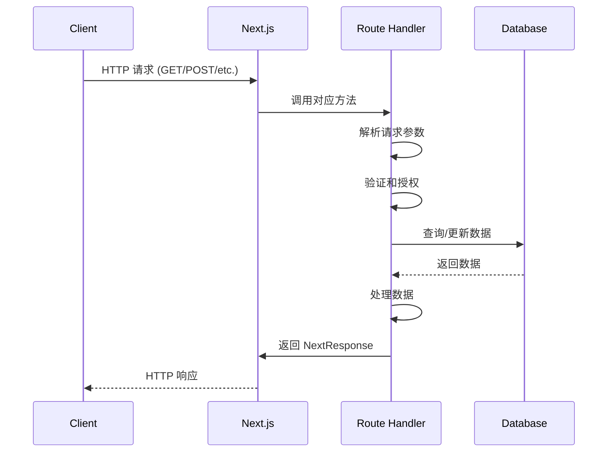

# Next.js 服务端路由处理程序（Route Handlers）

## 概述

Route Handlers（路由处理程序）是 Next.js App Router 中用于创建 API 端点的功能。它们允许你在服务端处理 HTTP 请求，实现 RESTful API 风格的接口。Route Handlers 使用 `route.ts`（或 `route.js`）文件来定义，与前端页面路由使用相同的文件系统路由约定。

### 核心特点

- **基于文件系统**：通过 `app` 目录下的文件夹结构自动生成 API 路由
- **RESTful 风格**：支持标准的 HTTP 方法（GET、POST、PUT、DELETE 等）
- **类型安全**：完整的 TypeScript 支持
- **服务端执行**：所有代码在服务端运行，不会包含在客户端 bundle 中
- **动态路由支持**：支持动态路由段和捕获所有路由

### 与 Pages Router API 路由的区别

| 特性 | Pages Router (`pages/api/`) | App Router (`app/.../route.ts`) |
|------|---------------------------|-------------------------------|
| 文件位置 | `pages/api/` | `app/` 目录任意位置 |
| 文件命名 | `[name].ts` | `route.ts` |
| 导出方式 | 默认导出函数 | 命名导出 HTTP 方法 |
| 路由组织 | 扁平结构 | 嵌套结构，支持路由组 |

## 基础用法

### 文件结构

Route Handlers 必须使用 `route.ts`（或 `route.js`）作为文件名，放在 `app` 目录下的任意位置：

```
app/
├── api/
│   ├── users/
│   │   └── route.ts          → /api/users
│   └── posts/
│       ├── route.ts          → /api/posts
│       └── [id]/
│           └── route.ts      → /api/posts/[id]
└── route.ts                  → /（根路由）
```

::: warning 重要提示
`route.ts` 文件不能与 `page.tsx` 文件位于同一路由段中，否则会导致路由冲突。每个路由段只能有 `page.tsx` 或 `route.ts` 其中之一。
:::

### 基本示例

```typescript
// app/api/users/route.ts
import { NextRequest, NextResponse } from 'next/server'

export async function GET(request: NextRequest) {
  // 处理 GET 请求
  const users = await fetchUsers()
  return NextResponse.json(users)
}

export async function POST(request: NextRequest) {
  // 处理 POST 请求
  const body = await request.json()
  const newUser = await createUser(body)
  return NextResponse.json(newUser, { status: 201 })
}
```

## HTTP 方法

Route Handlers 支持所有标准的 HTTP 方法。每个方法必须作为**命名导出**的函数，函数名**必须大写**且**不能修改**。

### 支持的方法

```typescript
// app/api/example/route.ts
import { NextRequest, NextResponse } from 'next/server'

// GET - 获取资源
export async function GET(request: NextRequest) {
  return NextResponse.json({ message: 'GET 请求' })
}

// HEAD - 获取响应头（不返回响应体）
export async function HEAD(request: NextRequest) {
  return new NextResponse(null, { status: 200 })
}

// POST - 创建资源
export async function POST(request: NextRequest) {
  const body = await request.json()
  return NextResponse.json({ message: 'POST 请求', data: body })
}

// PUT - 更新资源（完整替换）
export async function PUT(request: NextRequest) {
  const body = await request.json()
  return NextResponse.json({ message: 'PUT 请求', data: body })
}

// DELETE - 删除资源
export async function DELETE(request: NextRequest) {
  return NextResponse.json({ message: 'DELETE 请求' })
}

// PATCH - 部分更新资源
export async function PATCH(request: NextRequest) {
  const body = await request.json()
  return NextResponse.json({ message: 'PATCH 请求', data: body })
}

// OPTIONS - 预检请求（CORS）
// 如果没有定义 OPTIONS 方法，Next.js 会自动实现
export async function OPTIONS(request: NextRequest) {
  return new NextResponse(null, {
    status: 200,
    headers: {
      'Access-Control-Allow-Origin': '*',
      'Access-Control-Allow-Methods': 'GET, POST, PUT, DELETE, PATCH, OPTIONS',
      'Access-Control-Allow-Headers': 'Content-Type',
    },
  })
}
```

::: tip 方法命名规则
- 方法名称必须**完全大写**：`GET`、`POST`、`PUT` 等
- 方法名称**不能修改**：不能使用 `get`、`Get` 或其他变体
- 必须使用 `export async function` 导出
- 每个方法接收 `NextRequest` 作为第一个参数
:::

### OPTIONS 方法的自动处理

如果未定义 `OPTIONS` 方法，Next.js 会自动实现该方法以支持 CORS 预检请求。如果你需要自定义 CORS 行为，可以显式定义 `OPTIONS` 方法。

## 动态路由参数

Route Handlers 支持动态路由，使用方式与前端页面路由完全相同。在 Next.js 16 中，**动态参数 `params` 是异步的**，需要在第二个参数中解构并等待。

### 基础动态路由

```typescript
// app/api/users/[id]/route.ts
import { NextRequest, NextResponse } from 'next/server'

export async function GET(
  request: NextRequest,
  { params }: { params: Promise<{ id: string }> }
) {
  // Next.js 16: params 是异步的，需要 await
  const { id } = await params
  const user = await fetchUserById(id)
  
  if (!user) {
    return NextResponse.json(
      { error: '用户不存在' },
      { status: 404 }
    )
  }
  
  return NextResponse.json(user)
}
```

### 多个动态参数

```typescript
// app/api/posts/[postId]/comments/[commentId]/route.ts
import { NextRequest, NextResponse } from 'next/server'

export async function GET(
  request: NextRequest,
  { params }: { params: Promise<{ postId: string; commentId: string }> }
) {
  // Next.js 16: 解构并等待 params
  const { postId, commentId } = await params
  
  const comment = await fetchComment(postId, commentId)
  return NextResponse.json(comment)
}
```

### 捕获所有路由

```typescript
// app/api/docs/[...slug]/route.ts
import { NextRequest, NextResponse } from 'next/server'

export async function GET(
  request: NextRequest,
  { params }: { params: Promise<{ slug: string[] }> }
) {
  // slug 是一个数组，包含所有路径段
  const { slug } = await params
  const path = slug.join('/')
  
  return NextResponse.json({ path })
}
```

### 可选捕获路由

```typescript
// app/api/shop/[[...slug]]/route.ts
import { NextRequest, NextResponse } from 'next/server'

export async function GET(
  request: NextRequest,
  { params }: { params: Promise<{ slug?: string[] }> }
) {
  // slug 可能是 undefined（当访问 /api/shop 时）
  const { slug } = await params
  const path = slug?.join('/') || 'index'
  
  return NextResponse.json({ path })
}
```

### TypeScript 类型定义

在 Next.js 16 中，可以使用 `RouteContext` 类型来获得更好的类型推断：

```typescript
// app/api/users/[id]/route.ts
import { NextRequest } from 'next/server'
import type { RouteContext } from 'next/dist/server/app-render/route-module'

export async function GET(
  request: NextRequest,
  ctx: RouteContext<'/api/users/[id]'>
) {
  // TypeScript 会自动推断 params 的类型
  const { id } = await ctx.params
  return Response.json({ id })
}
```

::: warning Next.js 16 重要变化
在 Next.js 16 中，`params` 是异步的（Promise），必须使用 `await` 来获取值。这是为了支持流式渲染和更好的性能优化。如果你忘记使用 `await`，可能会导致运行时错误。
:::

## 请求处理

### 读取请求体

```typescript
// app/api/users/route.ts
import { NextRequest, NextResponse } from 'next/server'

export async function POST(request: NextRequest) {
  // JSON 数据
  const json = await request.json()
  
  // 表单数据
  const formData = await request.formData()
  const name = formData.get('name')
  
  // 文本数据
  const text = await request.text()
  
  // 二进制数据（Blob）
  const blob = await request.blob()
  
  return NextResponse.json({ success: true })
}
```

### 读取查询参数

```typescript
// app/api/search/route.ts
import { NextRequest, NextResponse } from 'next/server'

export async function GET(request: NextRequest) {
  // 从 URL 获取查询参数
  const { searchParams } = new URL(request.url)
  const query = searchParams.get('q')
  const page = searchParams.get('page') || '1'
  
  const results = await search(query, parseInt(page))
  return NextResponse.json(results)
}
```

### 读取请求头

```typescript
// app/api/protected/route.ts
import { NextRequest, NextResponse } from 'next/server'

export async function GET(request: NextRequest) {
  // 读取请求头
  const authorization = request.headers.get('authorization')
  const userAgent = request.headers.get('user-agent')
  
  // 检查认证
  if (!authorization) {
    return NextResponse.json(
      { error: '未授权' },
      { status: 401 }
    )
  }
  
  return NextResponse.json({ message: '已授权' })
}
```

### 读取 Cookie

::: tip 相关文档
关于 Cookie 的详细说明，包括自动携带机制、安全属性等，请参考[认证机制：Cookie、Token、Session](/guides/general/authentication)。
:::

```typescript
// app/api/profile/route.ts
import { NextRequest, NextResponse } from 'next/server'

export async function GET(request: NextRequest) {
  // 读取 Cookie
  const token = request.cookies.get('token')
  const sessionId = request.cookies.get('sessionId')
  
  if (!token) {
    return NextResponse.json(
      { error: '未登录' },
      { status: 401 }
    )
  }
  
  return NextResponse.json({ message: '已登录' })
}
```

## 响应处理

### 返回 JSON

```typescript
export async function GET() {
  return NextResponse.json({ message: '成功' })
}
```

### 设置状态码

```typescript
export async function POST() {
  return NextResponse.json(
    { message: '创建成功' },
    { status: 201 }
  )
}
```

### 设置响应头

```typescript
export async function GET() {
  return NextResponse.json(
    { data: 'some data' },
    {
      status: 200,
      headers: {
        'Content-Type': 'application/json',
        'Cache-Control': 'public, s-maxage=60, stale-while-revalidate=30',
      },
    }
  )
}
```

### 返回重定向

```typescript
import { redirect } from 'next/navigation'

export async function GET() {
  redirect('/login')
}
```

### 返回流式响应

```typescript
export async function GET() {
  const stream = new ReadableStream({
    async start(controller) {
      controller.enqueue(new TextEncoder().encode('数据块 1\n'))
      await new Promise(resolve => setTimeout(resolve, 1000))
      controller.enqueue(new TextEncoder().encode('数据块 2\n'))
      controller.close()
    },
  })
  
  return new Response(stream, {
    headers: {
      'Content-Type': 'text/plain',
    },
  })
}
```

### 设置 Cookie

::: tip 相关文档
关于 Cookie 安全设置的最佳实践，包括 `httpOnly`、`secure`、`sameSite` 等属性的详细说明，请参考[认证机制：Cookie、Token、Session](/guides/general/authentication)。
:::

```typescript
export async function POST() {
  const response = NextResponse.json({ success: true })
  
  response.cookies.set('token', 'abc123', {
    httpOnly: true,
    secure: process.env.NODE_ENV === 'production',
    sameSite: 'lax',
    maxAge: 60 * 60 * 24 * 7, // 7 天
  })
  
  return response
}
```

## 请求处理流程



## 最佳实践

### 1. 错误处理

```typescript
// app/api/users/[id]/route.ts
import { NextRequest, NextResponse } from 'next/server'

export async function GET(
  request: NextRequest,
  { params }: { params: Promise<{ id: string }> }
) {
  try {
    const { id } = await params
    
    if (!id) {
      return NextResponse.json(
        { error: 'ID 是必需的' },
        { status: 400 }
      )
    }
    
    const user = await fetchUserById(id)
    
    if (!user) {
      return NextResponse.json(
        { error: '用户不存在' },
        { status: 404 }
      )
    }
    
    return NextResponse.json(user)
  } catch (error) {
    console.error('获取用户失败:', error)
    return NextResponse.json(
      { error: '服务器内部错误' },
      { status: 500 }
    )
  }
}
```

### 2. 请求验证

```typescript
// app/api/users/route.ts
import { NextRequest, NextResponse } from 'next/server'
import { z } from 'zod' // 使用 zod 进行验证

const createUserSchema = z.object({
  name: z.string().min(1),
  email: z.string().email(),
  age: z.number().int().positive(),
})

export async function POST(request: NextRequest) {
  try {
    const body = await request.json()
    
    // 验证请求体
    const validatedData = createUserSchema.parse(body)
    
    const user = await createUser(validatedData)
    return NextResponse.json(user, { status: 201 })
  } catch (error) {
    if (error instanceof z.ZodError) {
      return NextResponse.json(
        { error: '验证失败', details: error.errors },
        { status: 400 }
      )
    }
    
    return NextResponse.json(
      { error: '服务器错误' },
      { status: 500 }
    )
  }
}
```

### 3. 认证和授权

::: tip 相关文档
关于 Cookie、Session 和 Token 认证机制的详细说明，包括工作原理、使用场景和安全最佳实践，请参考[认证机制：Cookie、Token、Session](/guides/general/authentication)。
:::

```typescript
// app/api/protected/route.ts
import { NextRequest, NextResponse } from 'next/server'
import { verifyToken } from '@/lib/auth'

export async function GET(request: NextRequest) {
  // 检查认证
  const token = request.headers.get('authorization')?.replace('Bearer ', '')
  
  if (!token) {
    return NextResponse.json(
      { error: '未授权' },
      { status: 401 }
    )
  }
  
  try {
    const user = await verifyToken(token)
    
    // 检查权限
    if (!user.isAdmin) {
      return NextResponse.json(
        { error: '权限不足' },
        { status: 403 }
      )
    }
    
    return NextResponse.json({ message: '访问成功', user })
  } catch (error) {
    return NextResponse.json(
      { error: '无效的令牌' },
      { status: 401 }
    )
  }
}
```

### 4. 使用路由组组织 API

```typescript
// app/(api)/v1/users/route.ts
// app/(api)/v2/users/route.ts
// 使用路由组来组织不同版本的 API
```

### 5. 缓存控制

```typescript
export async function GET() {
  const data = await fetchData()
  
  return NextResponse.json(data, {
    headers: {
      'Cache-Control': 'public, s-maxage=60, stale-while-revalidate=30',
    },
  })
}
```

### 6. 静态生成（generateStaticParams）

对于动态路由，可以使用 `generateStaticParams` 在构建时预生成静态路径：

```typescript
// app/api/posts/[id]/route.ts
import { NextRequest, NextResponse } from 'next/server'

export async function generateStaticParams() {
  const posts = await fetch('https://api.example.com/posts').then(res => res.json())
  
  return posts.map((post: { id: number }) => ({
    id: `${post.id}`,
  }))
}

export async function GET(
  request: NextRequest,
  { params }: { params: Promise<{ id: string }> }
) {
  const { id } = await params
  const post = await fetchPost(id)
  
  if (!post) {
    return NextResponse.json(
      { error: '文章不存在' },
      { status: 404 }
    )
  }
  
  return NextResponse.json(post)
}
```

## 常见问题

### Q: 为什么我的 Route Handler 返回 405 Method Not Allowed？

A: 确保你导出的方法名称完全大写且拼写正确。例如，使用 `GET` 而不是 `get` 或 `Get`。

### Q: 如何处理文件上传？

A: 使用 `request.formData()` 来接收文件：

```typescript
export async function POST(request: NextRequest) {
  const formData = await request.formData()
  const file = formData.get('file') as File
  
  // 处理文件
  const bytes = await file.arrayBuffer()
  // ... 保存文件
}
```

### Q: 可以在 Route Handler 中使用 Server Actions 吗？

A: 可以，但通常不需要。Route Handlers 本身就是服务端代码，可以直接调用数据库或其他服务端逻辑。

### Q: Route Handler 和 Server Actions 有什么区别？

A: 
- **Route Handlers**：用于创建 RESTful API 端点，处理 HTTP 请求
- **Server Actions**：用于在服务端组件中直接调用函数，无需创建 API 端点

### Q: 如何测试 Route Handler？

A: 可以使用 `fetch` API 或测试框架（如 Jest）来测试：

```typescript
// 测试示例
const response = await fetch('http://localhost:3000/api/users')
const data = await response.json()
```

### Q: 为什么在 Next.js 16 中 params 是异步的？

A: 这是为了支持流式渲染和更好的性能优化。通过将 params 设为 Promise，Next.js 可以在需要时才解析参数，提高初始渲染速度。

## 参考链接

- [Next.js 官方文档 - Route Handlers](https://nextjs.org/docs/app/building-your-application/routing/route-handlers)
- [Next.js 官方文档 - 动态路由](https://nextjs.org/docs/app/building-your-application/routing/dynamic-routes)
- [App Router 文件路由系统](/guides/nextjs/app-router) - 了解 App Router 的文件约定

