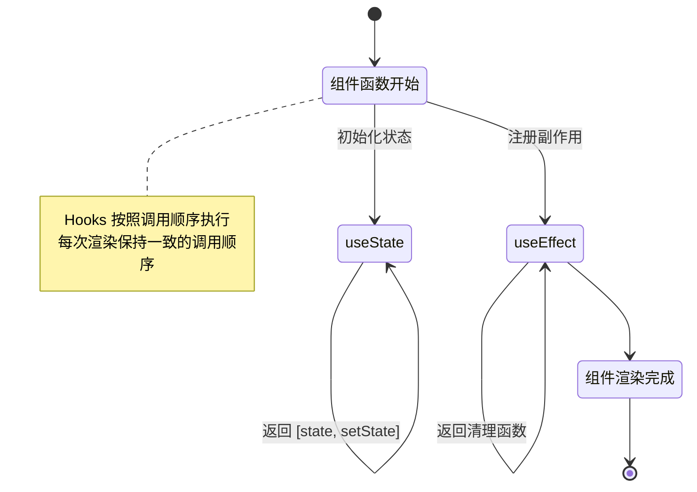

# React Hooks 概览

React Hooks 是 React 16.8 引入的特性，允许在函数组件中使用状态和其他 React 特性。

## Hooks 分类

| 分类 | Hooks | 用途 |
|------|-------|------|
| **状态 Hooks** | useState | 添加组件状态 |
| | useReducer | 复杂状态管理 |
| **副作用 Hooks** | useEffect | 处理副作用 |
| | useLayoutEffect | 同步副作用 |
| **引用 Hooks** | useRef | 直接访问 DOM/保存值 |
| **性能 Hooks** | useMemo | 缓存计算结果 |
| | useCallback | 缓存函数引用 |
| **上下文 Hooks** | useContext | 使用 Context |
| **高级 Hooks** | use | 使用 Promise/Context |
| | useId | 生成唯一 ID |
| | useCallback | 缓存函数 |

## 核心原则

### 1. 只在顶层调用 Hooks

```jsx
// 推荐 - 在顶层调用
function Counter() {
  const [count, setCount] = useState(0);  // ✓
  const [name, setName] = useState('');   // ✓
  return <div>...</div>;
}

// 不推荐 - 在条件/循环中调用
function Counter({ isLogged }) {
  if (isLogged) {
    const [count, setCount] = useState(0);  // ✗ 违反规则
  }
  // ...
}
```

### 2. 只在函数组件或自定义 Hooks 中调用

```jsx
// 可以在函数组件中使用
function MyComponent() {
  const [state, setState] = useState(0);
  // ...
}

// 可以在自定义 Hooks 中使用
function useWindowSize() {
  const [size, setSize] = useState({ width: 0, height: 0 });
  // ...
}
```

### 3. 使用 ESLint 插件

使用 `eslint-plugin-react-hooks` 来强制执行 Hooks 规则：

```bash
npm install eslint-plugin-react-hooks --save-dev
```

## 执行顺序



## 文档索引

- [useState](useState.md) - 基础状态管理
- [useEffect](useEffect.md) - 副作用处理
- [useRef](useRef.md) - 引用和可变对象
- [useCallback 与 useMemo](useCallback-useMemo.md) - 性能优化
- [自定义 Hooks](custom-hooks.md) - 逻辑复用

## 相关资源

- [React 官方文档 - Hooks](https://react.dev/reference/react)
- [use() API](/guides/react/use-api) - React 19 新特性
