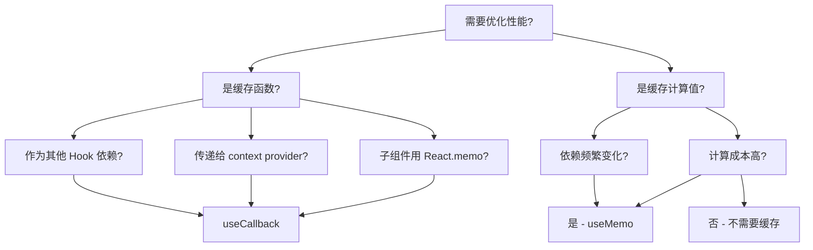

# useCallback 与 useMemo 性能优化

`useCallback` 和 `useMemo` 是 React 提供的性能优化 Hook，用于缓存函数和计算结果。

## 概述

```jsx
// 缓存函数
const memoizedCallback = useCallback(() => {
  doSomething(a, b);
}, [a, b]);

// 缓存值
const memoizedValue = useMemo(() => {
  return computeExpensiveValue(a, b);
}, [a, b]);
```

## useCallback

### 基础用法

```jsx
import { useCallback, useState } from 'react';

function TodoList() {
  const [todos, setTodos] = useState([]);
  const [filter, setFilter] = useState('all');

  // 不使用 useCallback - 每次渲染都创建新函数
  const addTodo = (text) => {
    setTodos(prev => [...prev, { text, done: false }]);
  };

  // 使用 useCallback - 依赖不变时返回相同函数
  const addTodoCallback = useCallback((text) => {
    setTodos(prev => [...prev, { text, done: false }]);
  }, []);  // 空依赖 - 函数永远不变
}
```

### 实际应用场景

```jsx
import { useCallback, useState } from 'react';

function UserList({ users, onDelete }) {
  return (
    <ul>
      {users.map(user => (
        <li key={user.id}>
          {user.name}
          <button onClick={() => onDelete(user.id)}>删除</button>
        </li>
      ))}
    </ul>
  );
}

function App() {
  const [users, setUsers] = useState([]);
  const [filter, setFilter] = useState('');

  // 传递给子组件的回调应该被缓存
  const handleDelete = useCallback((userId) => {
    setUsers(prev => prev.filter(u => u.id !== userId));
  }, []);

  return (
    <div>
      <input value={filter} onChange={e => setFilter(e.target.value)} />
      <UserList users={users} onDelete={handleDelete} />
    </div>
  );
}
```

## useMemo

### 基础用法

```jsx
import { useMemo, useState } from 'react';

function ExpensiveComponent({ a, b }) {
  // 不使用 useMemo - 每次渲染都重新计算
  const result = expensiveComputation(a, b);

  // 使用 useMemo - 依赖不变时返回缓存结果
  const memoizedResult = useMemo(() => {
    return expensiveComputation(a, b);
  }, [a, b]);
}
```

### 实际应用场景

```jsx
import { useMemo, useState } from 'react';

function ProductList({ products, category }) {
  // 缓存过滤结果
  const filteredProducts = useMemo(() => {
    console.log('过滤产品...');
    return products.filter(p => p.category === category);
  }, [products, category]);

  // 缓存排序结果
  const sortedProducts = useMemo(() => {
    console.log('排序产品...');
    return [...filteredProducts].sort((a, b) => b.price - a.price);
  }, [filteredProducts]);

  return (
    <ul>
      {sortedProducts.map(product => (
        <li key={product.id}>{product.name} - ${product.price}</li>
      ))}
    </ul>
  );
}
```

## 使用场景分析



### 什么时候使用 useCallback

```jsx
import { useCallback, memo } from 'react';

// 子组件使用 memo 包装
const ChildComponent = memo(function ChildComponent({ onClick }) {
  console.log('子组件渲染');
  return <button onClick={onClick}>点击</button>;
});

function Parent() {
  const [count, setCount] = useState(0);
  const [name, setName] = useState('');

  // 不使用 useCallback - 每次都触发子组件重渲染
  const handleClick = () => console.log('点击');

  // 使用 useCallback - 依赖不变时不触发子组件重渲染
  const memoizedHandleClick = useCallback(() => {
    console.log('点击');
  }, []);

  return (
    <div>
      <ChildComponent onClick={memoizedHandleClick} />
      <p>计数: {count}</p>
      <button onClick={() => setCount(c => c + 1)}>增加</button>
      <input value={name} onChange={e => setName(e.target.value)} />
    </div>
  );
}
```

### 什么时候使用 useMemo

```jsx
import { useMemo, useState } from 'react';

function ExpensiveCalculation() {
  const [n, setN] = useState(100);

  // 昂贵的计算
  const factorial = useMemo(() => {
    console.log('计算阶乘...');
    if (n <= 0) return 1;
    let result = 1;
    for (let i = 2; i <= n; i++) {
      result *= i;
    }
    return result;
  }, [n]);

  // 不需要 useMemo - 简单计算
  const doubled = n * 2;

  return (
    <div>
      <input type="number" value={n} onChange={e => setN(Number(e.target.value))} />
      <p>{n}! = {factorial}</p>
      <p> doubled = {doubled}</p>
    </div>
  );
}
```

## 性能优化模式

### 1. 避免子组件不必要的重渲染

```jsx
import { useState, useCallback, memo } from 'react';

const Button = memo(function Button({ onClick, children }) {
  console.log(`渲染按钮: ${children}`);
  return <button onClick={onClick}>{children}</button>;
});

function App() {
  const [count, setCount] = useState(0);
  const [text, setText] = useState('');

  // 缓存回调，避免按钮重渲染
  const increment = useCallback(() => {
    setCount(c => c + 1);
  }, []);

  const handleTextChange = useCallback((e) => {
    setText(e.target.value);
  }, []);

  return (
    <div>
      <Button onClick={increment}>增加计数</Button>
      <p>计数: {count}</p>
      <input value={text} onChange={handleTextChange} />
    </div>
  );
}
```

### 2. 缓存复杂对象

```jsx
import { useMemo, useState } from 'react';

function Form({ userId }) {
  const [formData, setFormData] = useState({
    name: '',
    email: '',
    address: {
      street: '',
      city: ''
    }
  });

  // 使用 useMemo 缓存配置对象
  const config = useMemo(() => ({
    validateEmail: true,
    maxLength: 100,
    requiredFields: ['name', 'email']
  }), []);  // 依赖为空，对象永远不变

  return (
    <form>
      <input
        value={formData.name}
        onChange={e => setFormData({ ...formData, name: e.target.value })}
      />
      {/* ... */}
    </form>
  );
}
```

### 3. 避免数组和对象字面量问题

```jsx
import { useState, useEffect } from 'react';

function Component({ items, filter }) {
  // 不推荐 - 每次渲染都创建新数组
  const filteredItems = items.filter(item => item.category === filter);

  // 推荐 - 使用 useMemo 缓存
  const filteredItemsMemo = useMemo(() => {
    return items.filter(item => item.category === filter);
  }, [items, filter]);

  // 不推荐 - 每次渲染都创建新对象
  const styles = { color: 'red', fontSize: 14 };

  // 推荐 - 使用 useMemo 缓存
  const stylesMemo = useMemo(() => ({
    color: 'red',
    fontSize: 14
  }), []);
}
```

### 4. 结合 useRef 存储回调

```jsx
import { useRef, useCallback, useEffect } from 'react';

function SearchResults({ query }) {
  const abortControllerRef = useRef(null);

  const search = useCallback(async () => {
    if (abortControllerRef.current) {
      abortControllerRef.current.abort();
    }

    abortControllerRef.current = new AbortController();

    try {
      const results = await fetch(`/api/search?q=${query}`, {
        signal: abortControllerRef.current.signal
      }).then(r => r.json());
      // 处理结果
    } catch (e) {
      if (e.name !== 'AbortError') {
        console.error('搜索失败:', e);
      }
    }
  }, [query]);

  useEffect(() => {
    search();
    return () => abortControllerRef.current?.abort();
  }, [search]);

  return <div>搜索结果...</div>;
}
```

## 常见问题

### Q: 过度使用 useCallback/useMemo 会有问题吗？

A: 是的，需要权衡：

```jsx
// 不推荐 - 简单场景过度优化
const handleClick = useCallback(() => {
  console.log('click');
}, []);  // 缓存简单函数的开销可能大于收益

// 推荐 - 只在需要时使用
function Component() {
  // 传递给 memo 化的子组件
  const handleSubmit = useCallback(() => {
    formRef.current.submit();
  }, []);

  return <ExpensiveChild onSubmit={handleSubmit} />;
}
```

### Q: 依赖数组应该怎么写？

```jsx
// 不推荐 - 空依赖但使用了外部变量
const handleClick = useCallback(() => {
  console.log(count);  // 使用了 count，但没有在依赖中
}, []);

// 推荐 1 - 添加所有使用的外部变量
const handleClick = useCallback(() => {
  console.log(count);
}, [count]);

// 推荐 2 - 如果确实不需要依赖，使用稳定的值
const handleClick = useCallback(() => {
  console.log('固定消息');
}, []);  // 没有使用任何外部变量
```

### Q: useMemo 返回函数会怎样？

```jsx
// 可以，但不推荐
const getItems = useMemo(() => {
  return () => expensiveComputation();
}, []);

// 推荐使用 useCallback
const getItems = useCallback(() => {
  return expensiveComputation();
}, []);
```

## 性能对比示例

```jsx
import { useState, useCallback, useMemo } from 'react';

function PerformanceDemo() {
  const [a, setA] = useState(1);
  const [b, setB] = useState(2);
  const [renderCount, setRenderCount] = useState(0);

  useState(() => {
    setRenderCount(c => c + 1);
  });

  // 不使用缓存 - 每次都重新计算
  const sumWithoutMemo = a + b;

  // 使用 useMemo - 只在依赖变化时重新计算
  const sumWithMemo = useMemo(() => {
    console.log('计算 sumWithMemo');
    return a + b;
  }, [a, b]);

  // 不使用 useCallback - 每次都是新函数
  const logWithoutCallback = () => {
    console.log(`a=${a}, b=${b}`);
  };

  // 使用 useCallback - 依赖不变返回相同函数
  const logWithCallback = useCallback(() => {
    console.log(`a=${a}, b=${b}`);
  }, [a, b]);

  return (
    <div>
      <p>渲染次数: {renderCount}</p>
      <p>sum (无 memo): {sumWithoutMemo}</p>
      <p>sum (有 memo): {sumWithMemo}</p>
      <button onClick={() => setA(a + 1)}>增加 A</button>
      <button onClick={() => setB(b + 1)}>增加 B</button>
      <button onClick={logWithCallback}>日志</button>
    </div>
  );
}
```

## 最佳实践总结

| 场景 | 建议 |
|------|------|
| 传递给 `React.memo` 的组件 | 使用 `useCallback` |
| 作为其他 Hook 的依赖 | 使用 `useCallback`/`useMemo` |
| 复杂计算结果 | 使用 `useMemo` |
| 简单计算或函数 | 不需要优化 |
| 传递给 Context 的值 | 使用 `useMemo` |
| 避免对象/数组字面量 | 使用 `useMemo` |

## 相关资源

- [React 官方文档 - useCallback](https://react.dev/reference/react/useCallback)
- [React 官方文档 - useMemo](https://react.dev/reference/react/useMemo)
- [React.memo](https://react.dev/reference/react/memo)
- [useState](useState.md) - 状态管理
- [useEffect](useEffect.md) - 副作用处理
