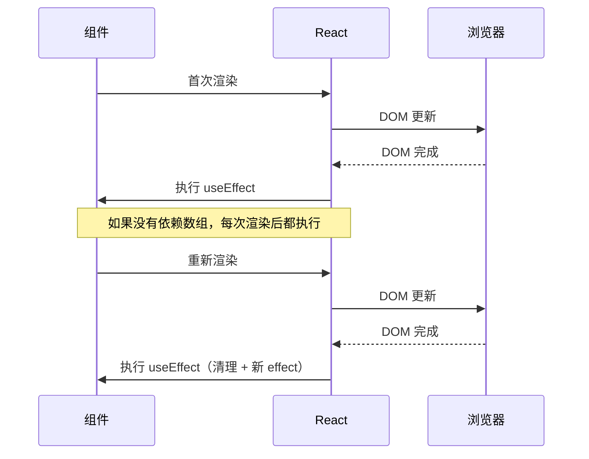

# useEffect 深度解析

`useEffect` 是 React 中处理副作用的主要 Hook，用于在函数组件中执行副作用操作。

## 什么是副作用？

副作用是指影响组件外部世界的操作：

```jsx
// 以下都是副作用
- 数据获取（API 调用）
- 订阅事件
- 直接操作 DOM
- 定时器（setTimeout、setInterval）
- 本地存储操作
- 打印日志
```

## 基础用法

```jsx
import { useEffect } from 'react';

function MyComponent() {
  useEffect(() => {
    // 副作用代码
    console.log('组件已挂载');

    // 返回清理函数（可选）
    return () => {
      console.log('组件将卸载');
    };
  }, []);  // 空依赖数组 - 只执行一次

  return <div>My Component</div>;
}
```

### 执行时机



## 依赖数组

### 空数组 - 只执行一次

```jsx
useEffect(() => {
  // 组件挂载时执行
  const subscription = subscribeToData();

  // 组件卸载时清理
  return () => {
    unsubscribeFromData(subscription);
  };
}, []);  // 空数组 = 只执行一次
```

### 有依赖 - 依赖变化时执行

```jsx
function UserProfile({ userId }) {
  const [user, setUser] = useState(null);

  useEffect(() => {
    // userId 变化时重新执行
    const controller = new AbortController();
    fetchUser(userId, { signal: controller.signal })
      .then(setUser);

    return () => controller.abort();
  }, [userId]);  // userId 变化时重新执行

  return <div>{user?.name}</div>;
}
```

### 无依赖 - 每次渲染都执行

```jsx
useEffect(() => {
  // 每次渲染都执行
  console.log('组件已渲染');
});  // 没有依赖数组
```

## 清理函数

清理函数在以下时机执行：

1. 组件卸载时
2. 重新执行 effect 之前
3. 依赖变化导致 effect 重新执行时

```jsx
useEffect(() => {
  const timer = setInterval(() => {
    setCount(c => c + 1);
  }, 1000);

  // 清理函数
  return () => clearInterval(timer);
}, []);
```

### 订阅清理示例

```jsx
function ChatRoom({ roomId }) {
  const [messages, setMessages] = useState([]);

  useEffect(() => {
    const subscription = chatAPI.subscribe(roomId, message => {
      setMessages(prev => [...prev, message]);
    });

    // 清理订阅
    return () => {
      chatAPI.unsubscribe(roomId, subscription);
    };
  }, [roomId]);

  return <div>{/* messages */}</div>;
}
```

## 常见用例

### 1. 数据获取

```jsx
function useUser(userId) {
  const [user, setUser] = useState(null);
  const [loading, setLoading] = useState(true);
  const [error, setError] = useState(null);

  useEffect(() => {
    let cancelled = false;

    async function fetchUser() {
      try {
        setLoading(true);
        const user = await fetch(`/api/users/${userId}`).then(r => r.json());
        if (!cancelled) {
          setUser(user);
          setError(null);
        }
      } catch (e) {
        if (!cancelled) {
          setError(e);
        }
      } finally {
        if (!cancelled) {
          setLoading(false);
        }
      }
    }

    fetchUser();

    return () => { cancelled = true; };
  }, [userId]);

  return { user, loading, error };
}
```

### 2. 事件监听

```jsx
function useWindowSize() {
  const [size, setSize] = useState({
    width: window.innerWidth,
    height: window.innerHeight
  });

  useEffect(() => {
    function handleResize() {
      setSize({
        width: window.innerWidth,
        height: window.innerHeight
      });
    }

    window.addEventListener('resize', handleResize);

    return () => {
      window.removeEventListener('resize', handleResize);
    };
  }, []);  // 空数组 - 只添加一次监听

  return size;
}
```

### 3. 本地存储

```jsx
function useLocalStorage(key, initialValue) {
  const [storedValue, setStoredValue] = useState(() => {
    try {
      const item = window.localStorage.getItem(key);
      return item ? JSON.parse(item) : initialValue;
    } catch {
      return initialValue;
    }
  });

  useEffect(() => {
    try {
      window.localStorage.setItem(key, JSON.stringify(storedValue));
    } catch (e) {
      console.error('保存到 localStorage 失败:', e);
    }
  }, [key, storedValue]);

  return [storedValue, setStoredValue];
}
```

### 4. 动画触发

```jsx
function FadeIn({ children }) {
  const [opacity, setOpacity] = useState(0);

  useEffect(() => {
    // 组件挂载后触发动画
    requestAnimationFrame(() => {
      setOpacity(1);
    });
  }, []);

  return (
    <div style={{ transition: 'opacity 0.5s', opacity }}>
      {children}
    </div>
  );
}
```

## 依赖数组的正确使用

### 依赖应该是稳定的

```jsx
// 不推荐 - 使用不稳定的依赖
function SearchResults({ query }) {
  const [results, setResults] = useState([]);

  useEffect(() => {
    search(query).then(setResults);
  }, [query]);  // query 每次渲染可能不同

  return <ResultsList results={results} />;
}

// 推荐 - 使用稳定引用
function SearchResults({ query }) {
  const [results, setResults] = useState([]);
  const stableQuery = useMemo(() => query, [query]);  // 稳定引用

  useEffect(() => {
    search(stableQuery).then(setResults);
  }, [stableQuery]);
}
```

### 使用函数依赖时的陷阱

```jsx
// 不推荐 - 函数每次渲染都是新的
function Component({ onComplete }) {
  useEffect(() => {
    onComplete();
  }, [onComplete]);  // onComplete 每次都不同
}

// 推荐 1 - 将函数移到 effect 内部
useEffect(() => {
  doSomething();
}, []);  // 不依赖外部函数

// 推荐 2 - 使用 useCallback 包装
const handleComplete = useCallback(() => {
  // 逻辑
}, [dependencies]);
useEffect(() => {
  handleComplete();
}, [handleComplete]);

// 推荐 3 - 重新思考设计
useEffect(() => {
  if (shouldComplete) {
    doSomething();
  }
}, [shouldComplete, dependencies]);  // 直接依赖值
```

### 对象和数组作为依赖

```jsx
// 不推荐 - 对象字面量每次都是新的
useEffect(() => {
  doSomething(options);
}, [options]);  // options 每次渲染都不同

// 推荐 1 - 使用 useMemo 创建稳定的对象
const options = useMemo(() => ({ timeout: 5000 }), []);
useEffect(() => {
  doSomething(options);
}, [options]);

// 推荐 2 - 直接在 effect 内部使用值
useEffect(() => {
  doSomething({ timeout: 5000 });
}, []);  // 没有外部依赖
```

## useLayoutEffect

`useLayoutEffect` 与 `useEffect` 类似，但会在 DOM 更新后同步执行。

```jsx
import { useLayoutEffect, useEffect } from 'react';

function My // 异步Component() {
 执行（推荐作为默认选择）
  useEffect(() => {
    console.log('DOM 已更新，浏览器已绘制');
  });

  // 同步执行 - 在 DOM 更新后、浏览器绘制前执行
  useLayoutEffect(() => {
    // 测量 DOM 元素尺寸
    const rect = element.getBoundingClientRect();
    console.log('DOM 尺寸:', rect);
  }, []);

  return <div ref={ref}>Content</div>;
}
```

### 使用场景对比

```jsx
// useEffect - 数据获取、订阅
useEffect(() => {
  const subscription = subscribe();
  return () => unsubscribe();
}, []);

// useLayoutEffect - DOM 测量、同步动画
function Tooltip() {
  const ref = useRef(null);
  const [position, setPosition] = useState({ x: 0, y: 0 });

  useLayoutEffect(() => {
    if (ref.current) {
      const rect = ref.current.getBoundingClientRect();
      setPosition({ x: rect.x, y: rect.y });
    }
  }, []);  // 同步更新位置，避免闪烁

  return <div ref={ref} style={{ position: 'absolute', ...position }}>Tooltip</div>;
}
```

## 常见问题

### Q: 为什么 effect 运行了两次？

A: React 18 开发模式下，组件挂载时会运行两次 effect 以帮助发现副作用问题：

```jsx
useEffect(() => {
  console.log('effect 运行');

  // 清理函数
  return () => {
    console.log('清理');
  };
}, []);

// 开发模式下输出：
// effect 运行
// 清理
// effect 运行
```

这是正常行为，确保清理函数能正确清理资源。

### Q: effect 中如何避免内存泄漏？

A: 使用 AbortController 或清理标志：

```jsx
useEffect(() => {
  const controller = new AbortController();

  async function fetchData() {
    try {
      const data = await fetch('/api/data', { signal: controller.signal });
      setData(await data.json());
    } catch (e) {
      if (e.name !== 'AbortError') {
        console.error('获取数据失败:', e);
      }
    }
  }

  fetchData();

  return () => controller.abort();
}, []);
```

### Q: 依赖数组为什么包含了组件 props？

A: effect 需要知道哪些外部值变化时需要重新执行：

```jsx
function UserProfile({ userId }) {
  const [user, setUser] = useState(null);

  // userId 变化时，需要重新获取用户数据
  useEffect(() => {
    fetchUser(userId).then(setUser);
  }, [userId]);  // 正确 - 依赖外部值

  return <div>{user?.name}</div>;
}
```

### Q: effect 中可以使用 async 函数吗？

A: 可以，但不能直接等待 async 函数：

```jsx
// 不推荐 - useEffect 不能返回 Promise
useEffect(async () => {
  const data = await fetchData();
  setData(data);
});  // 错误！返回了 Promise

// 推荐 1 - 在内部定义 async 函数
useEffect(() => {
  async function fetchData() {
    const data = await fetch('/api/data');
    setData(await data.json());
  }

  fetchData();
}, []);

// 推荐 2 - 使用立即执行函数
useEffect(() => {
  (async () => {
    const data = await fetch('/api/data');
    setData(await data.json());
  })();
}, []);
```

## 最佳实践总结

1. **理解 effect 的执行时机** - DOM 更新后、浏览器绘制后
2. **正确设置依赖数组** - 包含所有 effect 使用的外部值
3. **始终返回清理函数** - 防止内存泄漏和重复操作
4. **优先使用 useEffect** - 只有需要同步操作时才用 useLayoutEffect
5. **保持 effect 简洁** - 一个 effect 只做一件事
6. **使用自定义 Hooks** - 封装复杂的副作用逻辑

## 相关资源

- [React 官方文档 - useEffect](https://react.dev/reference/react/useEffect)
- [useState](useState.md) - 状态管理
- [useLayoutEffect](https://react.dev/reference/react/useLayoutEffect)
- [自定义 Hooks](custom-hooks.md) - 封装副作用逻辑
