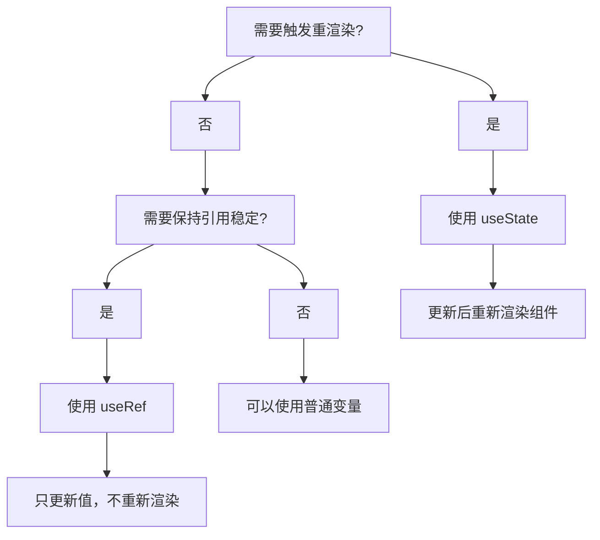

# useRef 深入指南

`useRef` 是一个多功能的 Hook，用于在函数组件中存储可变值，同时不会触发重新渲染。

## 概述

```jsx
const ref = useRef(initialValue);
```

### 返回值

`useRef` 返回一个对象，其 `current` 属性存储初始值：

```jsx
const ref = useRef(0);
console.log(ref.current);  // 0

ref.current = 5;
console.log(ref.current);  // 5
```

### 核心特性

- **可变对象** - `current` 属性可以自由修改
- **不会触发重渲染** - 修改 ref 不会导致组件重新渲染
- **持久化** - 跨渲染保持值不变

## 基础用法

### 存储可变值

```jsx
import { useRef, useState } from 'react';

function Timer() {
  const [count, setCount] = useState(0);
  const intervalRef = useRef(null);

  const startTimer = () => {
    intervalRef.current = setInterval(() => {
      setCount(c => c + 1);
    }, 1000);
  };

  const stopTimer = () => {
    clearInterval(intervalRef.current);
    intervalRef.current = null;
  };

  return (
    <div>
      <p>计数: {count}</p>
      <button onClick={startTimer}>开始</button>
      <button onClick={stopTimer}>停止</button>
    </div>
  );
}
```

### 访问 DOM 元素

```jsx
import { useRef } from 'react';

function FocusInput() {
  const inputRef = useRef(null);

  const handleClick = () => {
    // 直接访问 DOM 元素
    inputRef.current.focus();
  };

  return (
    <div>
      <input ref={inputRef} type="text" />
      <button onClick={handleClick}>聚焦</button>
    </div>
  );
}
```

## useRef vs useState



### 对比示例

```jsx
import { useState, useRef } from 'react';

function Counter() {
  const [count, setCount] = useState(0);  // 触发重渲染
  const renderCount = useRef(0);          // 不触发重渲染

  useState(() => {
    renderCount.current++;
  });

  return (
    <div>
      <p>计数: {count}</p>
      <p>渲染次数: {renderCount.current}</p>
      <button onClick={() => setCount(c => c + 1)}>
        增加
      </button>
    </div>
  );
}
```

## 高级用法

### 保存上一次的值

```jsx
import { useEffect, useRef } from 'react';

function usePrevious(value) {
  const ref = useRef();

  useEffect(() => {
    ref.current = value;
  }, [value]);

  return ref.current;
}

// 使用示例
function Counter() {
  const [count, setCount] = useState(0);
  const previousCount = usePrevious(count);

  return (
    <div>
      <p>当前: {count}</p>
      <p>上一次: {previousCount}</p>
      <button onClick={() => setCount(c => c + 1)}>增加</button>
    </div>
  );
}
```

### 存储回调函数引用

```jsx
import { useRef, useEffect } from 'react';

function Chat({ onSend }) {
  const latestOnSend = useRef(onSend);

  // 保持回调最新
  useEffect(() => {
    latestOnSend.current = onSend;
  }, [onSend]);

  const handleClick = () => {
    // 使用最新的回调
    latestOnSend.current('消息');
  };

  return <button onClick={handleClick}>发送</button>;
}
```

### 实现动画

```jsx
import { useRef, useEffect } from 'react';

function AnimatedBox() {
  const boxRef = useRef(null);
  const position = useRef({ x: 0, y: 0 });
  const velocity = useRef({ x: 1, y: 1 });

  useEffect(() => {
    let animationId;

    function animate() {
      position.current.x += velocity.current.x;
      position.current.y += velocity.current.y;

      // 反转方向
      if (position.current.x > 100 || position.current.x < 0) {
        velocity.current.x *= -1;
      }
      if (position.current.y > 100 || position.current.y < 0) {
        velocity.current.y *= -1;
      }

      if (boxRef.current) {
        boxRef.current.style.transform =
          `translate(${position.current.x}px, ${position.current.y}px)`;
      }

      animationId = requestAnimationFrame(animate);
    }

    animate();

    return () => cancelAnimationFrame(animationId);
  }, []);

  return (
    <div
      ref={boxRef}
      style={{
        width: 50,
        height: 50,
        background: 'blue',
        position: 'absolute'
      }}
    />
  );
}
```

### 累加器（避免闭包问题）

```jsx
import { useRef, useState } from 'react';

function Accumulator() {
  const [total, setTotal] = useState(0);
  const values = useRef([]);

  const addValue = (value) => {
    values.current.push(value);
    // 使用函数式更新确保基于最新状态
    setTotal(prev => prev + value);
  };

  return (
    <div>
      <p>总和: {total}</p>
      <button onClick={() => addValue(1)}>+1</button>
      <button onClick={() => addValue(5)}>+5</button>
      <button onClick={() => addValue(10)}>+10</button>
      <p>历史值: {values.current.join(', ')}</p>
    </div>
  );
}
```

## 结合 useImperativeHandle

自定义 ref 暴露给父组件的方法：

```jsx
import { useRef, useImperativeHandle, forwardRef } from 'react';

// 子组件
const MyInput = forwardRef((props, ref) => {
  const inputRef = useRef(null);

  // 暴露自定义方法给父组件
  useImperativeHandle(ref, () => ({
    focus: () => inputRef.current.focus(),
    select: () => inputRef.current.select(),
    clear: () => {
      inputRef.current.value = '';
    },
    getValue: () => inputRef.current.value
  }), []);

  return <input ref={inputRef} {...props} />;
});

// 父组件
function Form() {
  const inputRef = useRef(null);

  return (
    <div>
      <MyInput ref={inputRef} />
      <button onClick={() => inputRef.current.focus()}>聚焦</button>
      <button onClick={() => inputRef.current.select()}>全选</button>
      <button onClick={() => inputRef.current.clear()}>清空</button>
    </div>
  );
}
```

## 存储跨渲染的数据

```jsx
import { useRef, useState, useEffect } from 'react';

function DataProcessor() {
  const [data, setData] = useState(null);
  const cacheRef = useRef(new Map());  // 缓存数据
  const processingRef = useRef(false);  // 处理状态

  const processItem = (item) => {
    if (processingRef.current) {
      return '已在处理中...';
    }

    processingRef.current = true;

    // 模拟处理
    const result = `处理 ${item}`;
    cacheRef.current.set(item, result);

    setTimeout(() => {
      processingRef.current = false;
      setData(cacheRef.current.get(item));
    }, 500);

    return '开始处理...';
  };

  return (
    <div>
      <button onClick={() => processItem('A')}>处理 A</button>
      <button onClick={() => processItem('B')}>处理 B</button>
      {data && <p>结果: {data}</p>}
    </div>
  );
}
```

## 常见问题

### Q: useRef 修改后不更新 UI？

A: 这是正常的。useRef 不会触发重渲染：

```jsx
// 不推荐 - ref 更新不会显示在 UI
function Counter() {
  const countRef = useRef(0);

  return (
    <div>
      {/* 这个不会更新！ */}
      <p>计数: {countRef.current}</p>
      <button onClick={() => countRef.current++}>增加</button>
    </div>
  );
}

// 推荐 - 需要更新 UI 时使用 useState
function Counter() {
  const [count, setCount] = useState(0);

  return (
    <div>
      <p>计数: {count}</p>
      <button onClick={() => setCount(c => c + 1)}>增加</button>
    </div>
  );
}
```

### Q: 什么时候使用 ref 而不是普通变量？

```jsx
// 组件内部普通变量 - 每次渲染重新初始化
function Component() {
  let counter = 0;  // 每次渲染都是 0
  // ...
}

// useRef - 跨渲染保持值
function Component() {
  const counter = useRef(0);  // 保持值不变
  // ...
}
```

### Q: ref 可以存储函数吗？

A: 可以，但要注意闭包问题：

```jsx
function Component() {
  const callbackRef = useRef(null);

  // 存储最新的回调
  useEffect(() => {
    callbackRef.current = () => {
      console.log('最新回调');
    };
  }, []);

  return <button onClick={() => callbackRef.current?.()}>调用</button>;
}
```

## 最佳实践

1. **DOM 访问** - 使用 ref 直接操作 DOM
2. **存储实例数据** - 存储不需要触发重渲染的值
3. **缓存值** - 保存上一次的 props 或 state
4. **避免滥用** - 能用 state 解决的就用 state
5. **清理操作** - 在 useEffect 中清理定时器、订阅等

## 相关资源

- [React 官方文档 - useRef](https://react.dev/reference/react/useRef)
- [useState](useState.md) - 状态管理
- [useEffect](useEffect.md) - 副作用处理
- [forwardRef](https://react.dev/reference/react/forwardRef) - 转发 ref
- [useImperativeHandle](https://react.dev/reference/react/useImperativeHandle) - 自定义暴露方法
