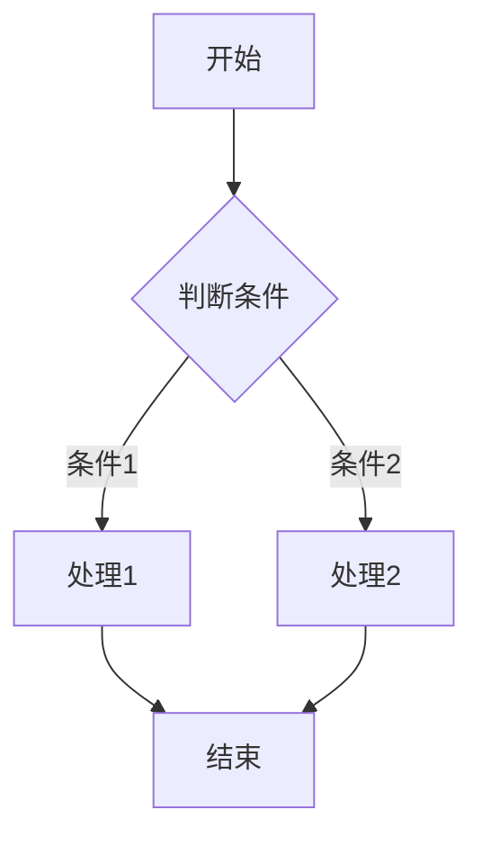
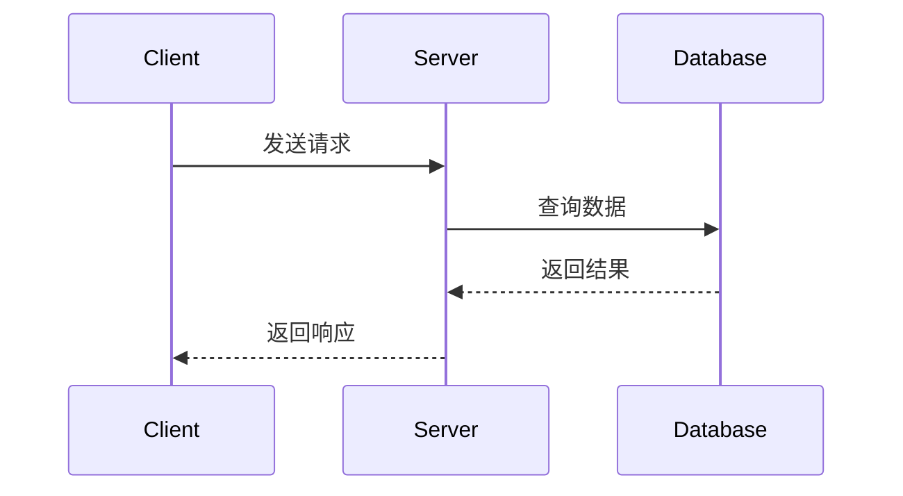
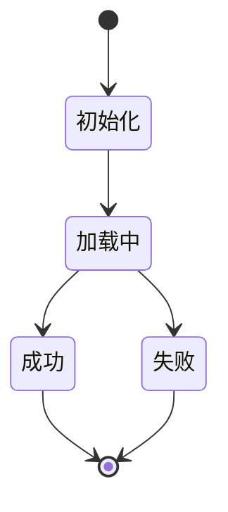
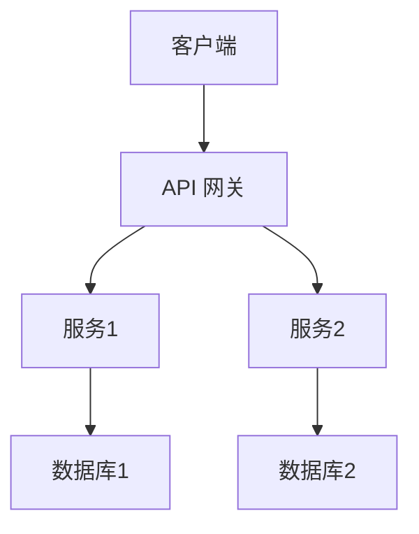
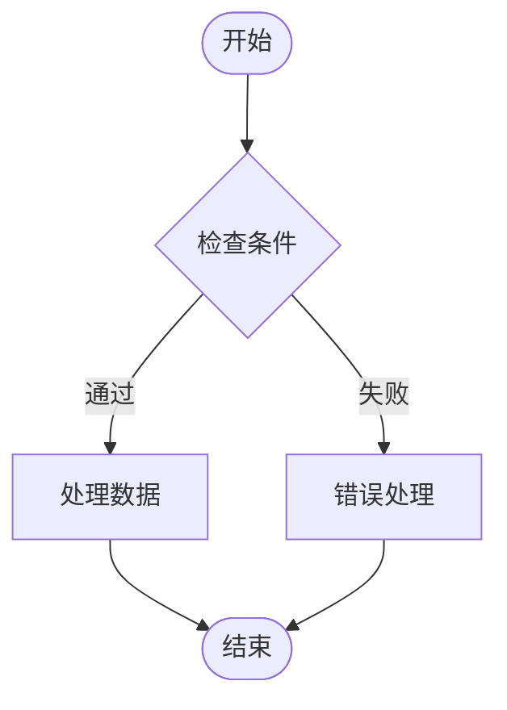

# AI 文档编写指南

本指南旨在帮助 AI 了解如何为用户编写符合要求的文档。请在编写任何文档前仔细阅读本指南。

## 学习技术栈清单

用户目前正在学习和使用以下技术栈，编写文档时应重点关注这些技术：

### 前端框架
- **React** - 用于构建用户界面的 JavaScript 库
- **Next.js** - React 生产框架，支持 SSR、SSG 等特性
- **React Native** - 使用 React 构建原生移动应用

### 后端框架
- **Node.js** - JavaScript 运行时环境
- **Hono.js** - 快速、轻量的 Web 框架，适用于 Edge 和 Cloudflare Workers
- **NestJS** - 用于构建高效、可扩展 Node.js 服务器端应用的渐进式框架

### 系统语言
- **Go** - 由 Google 开发的编程语言，适用于系统编程和云原生应用

## 文档风格指南

### 语言要求
- **必须使用中文编写**所有文档内容
- 保持中文表达的准确性和流畅性
- 技术术语可以使用英文，但应提供中文解释

### 文档结构
- 使用清晰的层级结构（H1 → H2 → H3）
- 每个章节应有明确的主题
- 使用 VitePress 的 frontmatter 配置（如 `outline: deep`）

### 代码示例格式
- 使用代码块语法高亮（如 `jsx`, `typescript`, `go` 等）
- 代码示例应完整、可运行
- 重要代码行可使用行号高亮（如 `{4}` 高亮第 4 行）
- 在代码前后提供必要的上下文说明

**示例：**

```jsx
// 组件示例
import { useState } from 'react'

function Counter() {
  const [count, setCount] = useState(0)
  return (
    <button onClick={() => setCount(count + 1)}>
      点击次数: {count}
    </button>
  )
}
```

### VitePress 特性使用
- 可以使用自定义容器（`::: info`, `::: tip`, `::: warning`, `::: danger`）
- 支持 Markdown 扩展功能（表格、任务列表等）
- 可使用 VitePress 的运行时 API（如 `useData()`）
- 支持 Mermaid 图表，用于可视化复杂概念和流程

### Mermaid 图表使用规范

VitePress 支持通过 `vitepress-plugin-mermaid` 插件显示 Mermaid 图表。合理使用图表能够显著增强文档的可读性和学习效率。

#### 使用原则

- **复杂流程和关系优先使用图表**：当概念涉及多个步骤、决策分支或组件交互时，使用图表比纯文字描述更清晰
- **架构和系统设计必须使用图表**：系统架构、组件关系、数据流等必须用图表展示
- **避免为简单概念使用图表**：简单的单步骤操作或基础概念不需要图表，避免过度使用

#### 图表类型与适用场景

根据不同的内容需求，选择合适的图表类型：

- **流程图 (graph/flowchart)**：适用于工作流程、决策流程、算法流程
  - 示例场景：请求处理流程、错误处理流程、用户操作流程

- **序列图 (sequenceDiagram)**：适用于 API 调用、组件交互、请求响应流程
  - 示例场景：客户端-服务器交互、中间件执行顺序、组件通信

- **状态图 (stateDiagram)**：适用于状态转换、生命周期
  - 示例场景：React 组件生命周期、应用状态管理、状态机

- **类图 (classDiagram)**：适用于类关系、模块依赖
  - 示例场景：NestJS 模块依赖、Go 包结构、面向对象设计

- **架构图 (graph)**：适用于系统架构、组件关系
  - 示例场景：微服务架构、前后端分离架构、系统组件关系

- **ER 图 (erDiagram)**：适用于数据库关系
  - 示例场景：数据模型设计、表关系、数据库架构

- **甘特图 (gantt)**：适用于时间线、学习路径
  - 示例场景：学习计划、项目时间线、开发流程

#### 技术栈特定建议

针对不同技术栈，以下场景建议使用图表：

**React/Next.js**
- 组件生命周期：使用状态图展示组件挂载、更新、卸载流程
- 数据流：使用流程图展示 props、state、context 的数据流向
- SSR/SSG 流程：使用序列图展示服务端渲染和静态生成的执行流程
- Hooks 执行顺序：使用序列图展示多个 Hooks 的执行顺序

**Node.js/后端框架**
- 请求处理流程：使用流程图展示从接收到响应的完整流程
- 中间件执行顺序：使用序列图展示中间件的执行顺序和调用链
- 模块依赖关系：使用类图或架构图展示模块之间的依赖关系
- 错误处理流程：使用流程图展示错误捕获和处理的流程

**Go**
- 并发模型：使用序列图展示 goroutine 的创建和通信
- goroutine 通信：使用序列图展示 channel 的发送和接收流程
- 包依赖关系：使用类图展示包之间的导入和依赖关系
- 接口实现关系：使用类图展示接口和实现的关系

**React Native**
- 原生桥接流程：使用序列图展示 JavaScript 和原生代码的交互
- 平台差异对比：使用流程图或架构图对比 iOS 和 Android 的实现差异
- 组件渲染流程：使用流程图展示从 JSX 到原生视图的转换过程

#### 代码格式规范

使用 Mermaid 图表时，遵循以下格式：

```markdown
```mermaid
[图表类型]
[图表内容]
```
```

**示例：流程图**

```markdown

```

**示例：序列图**

```markdown

```

**示例：状态图**

```markdown

```

::: tip 提示
- 图表中的文本应使用中文，保持与文档语言一致
- 图表节点命名应清晰、描述性，避免使用缩写
- 复杂图表可以拆分为多个简单图表，提高可读性
- 在图表前后提供必要的文字说明，解释图表内容
- **颜色配置**：使用 Mermaid 的样式配置确保文本和线条颜色适配主题
  - **文本颜色**：
    - 在亮色模式下使用深色文本（如 `#1e1e1e`）
    - 在暗色模式下使用浅色文本（如 `#e5e5e5`）
  - **线条和边框颜色**：
    - 在亮色模式下使用深色线条（如 `#1e1e1e`）
    - 在暗色模式下使用浅色线条（如 `#e5e5e5`）
  - **配置示例**：
    ```markdown
    %%{init: {'theme':'base', 'themeVariables': {
      'primaryTextColor':'#1e1e1e',
      'primaryBorderColor':'#1e1e1e',
      'lineColor':'#1e1e1e',
      'secondaryTextColor':'#1e1e1e',
      'tertiaryTextColor':'#1e1e1e'
    }}}%%
    ```
  - **注意**：CSS 样式文件会自动处理暗色模式下的颜色适配，确保线条和文本在两种模式下都清晰可见
:::

### 格式规范
- 标题使用简洁、描述性的语言
- 段落之间保持适当间距
- 列表使用有序或无序列表，保持一致性
- 链接应指向权威文档或相关资源
- **禁止使用 emoji 表情符号**，保持文档的专业性和简洁性

## 文档内容范围

编写文档时应包含以下类型的内容：

### 1. 技术概念解释
- 清晰解释技术概念和原理
- 说明适用场景和使用场景
- 与其他相关技术的对比（如适用）

### 2. 代码示例和实践
- 提供实际可运行的代码示例
- 展示最佳实践和常见模式
- 包含完整的代码上下文，避免片段化

### 3. 最佳实践和注意事项
- 列出常见错误和如何避免
- 提供性能优化建议
- 说明安全相关注意事项
- 标注版本兼容性问题

### 4. API 参考（如适用）
- 清晰的参数说明
- 返回值类型和示例
- 使用场景说明
- 相关示例链接

### 5. 进阶内容
- 高级用法和技巧
- 常见问题的解决方案
- 与其他技术栈的集成方法

## 文档结构模板

建议使用以下结构模板来组织文档：

```markdown
---
outline: deep
---

# [文档标题]

## 概述
简要介绍本主题的核心内容和学习目标。

## [主要概念 1]
详细解释第一个主要概念...

### 子概念 1.1
...

## [主要概念 2]
...

## 架构与流程（如适用）

当涉及系统架构、工作流程或复杂关系时，使用 Mermaid 图表进行可视化：

### 系统架构图



### 工作流程图



## 代码示例

### 基础示例
```[语言]
// 基础示例代码
```

### 进阶示例
```[语言]
// 进阶示例代码
```

## 最佳实践

::: tip 提示
重要的提示信息
:::

::: warning 注意
需要注意的事项
:::

## 常见问题

### Q: [问题]
A: [答案]

## 进阶内容
...

## 参考链接
- [相关文档链接 1](#) <!-- 替换为实际链接 -->
- [相关文档链接 2](#) <!-- 替换为实际链接 -->
```

## 编写原则

### 1. 以学习者为中心
- 假设读者对该技术有一定基础但不深入
- 循序渐进，从基础到进阶
- 提供足够的背景信息

### 2. 实用性优先
- 优先提供实际可用的代码和解决方案
- 避免纯理论性的长篇大论
- 每个概念都应有相应的示例

### 3. 准确性保证
- 确保代码示例能够运行
- 引用的 API 和特性版本应准确
- 避免过时或已废弃的内容

### 4. 结构清晰
- 使用目录大纲（`outline: deep`）便于导航
- 章节划分合理，内容聚焦
- 重要信息使用自定义容器突出显示

## 特殊注意事项

### React/Next.js 文档
- 优先使用函数组件和 Hooks
- 展示现代 React 开发模式
- 说明服务端渲染和客户端渲染的区别
- **图表使用建议**：
  - 使用状态图展示组件生命周期（挂载、更新、卸载）
  - 使用流程图展示数据流（props、state、context 的流向）
  - 使用序列图展示 SSR/SSG 的执行流程和客户端-服务端交互
  - 使用架构图展示 Next.js 的页面路由和 API 路由结构

### Node.js/后端框架文档
- 包含环境配置说明
- 提供完整的项目结构示例
- 说明中间件、路由等核心概念
- **图表使用建议**：
  - 使用流程图展示请求处理流程（从接收到响应的完整链路）
  - 使用序列图展示中间件执行顺序和调用链
  - 使用架构图展示 NestJS 模块依赖关系或 Hono.js 路由结构
  - 使用流程图展示错误处理和异常捕获流程

### Go 文档
- 遵循 Go 的代码规范和惯例
- 说明并发和 goroutine 的使用
- 包含错误处理的最佳实践
- **图表使用建议**：
  - 使用序列图展示 goroutine 的创建、通信和同步流程
  - 使用流程图展示 channel 的发送、接收和关闭操作
  - 使用类图展示包之间的导入和依赖关系
  - 使用架构图展示接口实现关系和类型系统

### React Native 文档
- 区分 iOS 和 Android 平台差异
- 包含原生模块的集成说明
- 提供性能优化建议
- **图表使用建议**：
  - 使用序列图展示 JavaScript 和原生代码的桥接交互流程
  - 使用架构图对比 iOS 和 Android 平台的实现差异
  - 使用流程图展示组件从 JSX 到原生视图的渲染转换过程
  - 使用状态图展示应用状态在不同平台间的同步机制

## 文档维护

- 当技术栈更新时，及时更新本指南
- 根据用户反馈调整编写规范
- 保持与最新版本和最佳实践同步

---

**最后更新日期**: 2024年

**目标读者**: AI 助手（用于指导文档编写）

